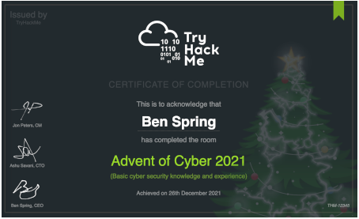
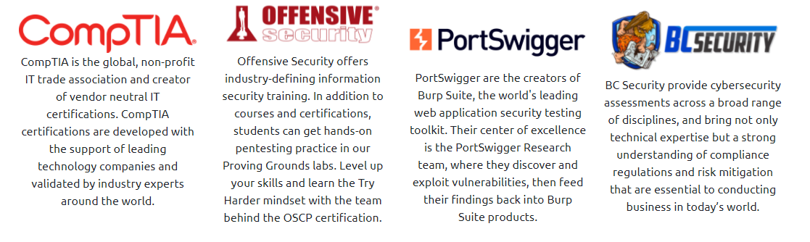

# Welcome to Advent of Cyber 2021

> Get started with Cyber Security in 25 days, by learning the basics and completing a new, beginner friendly security exercise every day leading up until Christmas; an advent calendar but with security challenges and not chocolate.

## Prizes & Certificate
We have over $19,000 worth of prizes! In this event, points don't matter but the number of questions you answer does. For each task you get correct, you get a raffle ticket and on the 26th December, we will choose the winners randomly using everyone's raffle tickets; the more questions you answer, the more chance you have of winning. Here are the prizes up for grabs:

- [5x PWK Course + 30 day lab access + OSCP exam certification ($4,995)](https://www.offensive-security.com/pwk-oscp)
- [4x ASUS ZenBook 14 8GB RAM, 512GB SSD, Intel i5 ($4000)](https://uk.store.asus.com/14524-ux425ja-bm031t-feed.html)
- [35x Burp Suite Certified Practitioner Exam Vouchers ($3225)](https://portswigger.net/web-security/certification)
- [20x Proving Grounds Vouchers ($380)](https://www.offensive-security.com/labs/individual/)
- [5x Attacking Windows AD Throwback Course ($425)](https://tryhackme.com/network/throwback)
- [2x Raspberry Pi 400 ($244)](https://www.raspberrypi.org/products/raspberry-pi-400)
- [2x HAK5 O.MG Cable ($240)](https://shop.hak5.org/products/o-mg-cable)
- [2x Advanced Threat Emulation: Red Teams BCSecurity ($3798)](https://www.bc-security.org//courses/advanced-threat-emulation-for-red-teams)
- [4x CompTIA Security+ Exam Vouchers ($1164)](https://uk-store.comptia.org/comptia-security-plus-exam-voucher/p/SEC-601-TSTV-20-C)
- [5x $30 TryHackMe Swag Vouchers ($150)](http://store.tryhackme.com/)
- [2x HAK5 Wifi Pineapple ($200)](https://shop.hak5.org/products/wifi-pineapple)
- [2x HAK5 Rubber Ducky ($100)](https://shop.hak5.org/collections/sale/products/usb-rubber-ducky-deluxe)
- [15x TryHackMe Subscriptions ($150)](https://tryhackme.com/why-subscribe)

> Total Prize Pool Value: $19,121

> Also, everyday you complete a challenge, you get entered into another prize draw for the chance to win a mini-prize. The "daily prizes" are done at the end of the week. Complete every task in the event and earn a certificate of completion! Make sure your name is set in your settings.

## View Sample Certificate

## Our Sponsors

> In the spirit of Christmas, we've brought together some of the biggest names in cyber security and are ecstatic that they're supporting the event by sponsoring prizes!

## Videos Featuring

> Each task released has a supporting video walkthrough, from a range of amazing and highly talented creators, including:  
> CyberSecMeg, John Hammond, Tib3rius, Neal Bridges, HuskyHacks, InsiderPhD, and NahamSec!

## Topics Include

> Topics that will be covered in the event are:

- Web Exploitation  
- Network Exploitation  
- OSINT  
- Cloud Hacking  
- Defensive Blue Teaming

# Questions

> Read the above and checkout the sponsors

This task has no answer needed.

===============================================================================