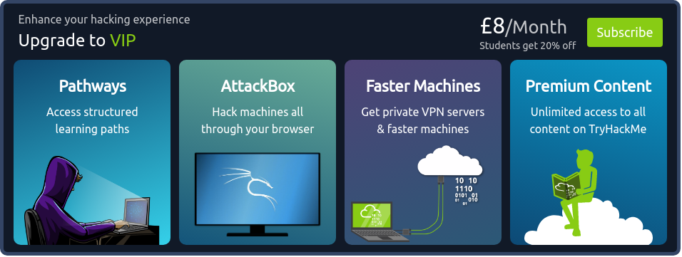

# Introduction

## Subscribing

> The Advent of Cyber event is completely free! However, check out some of the reasons to subscribe: 

> If you want to gift a TryHackMe VIP subscription, you can [purchase vouchers](http://tryhackme.com/subscriptions).

> In celebration of Advent of Cyber, you can get **20% off** the annual subscription using the discount code **AOC2021** at checkout. This discount is only valid until the 7th of December.

## Completing Advent of Cyber as an organization

> Advent of Cyber is a perfect event for introducing and upskilling many different teams within your company in cyber, through this fun 25-day event! 

> With TryHackMe's [management dashboard for business](https://tryhackme.com/business), teams in your company can tackle the daily challenges together, where you can monitor their progress and give them a premium learning experience.

## Christmas Swag

> Want to rep swag from your favorite cyber security training platform?  
> We have a special edition Christmas Advent of Cyber [t-shirt](https://store.tryhackme.com/collections/all/products/limited-edition-advent-of-cyber-t-shirt?variant=39643051065411). Buy from our [swag store](https://store.tryhackme.com/).

# Questions

> Read the above.

This task has no anwer needed.

===============================================================================