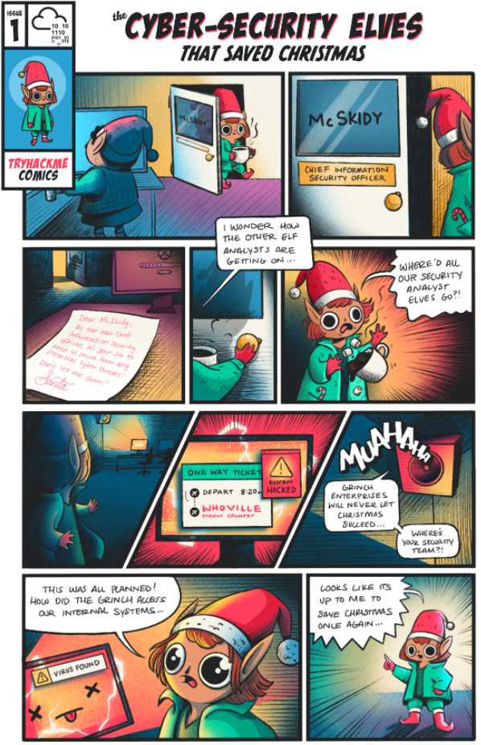

# Introduction

All exercises in Advent of Cyber follow a fun Christmas story. This year, the elf McSkidy needs your help to hack back and undo the grinch's malicious activities.

It's the eve of 30th November - McSkidy sits in her large office with a cup of hot cocoa, reminiscing over her stressful times at the Best Festival Company. Since her management of the Christmas Monster's cyber attacks last December, she'd been promoted to Chief Information Security Office (CISO) and has managed to build a world-class security team. She made a promise to never let Christmas get affected by cyber incidents and has done everything in her power to prepare the best festival company for any incidents, and assist Santa in delivering presents globally with no disruptions!

As she grins to herself "After all we've done, what could go wrong", Elf McAssistant runs into her office and gasps "All our security analysts have missed their last shift and no security personnel can be found in the building". McSkidy jumps out of her chair and spills her hot cocoa all over herself "WHAT".

She swiftly moves over to the Elf Security Center housing the security personnel and looks over the large area filled with empty desks. Where did everyone go on the eve of the most important time for the Best Festival Company. She rushes over to the desk of the head of her security analyst team, Elf McLeader, and notices the desk is surprisingly clean. For someone so messy, how is his work area completely empty? As she started theorising in her head, she noticed a small piece of paper hidden at the back of the desk behind the screen. As she made sense of what was on the paper, her eyes widened - why did McProfessional book a one-way flight ticket away on this exact day!

Before she had time to make any assumptions, a loud, grumpy voice was resonating across the security center from the internal announcement systems "Grinch Enterprises will never let Christmas succeed. It would be a shame if your world-class security team just suddenly disappeared"

"THIS WAS ALL PLANNED - HOW DID THEY ACCESS OUR INTERNAL SYSTEMS" cried McSkidy. Their intelligence team had prepared for this exact scenario but it didn't help that the security center was completely empty!

"This needs to stop happening" sighed McSkidy and dragged herself to the office to save Christmas

**Please note, tasks are released daily and will vary in difficulty** (although will always be aimed at a beginner level)

# Questions

The Christmas story is used within some of the tasks, so make sure you read the above.

This task has no anwer needed.

===============================================================================