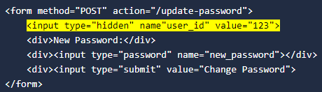
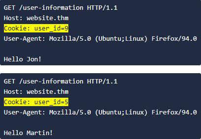
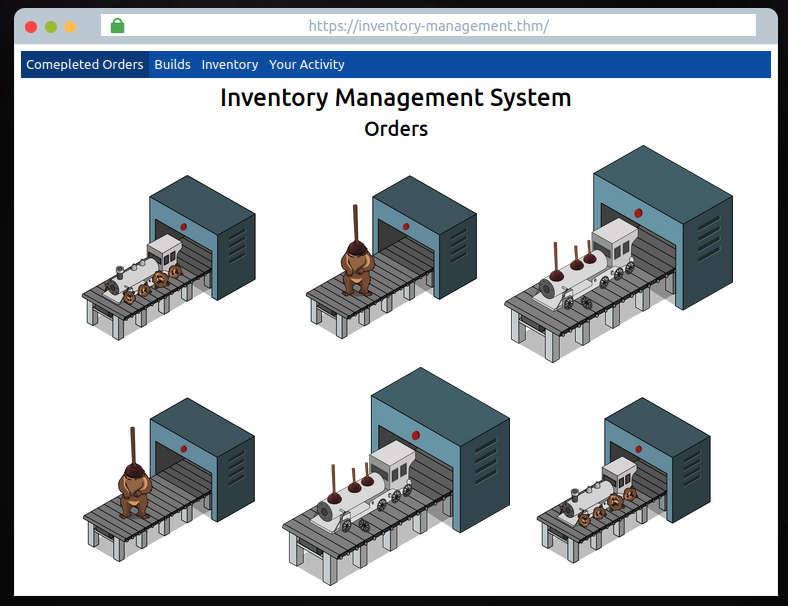
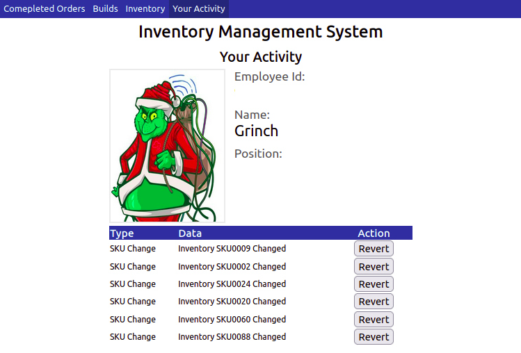
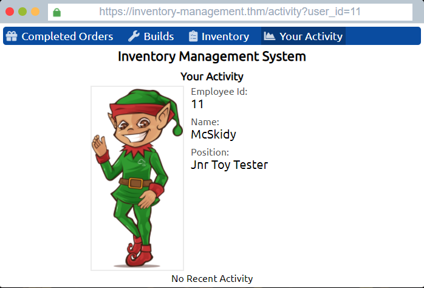
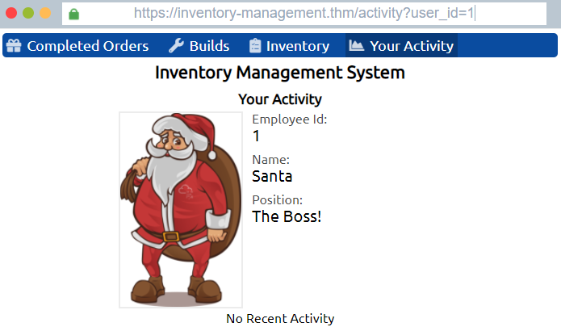
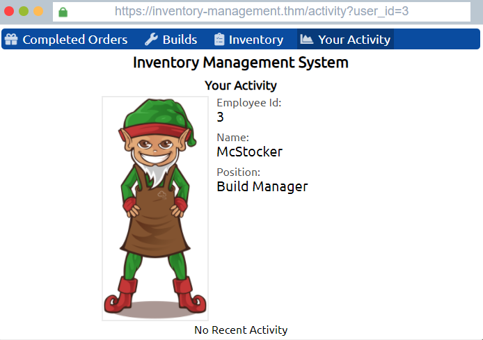
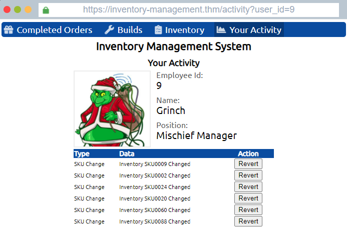

# Introduction

## Story

The inventory management systems used to create the gifts have been tampered with to frustrate the elves. It's a night shift, and McStocker comes to McSkidy panicking about the gifts all being built wrong. With no managers around to fix the issue, McSkidy needs to somehow get access and fix the system and keep everything on track to be ready for Christmas!

## Learning Objectives

1. What is an IDOR vulnerability?
2. How do I find and exploit IDOR vulnerabilities?
3. Challenge Walkthrough.
---

## What is an IDOR vulnerability?

IDOR stands for Insecure Direct Object Reference and is a type of access control vulnerability. An access control vulnerability is when an attacker can gain access to information or actions not intended for them. An IDOR vulnerability can occur when a web server receives user-supplied input to retrieve objects (files, data, documents), and too much trust has been placed on that input data, and the web application does not validate whether the user should, in fact, have access to the requested object.

## How do I find and exploit IDOR vulnerabilities?

As previously mentioned, an IDOR vulnerability relies on changing user-supplied data. This user-supplied data can mainly be found in the following three places:

### Query Component:

Query component data is passed in the URL when making a request to a website. Take, for instance, the following screenshot of a URL.

We can breakdown this URL into the following:

**Protocol**: https://  
**Domain**: website.thm  
**Page**: /profile  
**Query Component**: id=23

Here we can see the /profile page is being requested, and the parameter id with the value of 23 is being passed in the query component. This page could potentially be showing us personal user information, and by changing the id parameter to another value, we could view other users data.

### Post Variables:

Examining the contents of forms on a website can sometimes reveal fields that could be vulnerable to IDOR exploitation. Take, for example, the following HTML code for a form that updates a user's password.

You can see from the highlighted line that the user's id is being passed to the webserver in a hidden field. Changing the value of this field from 123 to another user_id may result in changing the password for another user's account.

### Cookies:

To stay logged into a website such as this one, cookies are used to remember your session. Usually, this will involve sending a session id which is a long string of random hard to guess text such as 5db28452c4161cf88c6f33e57b62a357, which the webserver securely uses to retrieve your user information and validate your session. Sometimes though, less experienced developers may store user information in the cookie its self, such as the user's ID. Changing the value of this cookie could result in displaying another user's information. See below for an example of how this might look.

## IDOR in the wild

Seeing a product, user, or service identifier in the URL or otherwise is a must to test. IDOR vulnerabilities can reveal sensitive information, as well as potentially giving you access to usually restricted site functionality. For security researchers, IDOR vulnerabilities can be impactful, and reporting them can yield a good bug bounty; see this [article](https://corneacristian.medium.com/top-25-idor-bug-bounty-reports-ba8cd59ad331), where an IDOR vulnerability report to PayPal had a $10,500 payout.

## Challenge Walkthrough

Click the green "View Site" button at the top right of this task to open up the inventory management system.

Here you'll find a mock browser on the completed orders page showing images of the toys which have been made incorrectly due to the Grinch's tampering!

There are also three other pages on the navigation panel; Builds, Inventory and Your Activity.

1. The **builds** page shows different toys and the parts they are made up of (as you can see, due to tampering, these are all incorrect)
2. The **Inventory** page lists the individual items with their corresponding SKU codes.
3. The **Your Activity** page displays McSkidy's user information, photo and their recent actions on the system.

As we learnt above, an IDOR vulnerability requires changing some kind of user input. Out of all the pages we can navigate to, the only page that has input that can be altered is on the **Your Activity** page. You'll see in the URL a query component parameter named **user_id**, which is set to the value of **11** (McSkidy's User Id).

Try changing the **user_id** value in the address bar, and you'll see that the web application tries to load another user's information. Try different numbers between the values 1 - 20 until you find a user who could have been responsible for the tampering on the system.

Clicking on the **Revert** button on the user's actions will roll back the changes and allow the toy-making machine to make properly built toys again. Once all the changes have been reverted, you'll be rewarded with a flag which can be entered below.

# Questions

After finding Santa's account, what is their position in the company?

Answer: **The Boss!**

After finding McStocker's account, what is their position in the company?

Answer: **Build Manager**

After finding the account responsible for tampering, what is their position in the company?

Answer: **Mischief Manager**

What is the received flag when McSkidy fixes the Inventory Management System?

Answer: **THM{AOC_IDOR_2B34BHI3}**

If you want to learn more about IDOR vulnerabilities, we suggest trying out this room https://tryhackme.com/room/idor

**No Answer Needed**

Tasks released each day get progressively harder (but are still guided with walkthrough videos). Come back tomorrow for Day 2's task!

**No Answer Needed**

===============================================================================

At opening the website, a set of instructions and the inventory webpage is provided:

Based on guided instruction, we can click on "Builds", "Inventory" or "Your Activity" tab to check out the website. At the "Your Activity" page, we note that an IDOR vulnerability is available at the URL:

Our current user_id is at 11. we can change the value and check out other user_id.

The Santa's account can be found at user_id=1

McStocker's account can be found at user_id=3

The Grinch, who is responsible for the tampering, can be found at user_id=9

After clicking on all the "Revert" buttons to fix the tampering, you will get the flag:

