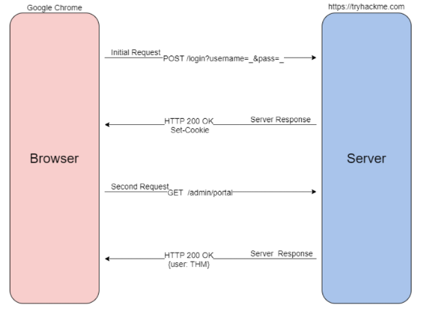

# Introduction

## Story

McSkidy needs to check if any other employee elves have left/been affected by Grinch Industries attack, but the systems that hold the employee information have been hacked. Can you hack them back to determine if the other teams in the Best Festival Company have been affected?

## Learning Objectives

- Understanding the underlying technology of web servers and how the web communicates.  
- Understand what cookies are and their purpose.  
- Learn how to manipulate and manage cookies for malicious use.  
---

## HTTP(S)

For your computer and a webserver to communicate with each other, an intermediary protocol is required. This is where the HTTP (Hypertext Transfer Protocol) is introduced! The HTTP protocol is a client-server protocol to provide communication between a client and a webserver. HTTP requests are similar to a standard TCP network request; however, HTTP adds specific headers to the request to identify the protocol and other information.

When an HTTP request is crafted, the method and target header will always be included. The target header will specify what to retrieve from the server, and the method header will specify how.

When retrieving information from a web server, it is common to use the GET method, such as loading a picture.

When sending data to a web server, it is common to use the POST method, such as sending login information.

### Example Request

Once the server receives a request, it will send back a response, including any requested content if successful and a status code. The status code is used to tell the client browser how the webserver interpreted the request. The most common "successful" status code is `HTTP 200 OK`.

### Example Response

The protocol itself is only one small piece of the puzzle; once content is retrieved from the web server, your browser needs a way to interpret and render the information sent. Web applications are commonly formatted in HTML (HyperText Markup Language), rendered, and styled in CSS (Cascading Style Sheets). JavaScript is also commonly used to provide additional functionality.

In today's web environment, the use of web frameworks has significantly increased in popularity. Most modern web applications use many web frameworks and other web solutions that an end-user does not see or interact with.

For more information about HTTP requests, methods, and headers, check out the [Web Fundamentals](https://tryhackme.com/room/webfundamentals) room!

## Cookies

HTTP is a stateless protocol. When you send requests to a web server, the server cannot distinguish your request from someone else's request.. To solve the stateless problem and identify different users and access levels, the webserver will assign cookies to create and manage a stateful session between client and server.

Cookies are tiny pieces of data (metadata) or information locally stored on your computer that are sent to the server when you make a request.

Cookies can be assigned any name and any value allowing the webserver to store any information it wants. Today we will be focusing on authentication cookies, also known as session cookies. Authentication or session cookies are used to identify you and what access level is attached to your session.

Below is a diagram describing assigning and using a cookie from the initial request to the session request.

To begin the process, when you send a request such as a login request, your browser will send that information typically as a POST request to the webserver. The web server will verify that it received the data and set a unique cookie; as previously mentioned, cookies are arbitrary, and values are determined by best-practice or the web developer. Once the cookie is assigned, as long as the cookie stays locally stored in your browser, all future GET requests will be automatically sent with that cookie to identify you and your access level. Once the server receives your GET request and cookie, it will locate and de-serialize your session. Deserialization is the process of taking a data format such as JSON and rebuilding it as an object. If successful, the webserver will reply to your request with a 200 response.

Now that we understand what cookies are and how they are used, let us dive into their contents.

## Cookie Components

Cookies are made up of 11 different components; you can find an explanation of each component in the table below.

Looking at all the components of a cookie may seem intimidating. There is no need to worry as attackers; we only need to concern ourselves with two components: `Name` and `Value`; the rest of the components are handled by the webserver.

Cookie components are always prepared in pairs. The main pair is `name-value`; this will define the name of the cookie and the value of the name. The second pair is the `attribute-value` pair; this will define an attribute of the cookie and the value of the attribute. Below is an example of what `Set-Cookie` syntax looks like.

`Set-Cookie: <cookie-name>=<cookie-value>; Domain=<domain-value>; Secure; HttpOnly`

## Cookie Manipulation

Cookie manipulation is taking a cookie and modifying it to obtain unintended behavior determined by the web developer. Cookie manipulation is possible because cookies are stored locally on your host system, meaning you have complete control over them and modify them as you please.

To begin modifying and manipulating cookies, we need to open our developer tools. In Google Chrome, developer tools are known as the "Chrome Developer Tools," and in Mozilla Firefox, they are known as the "Firefox Developer Tools."

Developer tools can be accessed by pressing `F12` or `Ctrl+Shift+I`. Once developer tools are open, to access your cookies, navigate to the `Storage` tab in Firefox or `Application` tab in Chrome/Edge; select the `Cookies` dropdown on the left-hand side of the console.

Cookie values may seem random at first; however, they often have an encoded value or meaning behind them that can be decoded to a non-arbitrary value such as a Javascript object.

From an attacker's perspective, you can decode the cookie value to identify the underlying objects. Once you have identified the underlying objects, you can modify them to what you want. To use the cookie, you will need to encode it back to the original encoding and replace the cookie value. Below is an example of a decoded cookie value.

`{firstName:"John", lastName:"Doe", age:50, eyeColor:"blue"}`

Now that we have all of the pieces of cookies and how to manipulate them, we can put them all together to gain unintended access.

Below is a summary of how cookie values could be manipulated.

1. Obtain a cookie value from registering or signing up for an account.
2. Decode the cookie value.
3. Identify the object notation or structure of the cookie.
4. Change the parameters inside the object to a different parameter with a higher privilege level, such as admin or administrator.
5. Re-encode the cookie and insert the cookie into the value space; this can be done by double-clicking the value box.
6. Action the cookie; this can be done by refreshing the page or logging in.

## Additional Resources

For more information about HTTP(s) and cookies, check out these other TryHackMe rooms.

HTTP: https://tryhackme.com/jr/httpindetail  
Authentication: https://tryhackme.com/jr/authenticationbypass

If you're stuck solving the challenge, check out the [walkthrough video here](https://www.youtube.com/watch?v=bovOGgp_TbE&t)

# Questions

> Open the static site in a new tab, [here](https://static-labs.tryhackme.cloud/sites/aoc-cookies/).

**No answer needed**

> Register an account, and verify the cookies using the Developer Tools in your browser.  
> What is the name of the new cookie that was created for your account?

Answer: **user-auth**

> What encoding type was used for the cookie value?

Answer: **hexadecimal**

> What object format is the data of the cookie stored in?

Answer: **JSON**

> Manipulate the cookie and bypass the login portal.  
> What is the value of the administrator cookie? (username = admin)

Answer: **7b636f6d70616e793a2022546865204265737420466573746976616c20436f6d70616e79222c206973726567697374657265643a2254727565222c20757365726e616d653a2261646d696e227d**

> What team environment is not responding?

Answer: **HR**

> What team environment has a network warning?

Answer: **Application**

> If you want to learn more about Authentication bypasses, we suggest trying out this room https://tryhackme.com/jr/authenticationbypass

**No answer needed**

> Tasks released each day get progressively harder (but are still guided with walkthrough videos). Come back tomorrow for Day 3's task, where InsiderPHD will be recording a video walkthrough!

**No answer needed**

===============================================================================

Start by accessing the [website here](https://static-labs.tryhackme.cloud/sites/aoc-cookies/).

Register for an account and login. You should get to a screen similar to below:

Next we need to manipulate the cookie. Open the developer tools using `F12` or `Ctrl+Shift+I`.  
Look for the Cookies: navigate to the `Storage` tab in Firefox or `Application` tab in Chrome/Edge; select the `Cookies` dropdown on the left-hand side of the console.

Under the cookie value, there is a very long string under the `Value` column. That string is in hexadecimal.  
You can use a hexadecimal to text converter to get the original text:  

manipulate the username value to `admin` and convert it back to hexadecimal.  
Replace the original cookie value with this new hexadecimal value, and re-attempt to login again. You should be able to see the dashboard as shown:

