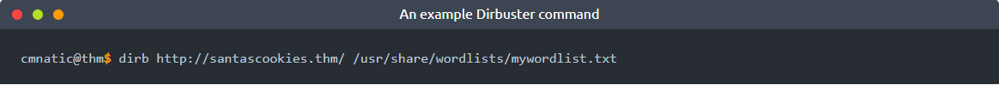

# Introduction

## Story

> Grinch Enterprises have also tried to block communication between anyone at the company. They've locked everyone out of their email systems and McSysAdmin has also lost access to their admin panel. Can you find the admin panel and help restore communication for the Best Festival Company.

## Learning Objectives

1. In today's task, we're going to be using our investigatory skills and techniques to discover un-listed content, and attempt some common authentication using the clues around us.
---

## What is Content Discovery & Why is it Useful?

Before we begin looking for content, let's define what "content" actually is. Content is the assets and inner workings of the application that we are testing. Contents can be files, folders, or pathways that weren't necessarily intended to be accessed by the general public.

For example, you may have a blog, where you post about your tasty treats! You want everyone to view all of your delicious snacks, but you don't want everyone to be able to manage what delicious snacks are up for review - You may hide the administrator panel away from the public!

Let's expand on this. Web servers, unless configured otherwise, are designed to serve these files and folders, as long as you know the names.

Content discovery is a useful technique to have in our arsenal because it allows us to find things that we aren't supposed to see. For example, we may be able to find:

- Configuration files
- Passwords and secrets
- Backups
- Content management systems
- Administrator dashboards or portals

These are just some examples of the types of information that we may be able to uncover by discovering content. We can find these pieces of information because they are stored in either a folder (which will have a name) or a file (which will have both a name and extension). This means that we can search for files by their extension, for example, discovering text files with the extension of `.txt`.

You can do this manually by thinking of some names such as "admin" or "passwords.txt" and navigating to it in your browser. However, we can use tools to do this process for us at a considerably faster rate. Enter Dirbuster. Dirbuster is a tool that we can use to automate this process for us. The tool works by accepting a wordlist which is a file containing everything that we want to search for, and then a few other arguments. Let's demonstrate this into the snippets below:

Dirbuster will scan the website "santascookies.thm" for the folders listed within this wordlist. To use Dirbuster to discover content on this site, we would use the command `dirb` and provide some information such as the URL of the website and the location of the word list. Our final command would look like something similar to the snippet below::

In the above, we have provided Dirbuster the following commands:  
- The URL of the website
- The location (full path) on our attacking machine of our wordlist. If you are unfamiliar with this, check out Linux Fundamentals.

Now, once we execute this command, Dirbuster will search for the existence of a directory on the website using every value in the wordlist that we have created. 

Your ability to discover content is only as good as your wordlist. You will find another collection of open-source wordlist such as SecLists, where you may be able to use a combination of context and wordlist to discover content.

## Default Credentials

Web applications and services often come with a default pair of credentials. Developers leave these credentials in place so that you can quickly get started with the platform (with the hopes that you will change them). However, as you'll come to discover, not everyone does, or in fact, applications often include other accounts that are not well documented. SecLists also provide a wordlist for default credentials, which you can find here.

For example, take a guess at using some common usernames and password combinations for privileged users. This could include:

Sometimes, these credentials are stored in the web applications configuration files or public documentation. For example, this application, "BikeIT", is an open-source application for registering your Bicycle to a community page. The administrator is enabled by default, with credentials provided in both the documentation and source code.

The photo above shows the "Read Me" documentation (or instructions) for the web application.

`$username="Administrator";`

`$password="letmein123"; //change this`

The source code contains these default credentials too.

---

Unless the administrator installing this application changes the credentials, anyone will be able to log in using them if they know to look for these details being published (such as they usually are with open-source projects), or are capable of guessing them.

For today's task, you will need to deploy the **vulnerable machine attached to this task** by pressing the green "Start Machine" button at the **top right of this task and the TryHackMe AttackBox**, which can be deployed by pressing the "Start AttackBox" button located at the **top-right of the room**.

---

## Additional Resources

If you are interested in learning more  (or wish to apply your knowledge) about content discovery and authentication bypass, check out the following rooms on TryHackMe:  
- [Content Discovery](https://tryhackme.com/jr/contentdiscovery)
- [Authentication Bypass  ](https://tryhackme.com/jr/authenticationbypass)

# Questions

> Using a common wordlist for discovering content, enumerate http://MACHINE_IP to find the location of the administrator dashboard. What is the name of the folder?

Answer: **admin**

> In your web browser, try some default credentials on the newly discovered login form for the "**administrator**" user. What is the password?

Answer: **administrator**

> Access the admin panel. What is the value of the flag?

Answer: **THM{ADM1N_AC3SS}**

===============================================================================

Start by launching the **vulnerable machine attached to this task** and your **TryHackMe AttackBox**. You may launch your own VM instead of using TryHackMe Attackbox.

Run the following command to look for the folder with the administrator dashboard:  
`dirb http://<vulnerable_machine_IP>/ /usr/share/wordlists/dirb/common.txt -r

upon reaching the website at `http://<vulnerable_machine_IP>/admin/`, you will see the administrator login:

Given the username "administrator", try to use some common/default passwords and login:

- `password`  
- `password123`  
- `admin123`  
- **`administrator`**

Login as the administrator to retrieve the flag:

