# Introduction

## Story

McSysAdmin managed to reset everyone's access except Santa's! Santa's expected some urgent travel itinerary for his route over Christmas. Rumour has it that Santa never followed the password security recommendations. Can you use bruteforcing to help him access his accounts?

## Learning Objectives

In today’s task, we’re going to learn the following.

1. Understanding authentication and where it is used  
2. Understanding what fuzzing is  
3. Understanding what Burp Suite is and how we can use it for fuzzing a login form to gain access  
4. Apply this knowledge to retrieve Santa’s travel itinerary 
---

## What is authentication, and where is it Used?

Authentication is the process of verifying a user’s identity, establishing that they are who they say they are. Authentication can be proven using a variety of authentication means, including:

1. A known set of credentials to the server and user such as a username and password  
2. Token authentication (these are unique pieces of encrypted text)  
3. Biometric authentication (fingerprints, retina data, etc.)

Authentication is often used interchangeably with authorisation, but it is very different. Authorisation is a term for the rules defining what an **authenticated user** can and cannot access. For example, a standard, the authenticated user will only be allowed access to some aspects of a website. An authenticated administrator will be able to access the entire thing – their level of authorisation determines this.

Authentication is used when there is a necessity to know who is accessing pieces of data or information to create accountability – protecting the Confidentiality element of the CIA triad. If you wish to learn more about this, I recommend checking out the _Principles of Security_ room on TryHackMe. You can find examples of authentication in the real world, for example, a badge or key-card to access restricted places within a building.

## What is Fuzzing?

Put simply, fuzzing is an automated means of testing an element of a web application until the application gives a vulnerability or valuable information. When we are fuzzing, we provide information as we would typically when interacting with it, just at a much faster rate. This means that we can use extensive lists known as wordlists to test a web application’s response to various information.

For example, rather than testing a login form for a valid set of credentials one-by-one (which is exceptionally time-consuming), we can use a tool for fuzzing this login form to test hundreds of credentials at a much faster rate and more reliably.

## Fuzzing with Burp Suite

Please note that this task presumes that you are using the TryHackMe AttackBox. The AttackBox has the necessary software, tools and wordlists installed for you to complete today’s task – so it is highly recommended that you use it (to start it, scroll to the top of this page and click the blue "Start AttackBox" button, then follow the steps below).

1. Let’s launch FireFox by navigating to “**Applications** -> **Internet** -> **Firefox**”

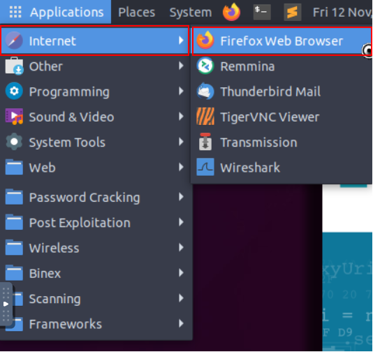

2. Navigate to the login form in the web browser using the vulnerable IP address (http://MACHINE_IP) (note that the IP address in the screenshots is only an example, you will need to replace this with the MACHINE_IP)

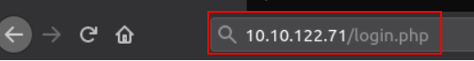

3. Let’s launch Burp Suite by navigating to “**Applications** -> **Other** -> **Burp Suite**"

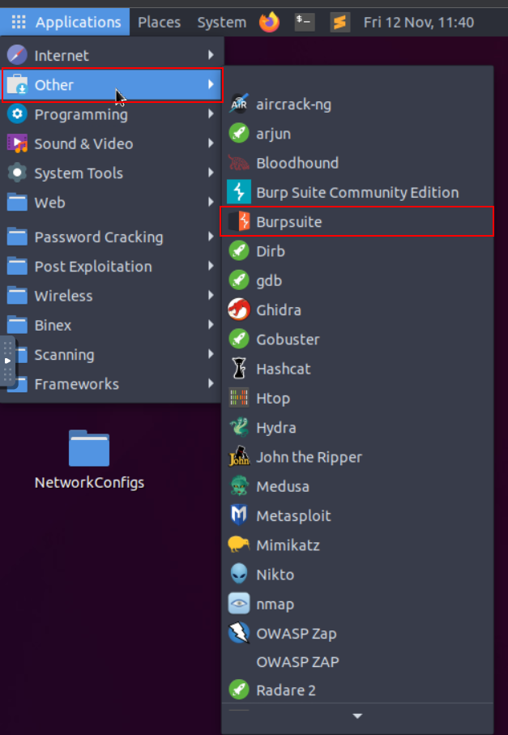

4. Navigate to the "**Proxy**" tab:

5. And press "**Intercept On**" in "**Proxy -> Intercept**"

6. Now we will need to return to our Firefox Browser and enable the FoxyProxy extension in Firefox. You can do this by pressing the “**FoxyProxy**” extension and pressing “**Burp**” like so:

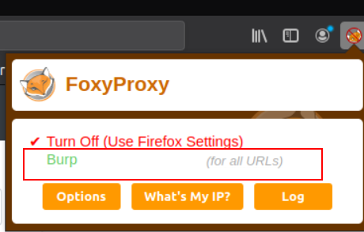

7. Submit some dummy data on the login form, such as below. Please note that the web browser will hang:

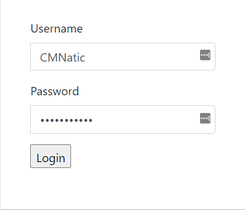

8. We will need to return to Burp Suite, where we will see some data has now been returned to us. Right-click the window containing the data and press “**Send to Intruder**”

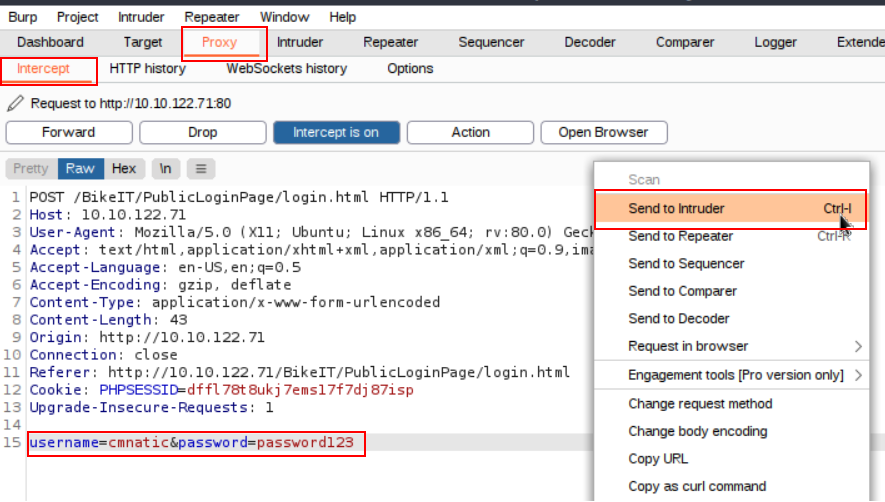

9. Navigate to the “**Intruder**” tab and select the following:

10.  

- Click the “**Positions**” tab and clear the pre-selected positions by pressing "**Clear $**"  
- Add the value of the "**username**" parameter as the first position, sometimes we will already know the username, other times we will not. We can tell Burp to use a wordlist of usernames for this position as well. However, as the username is already known (i.e. **cmnatic**), we are just brute-forcing the password. (this can be done by highlighting the password parameter and clicking “**Add $**”)  
- Add the “**password**” value as the position (**i.e. password123**) (this can be done by highlighting the value in the password parameter and clicking “**Add $**”)  
- Select “**Cluster Bomb**” in the Attack type in the dropdown menu.  
- We will now need to provide some values for Burp Suite to fuzz the login form with passwords. We can provide a list manually, or we can provide a wordlist. I will be providing a wordlist.

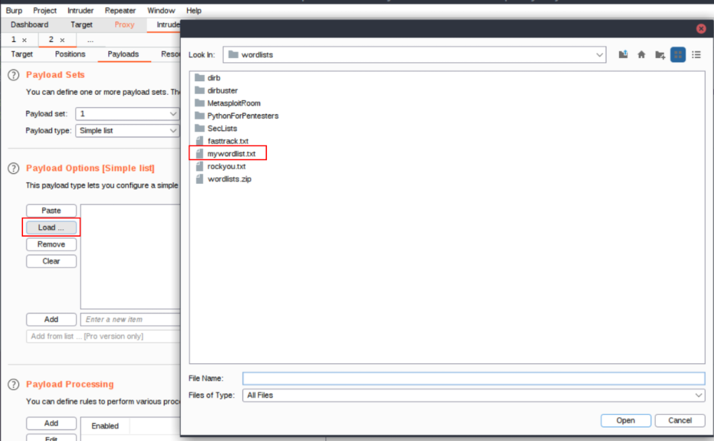

11. Now after selecting our wordlist, we can see that some passwords have filled the “Payload Options” window:

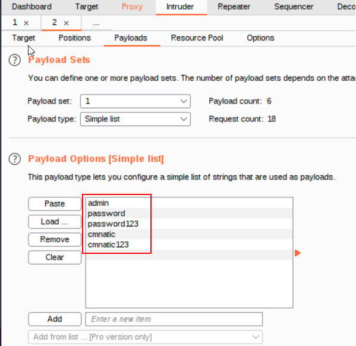

12. Now let’s press the “**Start Attack**” button, this will begin fuzzing the login form. Look at the results and sort by “Length”. Unsuccessful passwords will return a certain length, and successful passwords will return another length. You will need to examine the results with different lengths to determine the correct password in today’s task.

---

**Navigate to the vulnerable login form at http://MACHINE_IP/ and apply the material for today's task to login to Santa's itinerary**, using the **username as "santa" and the password list located at `/root/Rooms/AoC3/Day4/passwords.txt`** on the TryHackMe AttackBox (or download it from [here](https://assets.tryhackme.com/additional/aoc2021/day4/passwords.txt) for your payload.

## Additional Resources

If you are interested in learning more about Burp Suite, check out the [Burp Suite module](https://tryhackme.com/module/learn-burp-suite) on TryHackMe.

---

# Questions

> Access the login form at http://<vulnerable_machine_IP>

**No Answer Needed**

> Configure Burp Suite & Firefox, submit some dummy credentials and intercept the request. Use intruder to attack the login form.

**No Answer Needed**

> What valid password can you use to access the "santa" account?

Answer: **cookie**

> What is the flag in Santa's itinerary?

Answer: **THM{SANTA_DELIVERS}**

===============================================================================

Start by launching the **vulnerable machine attached to this task** and your **TryHackMe AttackBox**. You may launch your own VM instead of using TryHackMe Attackbox.

In your Attackbox or VM, launch the Burpsuite, and a web browser (with the burp proxy extension) and navigate to the <Vulnerable_Machine_IP> provided to you.

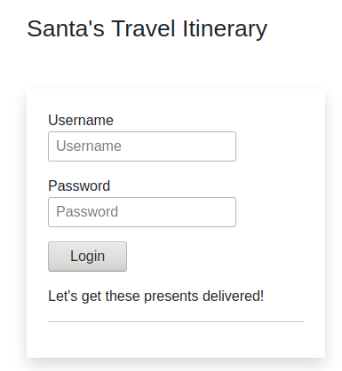

Ensure that the "intercept is on" on your Burpsuite and enable the burp proxy extension as instructed at step 5 and 6 respectively.

Submit dummy data and let the Burpsuite capture the POST method.

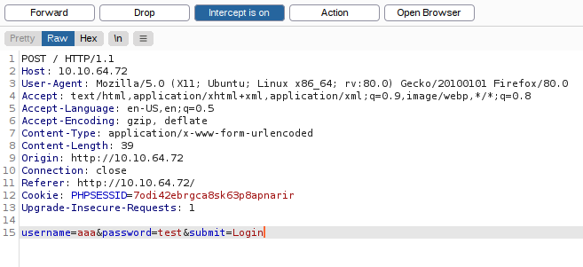

Right click the data window and send it to intruder.

Navigate to "intruder" tab, and go to the "Positions" tab.

Under the Attack Type, we will choose "Cluster Bomb" as instructed at step 10.

We are trying to access santa's account, so **username=$$**, password will be set to **password=$$**

Navigate to "Payloads" tab, and we will supply some simple passwords to fuzz by loading a password list from `/root/Rooms/AOC3/Day4/passwords.txt`. This list is already available at that filepath if you are using the TryHackMe AttackBox. Else you may download it [here](https://assets.tryhackme.com/additional/aoc2021/day4/passwords.txt).

For payload set "1", we will give it the definitive `santa` since the payload set 1 corresponds to the **username=$$**

For payload set "2", we will load the password list since this payload set corresponds to the **password=$$**

Start **attack now**.

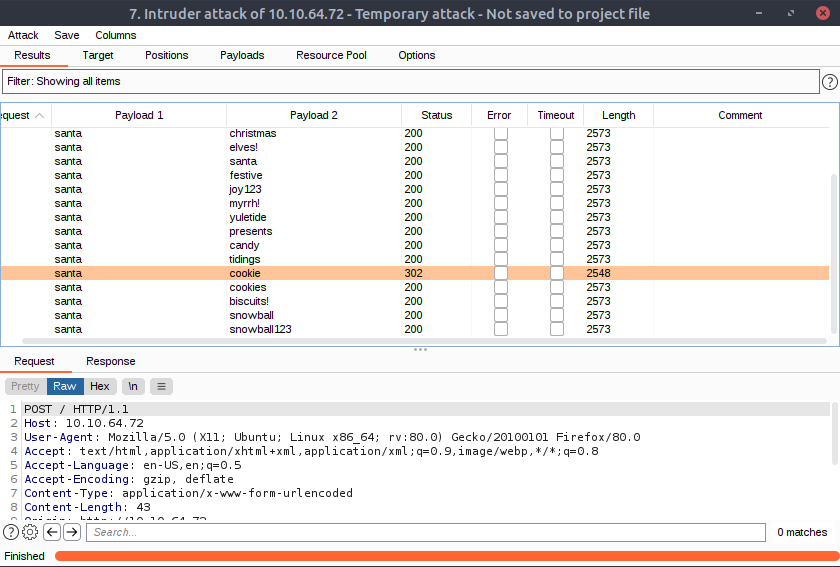

Notice how for the **santa**-**cookie** pair it has a lower length of **2548** compared to other lengths of **2573**

Using the **username=santa** and **password=cookie**, we can access Santa's account. (remember to disable the intercept or proxy or the website won't load)

