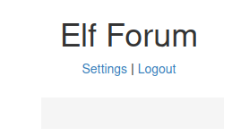

# Introduction

## Story

The Elf Forum is where all the elves express their joy and excitement about Christmas, but Grinch Enterprises has one bad admin account, and they've installed a plugin that changes all mentions of Christmas to Buttmas!! McSkidy needs to find that admin account and disable the plugin.

## Learning Objectives

1. What is an XSS vulnerability?  
2. What Types of XSS vulnerabilities are there?  
3. Challenge Walkthrough.  
---

## What is an XSS vulnerability?

Cross-Site Scripting, better known as XSS in the cybersecurity community, is classified as an injection attack where malicious JavaScript gets injected into a web application with the intention of being executed by other users.

If you can get JavaScript to run on a victim's computer, there are numerous things you can achieve. This can range from stealing the victim's cookies to take over their session, running a keylogger that will log every key the user presses on their keyboard while visiting the website, redirecting the user to a totally different website altogether or performing some kind of action on the website such as placing an order, or resetting their password etc.

## What types of XSS vulnerabilities are there?

XSS vulnerabilities fall into four different types; DOM, Reflected, Stored and Blind. Each type is quite a complex subject which we'll try and cover briefly here, but to gain a more in-depth understanding, you might want to try this room after completing the challenge https://tryhackme.com/room/xssgi

### DOM:

DOM stands for Document Object Model and is a programming interface for HTML and XML documents. It represents the page so that programs can change the document structure, style and content. A web page is a document, and this document can be either displayed in the browser window or as the HTML source.

DOM Based XSS is where the JavaScript execution happens directly in the browser without any new pages being loaded or data submitted to backend code. Execution occurs when the website JavaScript code acts on input or user interaction. An example of this could be a website's JavaScript code getting the contents from the `window.location.hash` parameter and then write that onto the page in the currently being viewed section. The contents of the hash aren't checked for malicious code, allowing an attacker to inject JavaScript of their choosing onto the webpage.

### Reflected:

Reflected XSS happens when user-supplied data in an HTTP request is included in the webpage source without any validation. An example of this could be an error message which is in a query string of an URL that is reflected onto the webpage. The URL could look something like the following:

The error message could be replaced with JavaScript code which gets executed when a user visits the page.

### Stored:

As the name infers, the XSS payload is stored on the web application (in a database, for example) and then gets run when other users visit the site or web page. This type of XSS can be particularly damaging due to the number of victims that may be affected. An example of this could be a blog that allows visitors to leave comments. If a visitor's message is not properly validated and checked for XSS payloads, then every subsequent visit to the blog page would run the malicious JavaScript code.

### Blind:

Blind XSS is similar to a stored XSS in that your payload gets stored on the website for another user to view, but in this instance, you can't see the payload working or be able to test it against yourself first. An example of this could be a contact form. In the contact form, your message could contain an XSS payload, which when a member of staff views the message it gets executed.

## Challenge Walkthrough

Click the green "Start Machine" button on the top right of this task. Once the machine has loaded, please click the following link:  
[https://LAB_WEB_URL.p.thmlabs.com](https://lab_web_url.p.thmlabs.com/) (if you receive an error, wait 30 seconds and try refreshing the page)

Here you'll find the elves forum where they talk about and spread the joy of Christmas! As you explore the forum and click on the different topics and threads, you'll notice that every mention of Christmas has been changed to Buttmas! This is because the grinch has an admin account and has installed a plugin that changes every mention of Christmas to Buttmas! You'll need to take over the Grinch account and disable the plugin to restore the Christmas joy!

First, click the login link towards the top of the page and log in with the following credentials:

Username: **McSkidy**

Password: **password**

Now that you're logged in you'll notice the navigation bar has now changed from Login to Settings and Logout.

Click on the Settings link, and you'll notice a feature for changing McSkidy's login password. Try changing your password to **pass123**. When you do this, you'll notice your address bar changes to look like the below screenshot (yours will have the IP address MACHINE_IP instead). If you can somehow trick the Grinch into visiting this URL, it will change their password to **pass123**.

Let's now go back to the forum and visit one of the threads. If you scroll to the bottom, you'll notice that you are able to leave a comment. Try leaving the following comment:

`hello <u>world</u>`

Once your comment is posted, you'll see that the word world has been underlined.

This means the comment is reflected as you wrote it without the underline HTML tags being stripped out. As this isn't being stripped out, you can try the HTML script tags instead to see if the website will run any JavaScript that is entered.

Using the URL, you found earlier for changing the user's password, you can try the following payload:

``

The ``

Upon pasting, you should see that there is an empty comment, because it was a statement within a script tag, meaning the script tag was not being disabled, and in fact, XSS scripting is working on the forum.

Next we log out and try to login as the **grinch**, with the **pass123* which we hoped he has entered the forum page that caused the XSS to run and changes his password into.

Username: **grinch**  
Password: **pass123**

Look for the plugin under `Settings` and disable it:

You will see the flag after disabling it

