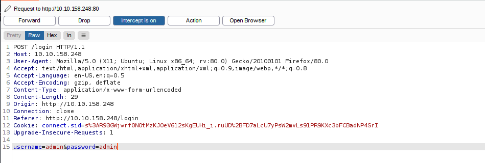

# Introduction

## Story

The development team that handles gift requests from Children migrated over to a new technology stack. In doing so, they left their application vulnerable, and Grinch Enterprises now controls access to the system. Fortunately, Grinch enterprises forgot to patch the system so you can use the same vulnerability to retrieve the gift requests for the students.

## Learning Objectives

1. What is NoSQL?  
2. Understanding NoSQL database  
3. Understand Why NoSQL happens  
4. Understand what NoSQL injection is  
5. Using NoSQL Injection to bypass a login form  
---

## What is NoSQL

A NoSQL database refers to a non-relational database that is short for `non SQL` and `Not only SQL`. It is a data-storing and data-retrieving system. NoSQL databases are commonly used nowadays for big Data and IoT devices due to their powerful features such as fast queries, ease of use to developers, scale easily, and flexible data structure. 

Today, we will cover the basic concepts of NoSQL databases and information gathering, enumeration, and exploiting NoSQL vulnerabilities.

## Understanding NoSQL

Various types of NoSQL databases can be covered, including MongoDB, Couchbase, RavenDB, etc. However, in this task, we will focus on `MongoDB` database, a free and popular document-store NoSQL database.

Similar to relational databases (such as MySQL and MSSQL), MongoDB consists of databases, tables, fields but with different names where 

- **Collections** are similar to tables or views in MySQL and MSSQL.  
- **Documents** are similar to rows or records in MySQL and MSSQL.  
- **Fields** are similar to columns in MySQL and MSSQL.

The following graph shows a visual example of these terms as we have a database named `AoC3` that has two collections: users, roles. The `users` collection has two documents (2 records). Documents in MongoDB are objects stored in a format called `BSON`, which supports `JSON` data types for document storing.

Also, it is useful to briefly look at and compare the query [operators](https://docs.mongodb.com/manual/reference/operator/query/) between MongoDB and MySQL:

- `$and` equivalent to `AND` in MySQL
- `$or` equivalent to `OR` in MySQL
- `$eq` equivalent to `=` in MySQL

## Interacting with a MongoDB server

**Note: To follow up with interacting with the MongoDB server, please deploy the attached machine and use the in browse access. If you're not seeing the in-browser screen boot up, use the Show Split View button at the top right of this page.**

Before we dive into the details of NoSQL injection, it is important to understand how MongoDB works in a general sense. Let's start with connecting to MongoDB on our deployed target machine using the default port `27017`. We will be creating a new database and collections as well as documents. 

Now let's use the `show` command to list all the databases that we have in MongoDB on our target machine:

Next, if we want to connect to a database, we can do this by using the `use` command. However, we will also show how to create a new database with collections and data. To create a new database, we also use the same `use` command to create and connect to it. Therefore, the use command is used to connect to a database if it exists or create a new one if it doesn't exist. Once the database is created, we can create two new collections, named users and roles using the `db.createCollection()` function, and then show all available collections within the database.

Next, we create a document within the `users` collection and insert data into it.

We successfully created two documents into `users` collection and then showed available documents within the collection using `db.users.find()`. Note that MongoDB automatically creates a unique ID called `_id` for each document within the collection from the above output. Let's also try to update the document as well as delete it using MongoDB commands. We will be using the `db.<collection>.update` function to update the document with `id=2` and update the username to be `tryhackme` and finally shows all documents to make sure our document gets updated.

Finally, let's remove the document using `db.users.remove()`  and then drop `db.users.drop()` the collection as follows,

Now that we know how to interact with the MongoDB server, look around by using the MongoDB commands we've learned, and find the flag to answer Question 1!

## What is NoSQL Injection?

Now that we have the basic knowledge of dealing with MongoDB commands to create databases and collections as well as insert, update, and delete documents, we will be discussing the NoSQL injection and the risks of having such vulnerability in the application. NoSQL injection is a web security vulnerability that allows the attacker to have control over the database. A NoSQL injection happens by sending queries via untrusted and unfiltered web application input, which leads to leaked unauthorized information. In addition, the attacker can use the NoSQL injection to perform various operations such as modifying data, escalating privileges, DoS attacks, and others.

## Bypassing login pages!

The logic of login pages is similar in most databases: first, connect to the database and then look for a certain username and password; if they exist in the collection (in the database), then we have a valid entry. The following is the query that is used in the web applications used on our login page:  `db.users.find({query})` or `db.users.findOne(query)` functions where the `query` is JSON data that's send via the application: `{"username": "admin", "password":"adminpass"}`. Note that when we provide the correct credentials, a document returns, while a `null` reply is received when providing the wrong credentials when nothing matches!

Before exploiting the NoSQL injection, there are MongoDB operators that we need to be familiar with that are heavily used in the injections, which are:

- `$eq` - matches records that equal to a certain value.  
- `$ne` - matches records that are not equal to a certain value.  
- `$gt` - matches records that are greater than a certain value.  
- `$where` - matches records based on Javascript condition.  
- `$exists` - matches records that have a certain field.  
- `$regex` - matches records that satisfy certain regular expressions.

Visit the [MongoDB website](https://docs.mongodb.com/manual/reference/operator/query/) for more information about the MongoDB operators. Next, we will be exploiting the logic of the login query by injecting a JSON object which includes one of the NoSQL operators, which is `$ne`. 

We injected a JSON objection `{"$ne": "XYZ"}`  in the password field, and we changed the logic to become as follows:

- We are telling MongoDB to find a document (user) with a username equal to `admin` and his password is `not equal to xyz`, which turns this statement to TRUE because the admin's password is not `xyz`.

As a result, we have successfully retrieved the document from MongoDB since our statement's logic is true. By applying this concept against a login page of a web application, we will be able to bypass the login page.

Now let's say if we wanted to log in to a system as another user who is not admin. In this case, we can also inject into a username field to be as follows,

If this were a login page, we would be logged in as a not `admin`, which is the `user`. We injected two JSON objects into a username as well as password fields: we are telling MongoDB to find a document that its username is `not equal to admin` and its password is `not equal to xyz`, which returns the statement as true.

## Exploiting NoSQL injection

To exploit NoSQL injection within the web application, first, you need to find an entry point that doesn't sanitize the user's input. Next, you need to understand how the web application passes the request to the database! Once you find an entry point, passing queries could be varied. Sometimes, the web app accepts the user's input via `GET` or `POST` queries, and sometimes web applications accept a `JSON` object, as is the case with `APIs`.

Injecting a NoSQL query has different forms if we deal with `GET` or `POST` queries than JSON objects but still have the same concept. Let's discuss how to inject into regular `GET` or `POST` requests. To interact with MongoDB via `GET` or `POST` is by injecting an array of the MongoDB operator to match the JSON objection to match the `Key:Value`. The following is an example of how to inject via URL:

> `http://example.thm.labs/search?username=admin&role[$ne]=user`

Note that we inject the MongoDB operator `[$ne](not equal)` in the `role` parameter. We can also use the same concept to pass the MongoDB operators in the `POST` requests.

We built a playground web application to search for the user(s) with a specific role! To perform NoSQL injection, first, you need to bypass the login page, as we discussed in the previous section.

Let's see the normal case where we search for username is equal `ben` with the `user` role.

> `http://example.thm.labs/search?username=ben&role=user`

As a result, the web application returns the expected result from MongoDB. Now let's inject MongoDB to show unexpected results! We will try to list all usernames that have a `user` role!

> `http://example.thm.labs/search?username[$ne]=ben&role=user`

As a result, the web application will return many records from MongoDB that satisfy the query. **It is practice time**; now make sure you have deployed the attached machine and the AttackBox (to use Burp), try to list all usernames that have `guest` roles. **Find the flag and answer question #2 below**

You can access and visit the website via the following link: `http://<VULNERABLE_MACHINE_IP>.p.thmlabs.com` or `http://<VULNERABLE_MACHINE_IP>` in case you're using the AttackBox.

# Questions

> Interact with the MongoDB server to find the flag. What is the flag?

**No Answer Needed**

> We discussed how to bypass login pages as an admin. Can you log into the application that Grinch Enterprise controls as `admin` and retrieve the flag?

> Use the knowledge given in AoC3 day 4 to setup and run Burp Suite proxy to intercept the HTTP request for the login page. Then modify the POST parameter.

Answer: **THM{b6b304f5d5834a4d089b570840b467a8}**

> Once you are logged in, use the gift search page to list all usernames that have guest roles. What is the flag?

Answer: **THM{2ec099f2d602cc4968c5267970be1326}**

> Use the gift search page to perform NoSQL injection and retrieve the mcskidy record. What is the details record?

Answer: **ID:6184f516ef6da50433f100f4:mcskidy:admin**

===============================================================================

Start by launching the **vulnerable machine attached to this task** and navigate on a new browser tab to [https://LAB_WEB_URL.p.thmlabs.com](https://lab_web_url.p.thmlabs.com/), where the <LAB_WEB_URL> is the IP address provided when you start the vulnerable machine.

Upon visiting the URL, you will encounter the page asking you to login:

we are given the username: `admin`, so we need to use burpsuite and change the `POST` parameter to look for the password.  
first we put `username=admin` and `password=admin`, and open burpsuite with intercept on, and switch on proxy capture on the browser:

once we receive the request, forward it to `Repeater` and edit the line such that:  
`username=admin&password[$ne]=admin`  
then press `send:  

Sometimes you will see a redirection as a response. If so, continue to send request until you see the text in green from screenshot above. That green text is the password to your admin account.

Login using that password to get to the dashboard:

The flag for Qn2 can be found in the `flag` link.

For Qn3, to find all usernames that have a `guest` role, we go to the search page, and enter a random username to search:

Look at the URL, we can see that the `username` and `role` are parameters in the URL. Applying what we learn previously on exploiting noSQL on web applications, we can change the URL to following:  
`http://<VULNERABLE_MACHINE_IP>/search?username[$ne]=se&role=guest`

We will obtain a list of usernames with the role `guest`. The flag for Qn3 is found within.

For last question, we just need to do another injection specifying for `mcskidy`:  
`http://<VULNERABLE_MACHINE_IP>/search?username=mcskidy&role[$ne]=aaa`

