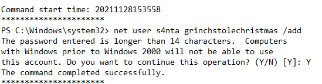

# Introduction

## Story

McSkidy was notified of some terrible news! Santa's laptop, which he uses to prepare his bag of toys for Christmas, is missing! We believe a minion at the Grinch Enterprise stole it, but we need to find out for sure. It is up to us to determine what actor compromised the laptop and recover Santa's bag of toys!

Unfortunately, The Best Festival Company had minimal monitoring tools on Santa's laptop (he is the boss, after all)! All we have to work with are some PowerShell Transcription Logs we were able to remotely recover just after it went missing. **You can find the transcription logs within the _SantasLaptopLogs_ folder on the Desktop of the attached Windows virtual machine.**

If you aren't familiar, PowerShell Transcription Logs capture the input and output of Windows PowerShell commands, allowing an analyst to review what happened when. Typically, PowerShell Transcription can be enabled by Group Policy, but another method to turn on this logging is by configuring the Windows Registry.

While you do not have to use these commands for this task, these will turn on PowerShell Transcription Logging for a local host if entered in an Administrator command prompt:

> reg add HKEY_LOCAL_MACHINE\Software\Policies\Microsoft\Windows\PowerShell\Transcription /v EnableTranscripting /t REG_DWORD /d 0x1 /f  
> reg add HKEY_LOCAL_MACHINE\Software\Policies\Microsoft\Windows\PowerShell\Transcription /v OutputDirectory /t REG_SZ /d C:/ /f  
> reg add HKEY_LOCAL_MACHINE\Software\Policies\Microsoft\Windows\PowerShell\Transcription /v EnableInvocationHeader /t REG_DWORD /d 0x1 /f

The Windows Registry is a large database of operating system settings and configurations. It is organized by "hives", with each hive containing "keys" and their corresponding "values." PowerShell Transcription Logging can be enabled in this way "per-user" via the `HKEY_CURRENT_USER` registry hive, or across the entire host via the `HKEY_LOCAL_MACHINE` registry hive. Thankfully, Santa's laptop had this enabled machine-wide!

**Note that for this task, you will interact with a Windows virtual machine to perform your analysis. For the sake of storyline, this is not Santa's laptop... rather, you have sample files that were recovered before the laptop was stolen.**

## Additional Resources
If you are interested in learning more about the Windows Fundamentals, check out the [Windows Fundamentals](https://tryhackme.com/module/windows-fundamentals) module on TryHackMe.

# Questions

> Read the premise above, start the attached Windows analysis machine and find the transcription logs in the _SantasLaptopLogs_ folder on the Desktop.
> 
> If you want to RDP into the machine, start the AttackBox and enter the following into a terminal: xfreerdp /u:Administrator /p:grinch123! /v:10.10.112.56 - The credentials for the machine are Administrator as the username, and grinch123! as the password.

**No Answer Needed**

> Each transcription log is a simple plain text file that you can open in any editor of your choice. While the filenames are random, you can get an idea as to which log "comes first" by looking at the Date Modified or Date Created attributes, or the timestamps just before the file extension!
> 
> Open the first transcription log. You can see the commands and output for everything that ran within PowerShell, like `whoami` and `systeminfo`!
> 
> What operating system is Santa's laptop running ("OS Name")?

Answer: **Microsoft Windows 11 Pro**
 
> Review each transcription log to get an idea for what activity was performed on the laptop just after it went missing. In the "second" transcription log, it seems as if the perpetrator created a backdoor user account!
> 
> What was the password set for the new "backdoor" account?

Answer: **grinchstolechristmas**

> In one of the transcription logs,  the bad actor interacts with the target under the new backdoor user account, and copies a unique file to the Desktop. Before it is copied to the Desktop, what is the full path of the original file? 

Answer: **C:\Users\santa\AppData\Local\Microsoft\Windows\UsrClass.dat**

> The actor uses a [Living Off The Land](https://lolbas-project.github.io/lolbas/Binaries/Certutil/) binary (LOLbin) to encode this file, and then verifies it succeeded by viewing the output file. What is the name of this LOLbin?

Answer: **certutil.exe**

> The `UsrClass.dat` file was encoded with Base64, which thankfully, you can decode and recover the original `UsrClass.dat` file!  Base64 decode the contents between the `-----BEGIN CERTIFICATE-----` and `-----END CERTIFICATE-----` markers within the transcription log with CyberChef, which you have a local copy of on the Desktop of your analysis machine. 
> 
> This file can be used to aid in our investigation. The `UsrClass.dat` file contains "Shellbags," or artifacts contained within the Windows registry that store user preferences while viewing folders within the Windows Explorer GUI. If you could carve out this information, you could get an idea as to what user activity was performed on the laptop before it was stolen or compromised! For more details and information on Shellbags, you are strongly encouraged to do some [extra reading](https://shehackske.medium.com/windows-shellbags-part-1-9aae3cfaf17) or research. :)
> 
> To extract the Shellbags information within this `UsrClass.dat file`, we will use the "[Shellbags Explorer](https://www.sans.org/tools/shellbags-explorer/)" graphical utility put together by [Eric Zimmerman](https://ericzimmerman.github.io/#!index.md). This utility is found readily available inside the `ShellBagsExplorer` folder on the Desktop of your Windows machine, with the application name `ShellBagsExplorer.exe`.
> 
> 
> 
> Read the above and open the ShellBagsExplorer.exe application found in the folder on your Desktop.

**No Answer Needed**

> With `ShellBagsExplorer.exe` open, use the top-bar menu to select `File -> Load offline hive` and navigate to the location of where you saved the decoded `UsrClass.dat`. Load in the `UsrClass.dat` file and begin to explore the Shellbags discovered!
> 
> 
> 
> Under the Desktop folder, there seems to be a suspicious folder named "SantaRat". Could this be a remote access trojan, that was used for further nefarious activity on Santa's laptop? Unfortunately, from just Shellbags alone, we only have insight into folder names (sometimes files, if we are lucky) and column data within Windows Explorer, but not files... how could we uncover more details?
> 
> Drill down into the folders and see if you can find anything that might indicate how we could better track down what this SantaRat really is. What specific folder name clues us in that this might be publicly accessible software hosted on a code-sharing platform?

Answer: **.github**

> Additionally, there is a unique folder named "Bag of Toys" on the Desktop! This must be where Santa prepares his collection of toys, and this is certainly sensitive data that the actor could have compromised. What is the name of the file found in this folder? 

Answer: **bag_of_toys.zip**

> Track down this SantaRat software online. It may be just as simple as searching for the name of the software on the suggested website (Github).
> 
> **Note that the TryHackMe Windows analysis machine does not have Internet access, so you will need to explore in your own web browser.**
> 
> 
> 
> What is the name of the user that owns the SantaRat repository?

Answer: **Grinchiest**

> Explore the other repositories that this user owns. What is the name of the repository that seems especially pertinent to our investigation?

Answer: **operation-bag-of-toys**

> Read the information presented in this repository. It seems as if the actor has, in fact, compromised and tampered with Santa's bag of toys! You can review the activity in the transcription logs. It looks as if the actor installed a special utility to collect and eventually exfiltrate the bag of toys. What is the name of the executable that installed a unique utility the actor used to collect the bag of toys?

Answer: **uharc-cmd-install.exe**

> In the last transcription log, you can see the activity that this actor used to tamper with Santa's bag of toys! It looks as if they collected the original contents with a [UHA](https://fileinfo.com/extension/uha) archive. A UHA archive is similar to a ZIP or RAR archive, but faster and with better compression rates. It is very rare to see, but it looks the Grinch Enterprises are pulling out all the tricks!
> 
> You can see the actor compressed the original contents of the bag of toys with a password. Unfortunately, we are unable to see what the specific password was in these transcription logs! Perhaps we could find it elsewhere...
> 
> Following this, the actor looks to have removed everything from the bag of toys, and added in new things like coal, mold, worms, and more!  What are the contents of these "malicious" files (coal, mold, and all the others)?

Answer: **GRINCHMAS**

> We know that the actor seemingly collected the original bag of toys. Maybe there was a slight OPSEC mistake, and we might be able to recover Santa's Bag of Toys! Review the actor's repository for its planned operations... maybe in the commit messages, we could find the original archive and the password!

**No Answer Needed**

> What is the password to the original bag_of_toys.uha archive? (You do not need to perform any password-cracking or bruteforce attempts)

Answer: **TheGrinchiestGrinchmasOfAll**

> McSkidy was able to download and save a copy of the `bag_of_toys.uha` archive, and you have it accessible on the Desktop of the Windows analysis machine. After uncovering the password from the actor's GitHub repository, you have everything you need to restore Santa's original bag of toys!! 
> 
> Double-click on the archive on the desktop to open a graphical UHARC extraction utility that has been prepared for you. Using the password you uncovered, extract the contents into a location of your choosing (you might make a "Bag of Toys" directory on the Desktop to save all the files into).
> 
> With that, you have successfully recovered the original contents of Santa's Bag of Toys! You can view these in the Windows Explorer file browser to see how many were present.
> 
> How many original files were present in Santa's Bag of Toys?

Answer: **228**

===============================================================================

Start by launching the **vulnerable machine attached to this task**

Open the `SantasLaptopLogs` on Desktop and open the logfile ending with `53510`. Scroll down to find the `OS NAME`:

For Qn2, open the logfile ending with `53538` and look for the password:

For Qn3, open the logfile ending with `53734` and look for the full path of the original file:

Using the same logfile, scroll down and find the `.exe` file for Qn4:

To answer Qn 6, First using back the same logfile ending with `53734`, we need to copy out the base64 encoded content between `-----BEGIN CERTIFICATE-----` and `-----END CERTIFICATE-----`, do not include these 2 lines.

Open the `CyberChef - Shortcut` offline page on Desktop and paste the content in the `input` section. Drag the `FROM BASE64` option into the `recipe` column and download the output file.  

Next, open the `ShellBagsExplorer` folder on Desktop, and execute the `ShellBagsExplorer.exe`.  
Choose `File - > Load offline hive` and load the output file that was download from CyberChef.

Expand `SantaRat` folder and you should find the hidden ".github" folder within.

For Qn 7, the answer can be found using the same `ShellBagsExplorer` and expand on the bag_of_toys.zip

Using own browser, google search with keywords `github` and `santarat` and you should find a github page with SantaRat repository. The username of this Github page is the answer for Qn8

Search the github user to find its other repositories for Qn9:

For Qn10, to find the executable that installed a unique utility the actor used to collect the bag of toys, open the logfile ending with `54858`. Scroll to find the `.exe` filename:

For Qn11, open the logfile ending with `55453` and check the `value` of these malicious toys:

For Qn13 to find the password of the original bag_of_toys.uha archive. Go back to the github page, and look through the past commits of the `operation-bag-of-toys` repository.  
expand the `...` beside the commit `stole Santa's bag of toys!!!!!!` and you should see the password

For last Qn, open the `bag_of_toys`.uha archive on Desktop, and enter the password found in the github page.

