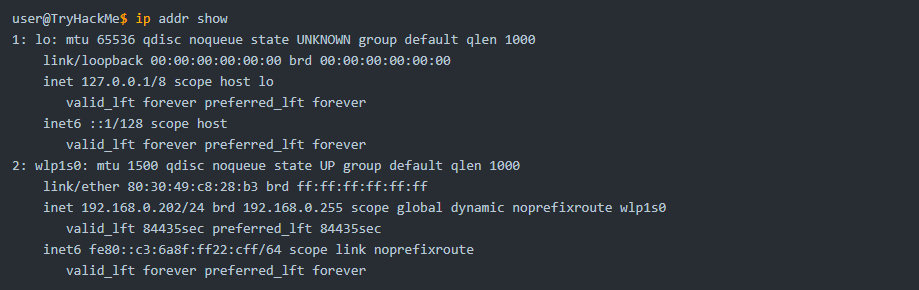
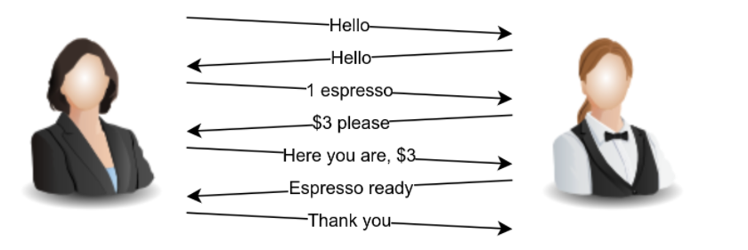
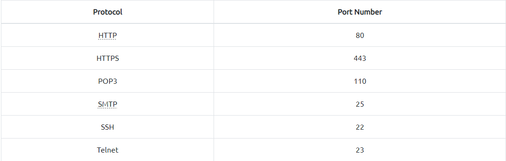
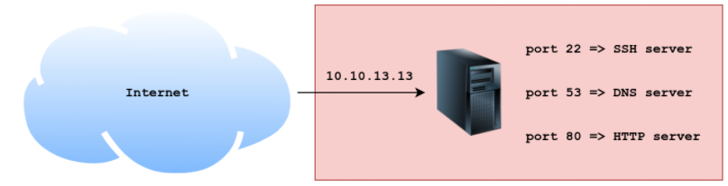
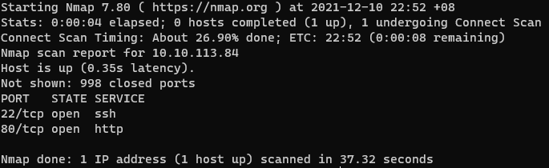
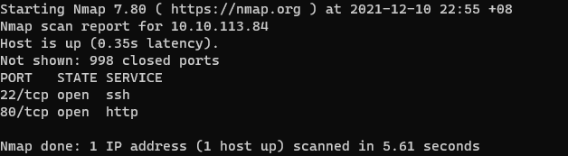
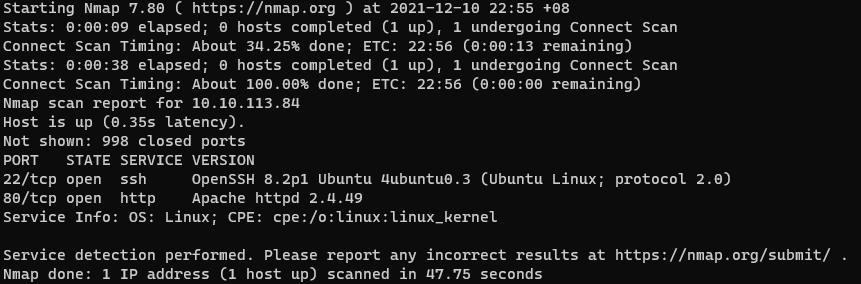
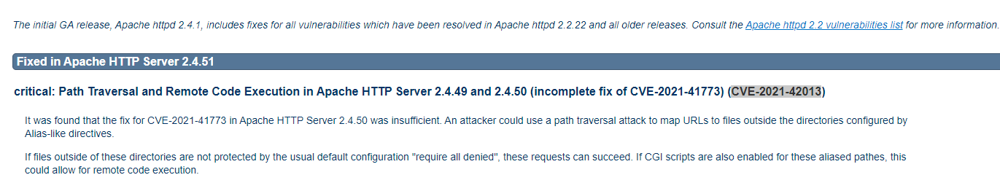
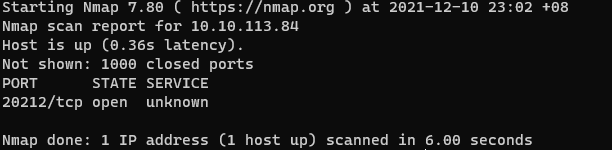
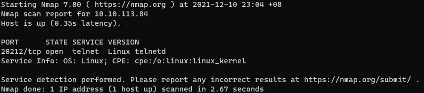

# Introduction

## Story

McSkidy is trying to discover how the attackers managed to penetrate the network and cause damage to the Best Festival Company’s infrastructure. She decided to start doing a security assessment of her systems to discover how Grinch Enterprises managed to cause this damage. She started by conducting a security assessment of her systems to discover how Grinch Enterprises managed to cause this damage and wonders what service they exploited.

Before McSkidy starts firing up Nmap, let’s review some keywords related to her task. If you are familiar with the terms IP address, protocol, server, and port number, feel free to skip the following three sections and start directly with the Nmap section.

## IP Addresses
Every computer (host) that connects to a network needs to have a logical address. For instance, a host can be any system with network access, such as a laptop, a smartphone, and a Raspberry Pi. We refer to this address as logical because it's assigned by software and could change over time, for example, when the host connects to a new network. The logical address, in this case, is the IP address.

IP stands for Internet Protocol. To keep things simple, we will consider Internet Protocol version 4 (IPv4). An IPv4 address is made up of 4 decimal numbers. The range for each number is from 0 to 255. Example IPv4 addresses are:

- 192.168.0.10  
- 172.16.0.100  
- 10.10.11.12  
- 1.1.1.1

The first 3 IP addresses in the list above are private, meaning that they can only be accessed from the private network they belong to. The last IP address, `1.1.1.1`, is a public IP address that can be accessed by the whole Internet and belongs to Cloudflare.

Some IP addresses serve a special purpose. For example, `127.0.0.1` is often referred to as the 'loopback address' or 'localhost'. By default, any packet or traffic destined to this address won't leave the host.

On Microsoft Windows, one way to find your IP address is by running `ipconfig` in the command prompt or PowerShell. On Linux and macOS, you can find your IP address by executing `ip address show` on the terminal. Note that `ip` will accept abbreviations of arguments such as `ip addr show` or even `ip a s`.

The terminal output above shows that this Linux system has a wireless adaptor with the IP address `192.168.0.202`.

If you want to learn more about computer networking, we recommend the [Network Fundamentals](https://tryhackme.com/module/network-fundamentals) module.

## Protocols and Servers

Let’s say that we want to set up a website and we've made it accessible to the whole Internet. In order to make our website accessible to the users on the Internet, a public IP address is required. A web server is a program that listens for incoming connections, usually from web browsers, and responds to their requests.

A server usually refers to a computer system that provides services to other clients, i.e. other computers, over a network. Example services include serving webpages, delivering email, and facilitating video conferencing.

For the client computer to communicate with the server, a specific protocol must be followed. Consider the following analogy. You want to order an espresso from a coffee shop for takeaway. The protocol to get an espresso might go as follow:

- Customer: Hello
- Barista: Hello
- Customer: I want one espresso, please
- Barista: That would be £3
- Customer: Here you are, £3
- Barista: Thank you. Your espresso is ready.
- Customer: Thank you.

Since I follow this “protocol”, other customers might follow a slightly different “protocol” based on the coffee shop and the country’s culture. Some might skip the “hello” at the beginning or drop the “thank you” at the end. In the human world, this would still work; however, for computers, we need to adopt a strict protocol that both clients and servers need to adhere to. This is why we have standard protocols for computers.

To name a few, these are some example TCP/IP protocols:

- Hypertext Transfer Protocol (HTTP) for serving webpages
- Domain Name System (DNS) for resolving hostnames to IP addresses
- Post Office Protocol version 3 (POP3) for delivering email
- Simple Mail Transfer Protocol (SMTP) for sending email
- Telnet for remote login
- Secure Shell (SSH) for secure remote login

Each of these protocols are defined in detail in a Request for Comment (RFC) document. If you want to know more about these protocols, we suggest joining the [Protocols and Servers](https://tryhackme.com/jr/protocolsandservers) room.

## Ports

On a host, multiple processes (programs) can be accessing the network at the same time. These processes can use the network simultaneously. For the host to tell which process receives which packet, we need to use port numbers. To better understand the concept of IP addresses and port numbers, let’s consider the following analogy.

Let’s imagine TryHackMe’s company in London, and let’s imagine there are 100 offices for 100 content engineers there. The company address is like a public IP address. With the company address, the mailman (analogy for a router) knows how to reach the company and deliver mail packages. The port number is like the office number within the company. The mailman can deliver to the company address and hand it to the receptionist; however, a TryHackMe employee will deliver the package to the internal office.

When multiple processes are using the network or Internet simultaneously, each process can be recognized by the port number it is using. In public servers, default port numbers are used by different protocols so that clients don’t need to guess. The table below shows some of the common protocols and the port numbers they use by default.

Consider the figure below. IP packets coming to the server with the IP address `10.10.13.13` will be delivered to the running process based on the destination port number.

- For packets of type TCP with port number 22, the destination process is the SSH server.
- For packets of type TCP with port number 80, the destination process is the HTTP server.
- For packets of type UDP (or TCP) with port number 53, the destination process is the DNS server.

We will not cover TCP and UDP in detail in this task. All you need to know for now is that these two protocols live on top of the IP protocol and connect processes running on different hosts. Moreover, TCP requires a three-way handshake for a connection to be established, while UDP does not.

## Nmap

McSkidy wants to discover what the attacker learned about her hosts and servers. She starts the AttackBox and starts the attached Virtual Machine (VM), and waits for both to fully load.

She wants to check which services she has installed on the VM. On the AttackBox, she opens a terminal and rushes to run an Nmap scan against the VM. McSkidy can run a very basic network port scan using the command `nmap -sT MACHINE_IP` or `nmap -sS MACHINE_IP`. By default, Nmap checks the 1000 most common TCP ports.

- TCP Connect Scan: To run this type of scan, the `-sT` option is required. Nmap will attempt to complete the three-way handshake in order to establish a connection with each port scanned.
- TCP SYN Scan: You can select this scan with the `-sS` option, and Nmap will not make a complete connection if the port is open. Technically speaking, Nmap does not complete a TCP three-way handshake.

To better understand the difference between `-sT` and `-sS`, we can use the analogy of knocking on a door. The TCP connect scan (`-sT`) is like knocking on a door, waiting for someone to open it, greeting each other, then excusing yourself to leave. The TCP SYN scan (`-sS`) resembles knocking, and once someone answers, you pretend that it was not you that knocked and walk away innocently. The latter will make it more difficult for the other party to remember you.

---
# Questions

> Help McSkidy and run `nmap -sT MACHINE_IP`. How many ports are open between 1 and 100?

Answer: **2**

> What is the smallest port number that is open?

Answer: **22**

> What is the service related to the highest port number you found in the first question?

Answer: **http**

> Now run `nmap -sS MACHINE_IP`. Did you get the same results? (Y/N)

Answer: **T**

> If you want Nmap to detect the version info of the services installed, you can use `nmap -sV MACHINE_IP`. What is the version number of the web server?

Answer: **Apache httpd 2.4.49**

> By checking the [vulnerabilities related to the installed web server](https://httpd.apache.org/security/vulnerabilities_24.html), you learn that there is a critical vulnerability that allows path traversal and remote code execution. Now you can tell McSkidy that Grinch Enterprises used this vulnerability. What is the CVE number of the vulnerability that was solved in version 2.4.51?

Answer: **CVE-2021-42013**

> You are putting the pieces together and have a good idea of how your web server was exploited. McSkidy is suspicious that the attacker might have installed a backdoor. She asks you to check if there is some service listening on an uncommon port, i.e. outside the 1000 common ports that Nmap scans by default. She explains that adding `-p1-65535` or `-p-` will scan all 65,535 TCP ports instead of only scanning the 1000 most common ports. What is the port number that appeared in the results now?

Answer: **20212**

> What is the name of the program listening on the newly discovered port?

Answer: **telnetd**

> If you would like to learn more about the topics covered in today’s tasks, we recommend checking out the Network Security module.

**No Answer Needed*

===============================================================================

Start by launching the **Vulnerabile machine** and **AttackBox**.

Using the AttackBox, enter the command: `nmap -sT <VULNERABLE_MACHINE_IP>`

Two ports are open: `22` and `80`

Now run another command: `nmap -sS <VULNERABLE_MACHINE_IP>`  
**Note: You may need to use _sudo_ to run the command**

You will get the same result as the previous command.

Next, run the following command to find version info of services installed: `nmap -sV <VULNERABLE_MACHINE_IP>`

Next, visit this [website](https://httpd.apache.org/security/vulnerabilities_24.html) to find the CVE number of the vulnerability that was fixed in Apache version 2.4.51

To scan for ports outside the range top 1000 common ports, add the flag `-p-` or `-p1-65535`. Enter the following command: `nmap -sT <VULNERABLE_MACHINE_IP> -p-`  
**Note: you may use `-T4` or `-p20000-30000` to speed up the process**

Use this command to find the program listening on the newly discovered port: `nmap -sV <VULNERABLE_MACHINE_IP> -p20212`

