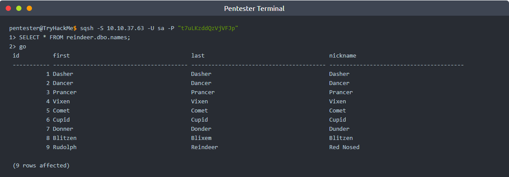

# Introduction

## Story

Before we begin, we suggest that you start the attached Machine and the AttackBox as you will need to use these resources to answer the questions at the end.

McDatabaseAdmin came rushing into the room and cried to McSkidy, “We’ve been locked out of the reindeer schedule - how will Santa’s transportation work for Christmas?” The grinch has locked McDatabaseAdmin of his system. You need to probe the external surface of the server to see if you get him his access back.

MS SQL Server is a Relational Database Management System (RDBMS). One simple way to think of a relational database is a group of tables that have relations. To gain a rough understanding of relational databases work, consider a shop's database with the following three tables:

1. Electronic Items
2. Customers
3. Invoices

Each item in the Electronic Items table has:
- ID
- Name
- Price
- Quantity

Each item in the Customers table has its own attributes as well:
- ID
- Name
- Email
- Phone

Finally, the Invoices table will refer to a customer and one or more electronic items. The Invoice table will refer to an “entity” from another table using its ID. This way, we only need to have the customer details and electronic item details written once instead of copying them to each new invoice. This case is a simplified example of a relational database. The figure below shows how the three tables are related.

The transportation schedule is in the reindeer database. However, McDatabaseAdmin can no longer log in to his system after the grinch changed the system password. Let’s see how we can help. Make sure you have started the attached Machine along with the AttackBox. Give them a few minutes to fully start before proceeding to answer the following questions.

---
# Questions

> You decided that the first step would be to check the running services on `MACHINE_IP`. You resort to yesterday’s tool, Nmap.
> 
> Knowing that `MACHINE_IP` is a MS Windows system, you expect it to not respond to ping probes by default; therefore, you need to add `-Pn` to your `nmap` command to perform the scan. This instructs Nmap to skip pinging the target to see if the host is reachable. Without this option, Nmap will assume the target host is offline and not proceed with scanning.
> 
> There is an open port related to MS SQL Server accessible over the network. What is the port number?

Answer: **1433**

> Knowing the MS SQL Server is running and accessible over the network, we want to check if our username and password are still valid. Using the AttackBox terminal, we will use the command `sqsh` (pronounced skwish), an interactive database shell.
> 
> A simple syntax would be `sqsh -S server -U username -P password`, where:
> 
> `-S server` is used to specify the server, for example -S MACHINE_IP  
> `-U username` is used to provide the username; for example, -U sa is the username that we have enabled.  
> `-P password` lets us specify the password.
> 
> Let’s try to run, `sqsh -S MACHINE_IP -U sa -P t7uLKzddQzVjVFJp`
> 
> If the connection is successful, you will get a prompt. What is the prompt that you have received?

Answer: **1>**

> McDatabaseAdmin told us the database name is `reindeer` and it has three tables:
> 
> 1. `names`
> 2. `presents`
> 3. `schedule`
> 
> To display the table `names`, you could use the following syntax, `SELECT * FROM table_name WHERE condition`.
> 
> - `SELECT *` is used to return specific columns (attributes). `*` refers to all the columns.
> - `FROM table_name` to specify the table you want to read from.
> - `WHERE condition` to specify the rows (entities).
> 
> In the terminal below, we executed the query, `SELECT * FROM reindeer.dbo.names;`. This SQL query should dump all the contents of the table `names` from the database `reindeer`. Note that the `;` indicates the end of the SQL query, while `go` sends a SQL batch to the database.
> 
> 
> 
> We can see four columns in the table displayed above: id, first (name), last (name), and nickname. What is the first name of the reindeer of id 9?

Answer: **Rudolph**

> Check the table schedule. What is the destination of the trip scheduled on December 7?

Answer: **Prague**

> Check the table presents. What is the quantity available for the present “Power Bank”?

Answer: **25000**

> You have done fantastic work! You have helped McDatabaseAdmin retrieve the schedule! Now, let’s see if we can run MS Windows commands while interacting with the database. Some MS SQL Servers have `xp_cmdshell` enabled. If this is the case, we might have access to something similar to a command prompt.
> 
> The command syntax is `xp_cmdshell 'COMMAND'`;. Let’s try a simple command, `whoami`, which shows the user running the commands. In the terminal output below, after connecting to MS SQL Server, we tried `xp_cmdshell 'whoami'`;, and we can see that the user is `nt service\mssqlserver`. This means that any command we pass to `xp_cmdshell` will run as `nt service\mssqlserver`.
> 
> 
> 
> We can run other commands that we can execute on the MS Windows command line. For example, we can use `dir` to list files and directories and `type filename` to display the contents of a file. Consider the example in the terminal window below where we reveal the contents of the text file `WindowsUpdate.log`.
> 
> 
> 
> There is a flag hidden in the `grinch` user's home directory. What are its contents?

Answer: **THM{YjtKeUy2qT3v5dDH}**

> Congratulations, the flag you have recovered contains the password of `McDatabaseAdmin`! In this task, we learned how to use `sqsh` to interact with a MS SQL Server. We learned that if `xp_cmdshell` is enabled, we can execute system commands and read the output using `sqsh`.

**No Answer Needed*

===============================================================================

Start by launching the **Vulnerabile machine** and **AttackBox**.

Using the AttackBox, enter the command: `nmap -Pn <VULNERABLE_MACHINE_IP>`

The open ports are: `22`, `135`, `1433`, and `3389`. One of them is related to MS SQL server, which is port `1433`.

Now run another command for Qn2: `sqsh -S <VULNERABLE_MACHINE_IP> -U sa -P t7uLKzddQzVjVFJpS `  

For Qn3, run the following commands:  
`SELECT * FROM reindeer.dbo.names;`  
`go` - to send the SQL query

For Qn 4: run the following commands:  
`SELECT * FROM reindeer.dbo.schedule;`  
`go`

For Qn5: run the following commands:  
`SELECT * FROM reindeer.dbo.presents;`  
`go`

For Qn6: we need to run some `xp_cmdshell` commands to find the flag. Run the following commands:  
`xp_cmdshell 'type c:\Users\grinch\Documents\flag.txt';`  
`go`

