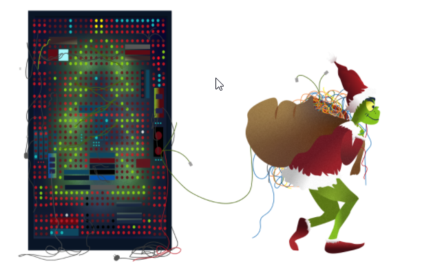
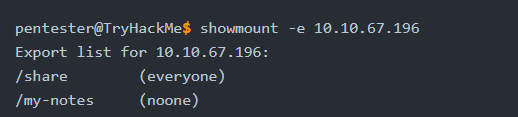
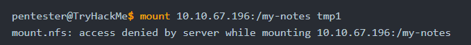
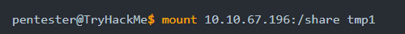
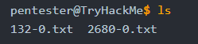
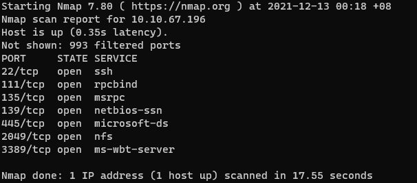
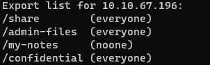
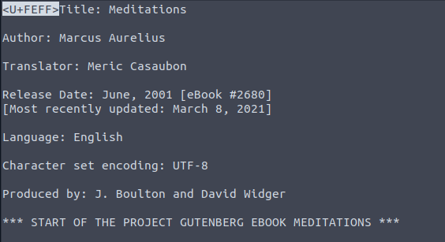
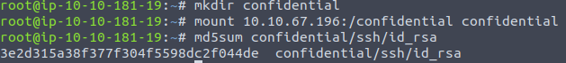

# Introduction

## Story

Before we begin, we suggest that you start the attached Machine and the AttackBox as you will need to use these resources to answer the questions at the end.

Grinch Enterprises has been leaving traces of how their hackers have been accessing data from the system - you’ve found a unique server they use. We need your help to find out what method they’ve been using to extract any data.

We have noticed that `MACHINE_IP` is generating unusual traffic. We highly suspect that Grinch Enterprises are using it to access our data. We will use Nmap to discover the services are running on their server.

---
# Questions

> Scan the target server with the IP `MACHINE_IP`. Remember that MS Windows hosts block pings by default, so we need to add `-Pn`, for example, `nmap -Pn MACHINE_IP` for the scan to work correctly. How many TCP ports are open?

Answer: **7**

> Network File System (NFS) is a protocol that allows the ability to transfer files between different computers and is available on many systems, including MS Windows and Linux. Consequently, NFS makes it easy to share files between various operating systems.
> 
> In the scan results you received earlier, you should be able to spot NFS or mountd, depending on whether you used the -sV option with Nmap or not. Which port is detected by Nmap as NFS or using the mountd service?

Answer: **2049**

> Now that we have discovered an NFS service is listening, let’s check what files are being shared. We can do this using the command `showmount`. In the terminal below, we run `showmount -e <MACHINE_IP>`. The `-e` or `--exports` show the NFS server’s export list.
> 
> 
> 
> As we can see in the terminal output above, we have two shares, `/share` and `/my-notes`. After you have started the attached machine, use the AttackBox terminal to discover the shares on `<MACHINE_IP>`.
> 
> How many shares did you find?

Answer: **4**

> How many shares show “everyone”?

Answer: **3**

> Let’s try to mount the shares we have discovered. We can create a directory on the AttackBox using `mkdir tmp1`, where `tmp1` is the directory’s name. Then we can use this directory  we created to mount the public NFS share using: `mount <MACHINE_IP>:/my-notes tmp1`.
> 
> 
> 
> We can see that the mounting has failed. `my-notes` is not public and requires specific authentication mechanisms that we don’t have access to. Let’s try again with the other folder, `share`.
> 
> 
> 
> We didn’t get any error messages, so it was a success. Let’s go inside the share to see what’s inside it using `cd tmp1`, then `ls`.
> 
> 
> 
> There are two text files. We can open the file using any text editor such as `nano FILENAME` or something quicker such as `less FILENAME`.
> 
> What is the title of file 2680-0.txt?

Answer: **Meditations**

> It seems that Grinch Enterprises has forgotten their SSH keys on our system. One of the shares contains a private key used for SSH authentication (`id_rsa`). What is the name of the share?

Answer: **/confidential**

> We can calculate the MD5 sum of a file using `md5sum FILENAME`. What is the MD5 sum of `id_rsa`?

Answer: **3e2d315a38f377f304f5598dc2f044de**

===============================================================================

Perform the following command to get answer for Qn1 and Qn2:  
`nmap -Pn <MACHINE_IP>`

For Qn3 and Qn4, run the following commands:  
`showmount -e <MACHINE_IP>`

For Qn5, run the following commands:  
`mkdir tmp1`  
`mount <MACHINE_IP>:/share tmp1`  
`less tmp1/2680-0.txt`

Use back the following commands to find answer to Qn6:  
`showmount -e <MACHINE_IP>`

For Qn7, run the following commands:  
`mkdir confidential`  
`mount <MACHINE_IP>:/confidential confidential`  
`md5sum confidential/ssh/id_rsa`

