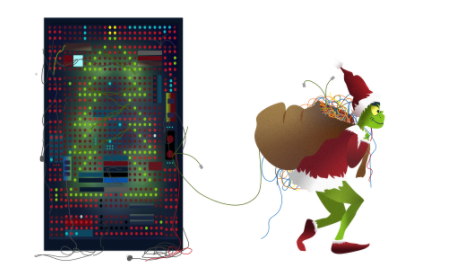
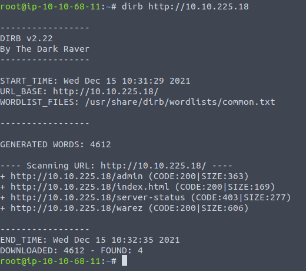
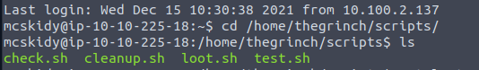
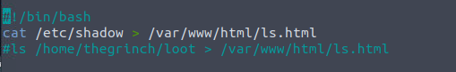
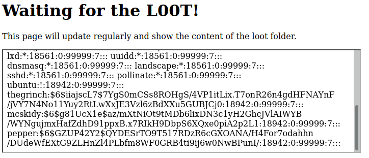
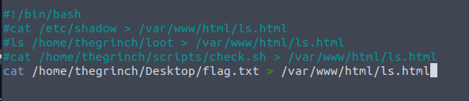
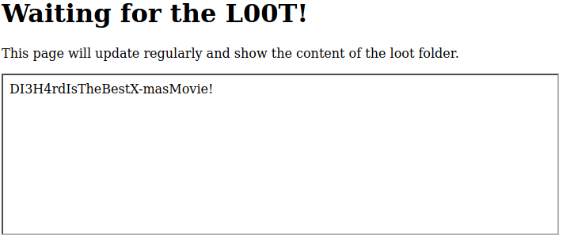

# Introduction

## Story

McDev - the head of the dev team, sends an alarming email stating that they're unable to update the best festival company's external web application. Without this update, no one can view the Best Festival Company's plan. The dev team has been using a CI/CD server to automatically push out updates to the server but the CI/CD server has been compromised. Can you help them get their server back?

## Learning Objectives

1. Understanding the CI/CD concept
2. Overview of risks associated with CI/CD
3. Having a basic understanding of CI/CD exploitation vectors

--- 

## What is CI/CD?

CI/CD are two terms that will often come up when talking about software development and DevOps. Their definitions are pretty straightforward.
CI: Continuous Integration is the process in which software source code is kept in a central repository (such as GitHub). All changes are stored in this central repository to avoid ending up with different versions of the same code.
CD: Continuous Delivery is the following (sometimes integral) step of the continuous integration model where code is automatically deployed to the test, pre-production, or production environments. CD is sometimes used as an acronym for "Continuous Deployment". If you feel like the terms above don't seem to have clear limits, you are right. CI, CD, and the other CD are all part of DevOps best practices that aim to make code delivery faster and more reliable.

CI/CD should be considered as a set of practices that are put in place to enable development teams to make changes, test their code, and deploy the application more reliably.

We should think of CI/CD as a continuous process or loop that includes steps of the software development process.

## Risks Associated with CI/CD

The CI/CD integration approach seems to be an effective way to mitigate risks that may result from manually aggregating changes made to the code, manually testing them, and manually deploying the updated version of the application. However, some risks associated with the CI/CD process should be taken into consideration when dealing with such an integration. As a penetration tester, one of our goals would be to uncover weaknesses in the automation process. These can vary from file permissions to configuration errors made when installing any CI/CD automation software. DevOps teams typically use software such as Jenkins, GitLab, Bamboo, AWS CodePipeline, etc., to automate CI/CD steps summarized above.

Major risks related to a CI/CD integration are mentioned below:  
- Access security: The increasing number of integration points can make access management difficult. Any component integrated with the process may need partial or full access to another component. In this case, allowing too much access can also open a path for malicious activity.
- Permissions: Components are connected with each other and perform their tasks with user accounts. Similar to access security, user permissions should be checked.
- Keys and secrets: Many integrations are done using keys (API keys, ID keys, etc.) or secrets. These should be secured. Otherwise, anyone could potentially access resources using this authentication method.
- User security: User accounts are another successful attack vector often used by cybercriminals. Any user who has access to the source code repository could include a malicious component in the codebase and could be included in the deployed application.
- Default configuration: Some platforms are known to have default credentials and vulnerabilities. If the default credentials are not changed, and in use within the CI/CD process, this could result in the complete compromise of the infrastructure.

## The Grinch CI/CD

The Grinch has put his own version of a CI/CD pipeline in place. He has used BASH scripts and scheduled jobs to automate the process. Let's dive in.

Visiting MACHINE_IP from your browser will show the Grinch is waiting for the loot, but not here.

At this stage, we can run a `dirb` scan to discover the MACHINE_IP/admin page, which looks more promising.

Looking at the source code, we see something interesting. There is an iFrame that refers to the `ls.html` page. This page seems suspiciously close to the output from running the `ls` command.

Connect to the target machine using in-browser access or via `SSH` with the credentials below:  
username: **mcskidy**  
password: **Password1**

Navigating to the `/home/thegrinch/scripts` folder and running the `ls` command will show that most of the scripts in the folder are not accessible by the McSkidy user.  
The content of the `loot.sh` script gives us a clearer understanding of the `ls.html` file we have located earlier.

The code is simple; it runs the `ls` command and prints the output to the ls.html file. The Grinch can browse the page from anywhere within the network to see the loot he has accumulated.  
Clever, this Grinch. However, there seems to be a problem regarding the permissions of his continuous integration attempt. McSkidy can change the contents of the `loot.sh` file.

Change the code in the file to print the contents of the `/etc/shadow` file. This will be conclusive proof that this permission misconfiguration not only creates a threat for the CI process but can also be used to escalate our privileges. If you are interested in learning more about privilege escalation techniques, please visit our Linux Privilege Escalation room.

This misconfiguration can be leveraged to read the contents of the Grinch's other scripts.  
Let's have a look at the `check.sh` script using the vulnerability we have used to read the `/etc/shadow` file.

Within a couple of minutes, the MACHINE_IP/admin page will be updated to reveal the code of the `check.sh` script.

This script checks for the existence of a file named `remindme.txt` in the loot folder. If it finds the file, it prints the Grinch's password to an HTML file that will appear in <MACHINE_IP>/pass.html

Grinch's memory isn't what it used to be.

Alternatively, McSkidy could create a file named `remindme.txt` in the `/home/thegrinch/loot` folder and wait for the automation to work its magic.
Can you answer question 4 using this vector?

## Lessons Learned

This CI/CD simulation aimed to help showcase major types of vulnerabilities that are often seen in CI/CD automation. A locally installed Jenkins application can have an unpatched component deployed for various operational reasons. However, it is rare that a critical vulnerability remains unpatched for an extended period of time on infrastructure managed by a cloud service provider such as Amazon, Azure, or Google. This is the main reason you will more often see vulnerabilities being a result of improper access management, lax account privileges, or logic flaws.

In the example above, we have seen:  
- **Folder permissions that were too lax**: The low privileged McSkidy user could write to the Grinch's "loot" folder.
- **File permissions were misconfigured**: The low privileged McSkidy user could change the contents of the loot.sh script.
- **Improper key protection**: In this example, Grinch's password can be seen as the secret key used to connect CI/CD components. If the key can be read from a configuration file, the attacker can reuse this key to their advantage.
- **Installation was not secure**: cronjobs were regularly running tasks without any controls for unauthorized changes. As you may have read in sector news, a similar lack of controls has led to the release of backdoored software.

---
# Questions

> How many pages did the dirb scan find with its default wordlist?

Answer: **4**

> How many scripts do you see in the /home/thegrinch/scripts folder?

Answer: **4**

> What are the five characters following $6$G in pepper's password hash?

Answer: **ZUP42**

> What is the content of the flag.txt file on the Grinch's user’s desktop?

Answer: **DI3H4rdIsTheBestX-masMovie!**

===============================================================================

Start both the **Vulnerable Machine** and **AttackBox**

On the Attackbox, run the following command:  
`dirb http://<Machine_IP>`

Run the following command to SSH into the Vulnerable Machine:  
`ssh mcskidy@<Machine_IP>` --password: **Password1**

Once in the server, run the following to find out the number of scripts in `/home/thegrinch/scripts` folder:  
`cd /home/thegrinch/scripts`  
`ls`  

Edit the code in `loot.sh` using the following commands:  
`nano loot.sh` -- you can use any other text editor like VIM  
insert `cat /etc/shadow > /var/www/html/ls.html` and comment out the `ls /home.... /ls.html` line.

Save and browse to `http://<Machine_IP>/admin`:  

Edit the code in `loot.sh` again to look at `check.sh`:  
insert `cat /home/thegrinch/Desktop/flag.txt > /var/www/html/ls.html` and comment out the previous command.

Save and browse to `http://<Machine_IP>/admin`:  

