# Introduction

## Story

Grinch Enterprises has decided to use the best festival company to try their new ransomware service. While they think that this is a great proving ground, McSkidy is adamant to determine their goals and share them with the wider security community - can you use your open source intelligence methods to find out more information about their ransomware gang!

## Learning Objectives

- Understanding what OSINT is and where it originates
- Understand the implications of OSINT and how it can be used for reconnaissance and information gathering
- Learn how to conduct an OSINT investigation to gather information on an individual

OSINT stands for Open Source Intelligence, information that can be obtained from free and public sources. Offensive teams commonly use OSINT to perform reconnaissance on a target, an individual, or a corporation. Agencies and law enforcement can also leverage OSINT to gather information.

OSINT may seem scary at first; where do I find this information? Will I get in trouble? No need to worry; most OSINT operations are straightforward using tools you are already familiar with on the clearnet.

OSINT is an extensive-term. It is an overarching term of many different intelligence disciplines; however, in this task, we will be covering the topic as it is commonly known. Information is at the core of OSINT; information is typically found in two places,

Clearnet: This refers to anything you can publicly access from your traditional web browser, including,
- Facebook
- Twitter
- GitHub

Darknet: The darknet is accessed using special software and requires additional configuration; it is most commonly used by privacy-minded individuals, whistleblowers, censored people, criminals, journalists, and government law enforcement agencies. Below are a few examples of what the darknet has to offer,
- TOR
- Freenet
- I2P
- IPFS
- Zeronet

In this task, we will be focusing on how we can leverage the clearnet to our advantage to gather information on a specified target. The clearnet is more often used due to the vast amount of public data.

Information used in OSINT originates from your digital footprint. This may seem like a "buzz" word, but it is key to why OSINT can be rewarding. When conducting OSINT, we look at what data a target left behind to lead us to the information/objective we are seeking.

## OSINT Process Cycle

When conducting an OSINT investigation, each individual and team will have their methodology to approach the task. The approach to OSINT can be quantified through models and systematic steps to follow. We will briefly look at two RIS OSINT information models from this [research paper](https://arnoreuser.com/wp-content/uploads/2018/12/201712-The-RIS-OSINT-Intelligence-Cycle.pdf).

The RIS OSINT data-information model outlines an approach to gathering information to identify and categorize data.

Intelligence is obtained from information that is obtained from data. Intelligence will ultimately lead you or your customer to a decision. This decision will determine where in the next model you will move. 

The RIS OSINT Roller Coaster outlines phases of an OSINT investigation centering around the client. This is an ever-evolving process that will change and continue depending on intelligence and decisions from the previous model.

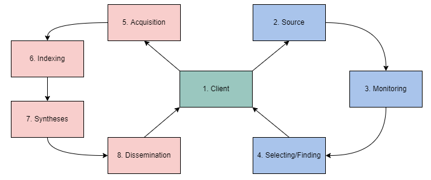

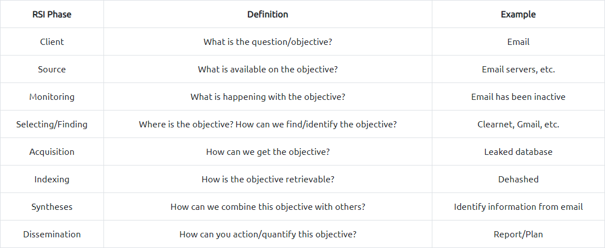

## Account Discovery & Analysis

Accounts are a prevalent and well-known part of a target's footprint. Accounts can include any public accounts linked to the target or a target persona, including but not limited to Facebook, Twitter, Reddit, etc.

When analyzing a target's account, we are commonly looking at the following objectives,

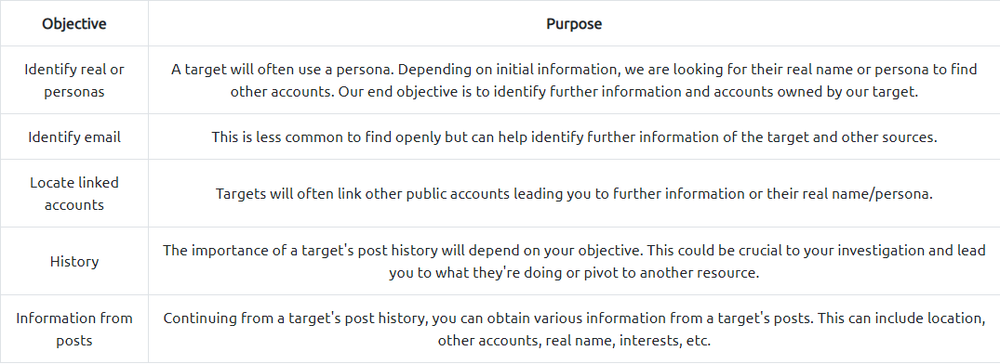

Account discovery can be difficult depending on the target's digital footprint and will depend on where you are within your OSINT process.

## Google Dorking

To even begin searching for information, we need to first index and quickly find these sources. Luckily for us, Google is our best friend; unfortunately, a simple google search will not necessarily get us what we want or will not be as granular as we would like. Google has a known feature called "google dorks" that will allow you to use specific syntax in a search query to filter further and make your search more granular.

Google offers a defined list of key terms that we can leverage to reach our objectives. Below is a small list of possible key terms, a complete list of google dork terms can be found [here](https://www.sans.org/posters/google-hacking-and-defense-cheat-sheet/) or [here](https://gist.github.com/sundowndev/283efaddbcf896ab405488330d1bbc06).

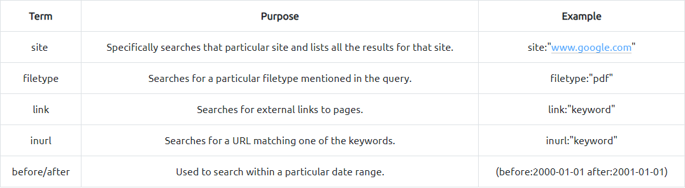

## OSINT & The Blockchain

With the introduction of [Web 3.0](https://web3.foundation/), a decentralized web protocol set in its infancy, and the increased popularity in cryptocurrencies, OSINT from a [blockchain technology](https://www.investopedia.com/terms/b/blockchain.asp) and decentralization perspective has become increasingly important. A core principle of blockchain technology and decentralization is anonymity. How can you gather information on a target if they are anonymous?

Blockchain technology is completely open while remaining anonymous; this comes with its pros and cons from an OSINT perspective; we can quickly identify specific identifiers but linking them can become difficult. Multiple tools aid in exploring the blockchain, including but not limited to,

- Blocktrail
- Bitcoin Who's Who
- Graphsense
- Block Explorer

We can apply the same methodology as previously discussed to blockchain technology. Although identifiers may be anonymous, that does not make them less unique or impossible to link to personas. When faced with blockchain technology, our end goal is to get back to a traditional persona. This process may change as the web changes but will stay the same for now with current technology.

Objectives and methodologies will change as decentralization and blockchain technology change and adapt. Examples of this can already be seen with most cryptocurrency wallets rotating addresses and ensuring proper security measures and privacy.

## Going Deeper

At its core, OSINT is searching and identifying information. However, we also need to look at how we can use platform functionality to our advantage to get further information and links that may still be publicly accessible but are not easily found.

Each platform will have its unique functionality and "tricks" that can be used. It is essential to familiarize yourself with all of these platforms and understand their ins and outs. In this task, we will be focusing on GitHub specifically and some of the ways individuals may not be properly securing their private information.

Previously we have discussed the idea of looking at a user's history to identify information. At first thought, it may seem that GitHub does not have a history we can leverage, but it indeed does. Version control is critical to GitHub's operation, but it can lead to potential information leaks when not adequately sanitized or monitored.

An example of an unintentional information leak from GitHub could be a company that forgot to delete its API keys from a JSON file. They made a new commit to their repository with the thought that no one could access those keys anymore. Anyone can look at a public repository commit history and view exactly what was deleted and added to the repository.

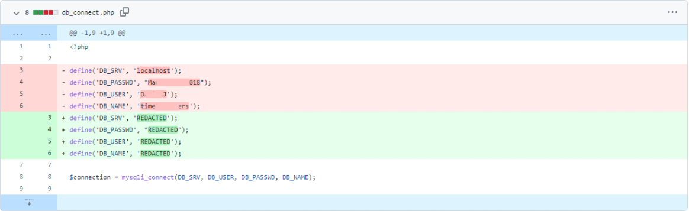

## Compiling an Investigation

The most daunting part of an OSINT investigation can be starting and putting all of the pieces together. There is no need to worry; you will almost always be given a starting point or some form of reference with which to begin. When trying to put pieces of an investigation together, it is important to remember that not everything may have a link, and there can be multiple pieces that go to one another don't focus on one thing too much and focus on creating a more general persona and understanding of what or who you are targeting.

---
## Questions

> 
>
> You are the responding intelligence officer on the hunt for more information about the infamous "Grinch Enterprises" ransomware gang. 
As a response to the recent ransomware activity from Grinch Enterprises, your team has managed to collect a sample ransomware note. 
> 
> !!! ВАЖНЫЙ !!!
> 
> Ваши файлы были зашифрованы Гринчем. Мы используем самые современные технологии шифрования.
> 
> Чтобы получить доступ к своим файлам, обратитесь к оператору Grinch Enterprises.
> 
> Ваш личный идентификационный идентификатор: «b288b97e-665d-4105-a3b2-666da90db14b».
> 
> С оператором, назначенным для вашего дела, можно связаться как "GrinchWho31" на всех платформах.

**No Answer Needed**

> What is the operator's username?

Answer: **GrinchWho31**

> What social media platform is the username associated with?

Answer: **twitter**

> What is the cryptographic identifier associated with the operator?

Answer: **1GW8QR7CWW3cpvVPGMCF5tZz4j96ncEgrVaR**

> What platform is the cryptographic identifier associated with?

Answer: **keybase.io**

> What is the bitcoin address of the operator?

Answer: **bc1q5q2w2x6yka5gchr89988p2c8w8nquem6tndw2f**

> What platform does the operator leak the bitcoin address on? 

Answer: **github**

> What is the operator's personal email?

Answer: **DonteHeath21@gmail.com**

> What is the operator's real name?

Answer: **Donte Heath**

===============================================================================

Use a google translate from Russian to English to get operator's username:

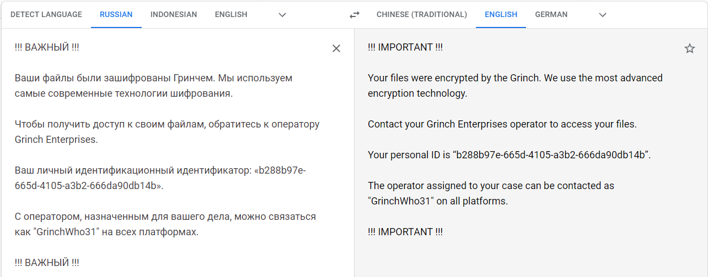

Search common social media to find the username **GrinchWho31**:

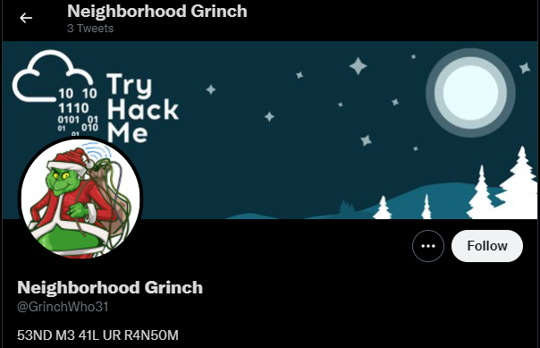

Check its pinned tweet for cryptographic identifier and the platform linked to it:

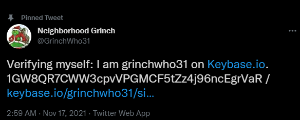

Check the keybase.io website on the pinned tweet to find its bitcoin address:

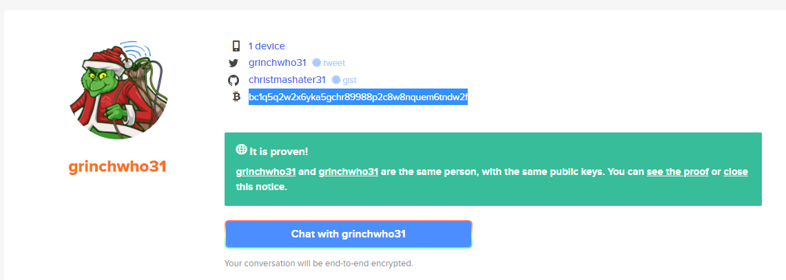

Click on the bitcoin address to find what other account the operator has leaked its bitcoin address on:

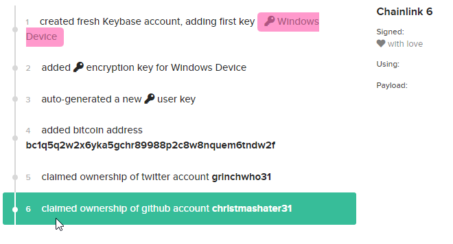

Navigate to `www.github.com/christmashater31` to find the operator's github page:

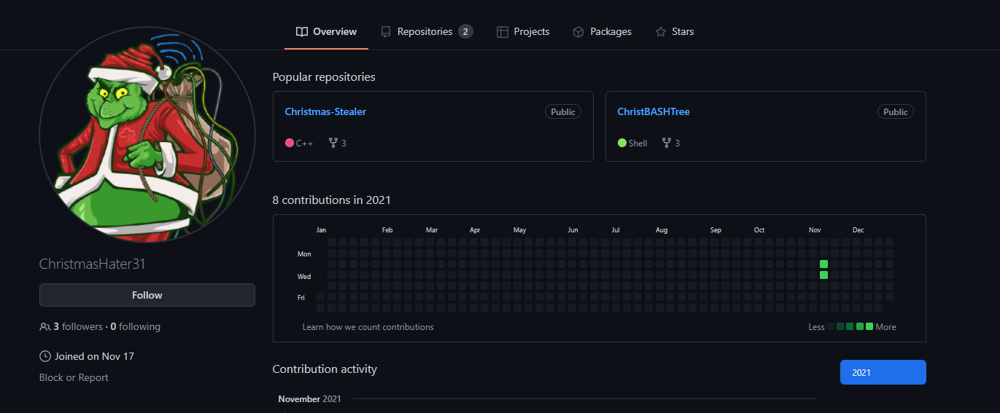

Look at the `ChristBASHTree` repository, and look at the latest commit info for email and real name of operator:

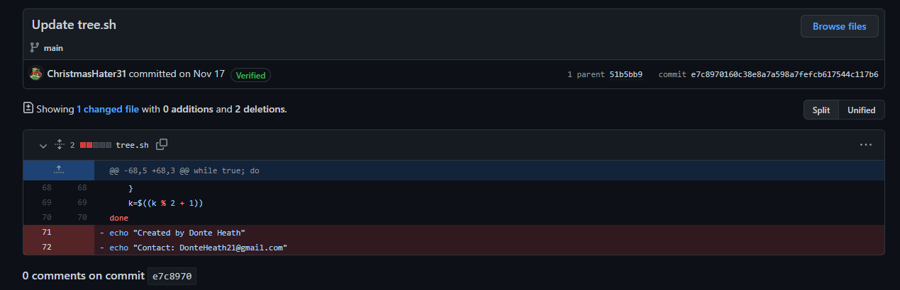