**NOTE: Please note: If you are on the TryHackMe free plan, the attack box does not have internet access and cannot reach AWS. You will need to install curl and the AWS CLI on your own machine in order to complete this challenge. Instructions for installing the AWS CLI are here: https://docs.aws.amazon.com/cli/latest/userguide/getting-started-install.html**

## Premise

Grinch Enterprises has been gloating about their attack on an underground forum. We know they were specifically targeting organizations in a campaign they've themed "Advent of Cyber" (AOC) - what a frustrating coincidence. Tracing the user back over time - we also encountered a reference to using AWS Elastic Container Registry (ECR) to store container images they use as infrastructure in their attacks. Let's see if we can find out more about the attack tooling Grinch Enterprises is using.

## Getting Started

You'll need to start your AttackBox to run commands using the Docker container tool. Containers are a virtualization mechanism similar to Virtual Machines (VMs), and container images are based on the [Open Container Initiative](https://opencontainers.org/) [Distribution Specification](https://github.com/opencontainers/distribution-spec/blob/main/spec.md). However, when someone talks about "Docker" or "containers", they often are talking about multiple container technologies that work together. Specifically, the term "Docker" is used to describe:

- Docker API - a local communication interface on a configured Linux machine, with standardized commands used to communicate with a Docker Daemon.
- Docker Daemon - a process that runs on your machine (the Docker daemon), to interact with container components such as images, data volumes, and other container artifacts.
- Docker Container Image Format - ultimately a .tar file. For Version 1, the docker image format was not strictly compliant with the OCI [Image Specification](https://github.com/opencontainers/image-spec). For our purposes, this won't change how we interact with container images in this exercise, but it does slightly change the format and content of a container image.

Now that we've gotten some of the basic terminologies out of the way, let's get started with today's learning objective.

## Today's Learning Objective - AWS Elastic Container Registry - ECR Public Gallery

Today we'll be covering the basics of container images and AWS Elastic Container Registry ([ECR](https://aws.amazon.com/ecr/)) - an online registry for public and private container images. We'll learn about how to retrieve a container image from an online registry and inspect the elements of that container image to identify potential security issues.

Docker Images and Amazon Elastic Container Registry
In a cloud-native computing environment, containers are a first-choice solution for deploying infrastructure. Similar to virtual machines, containers serve as the compute fabric for many running applications and hosted processes in the cloud.

Once you've logged on to an AttackBox, you can run the following command to see the container images that are stored by default on your AttackBox:

`docker images`

which should return an output similar to the following:

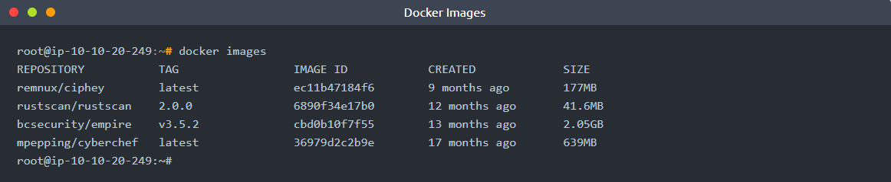

Docker containers are stored in "repositories", which are a reference to file mappings the Docker daemon knows how to reach, which include the container .tar files. Each image in a repository will include an image tag, and images can be referenced using either their tag or Image ID.

For example:  
`remnux/ciphy:latest`  
or  
`ec11b47184f6`

## Grinch Enterprise Attack Infrastructure

We've traced the Grinch Enterprises attack infrastructure back to a likely Elastic Container Registry that is publicly accessible:

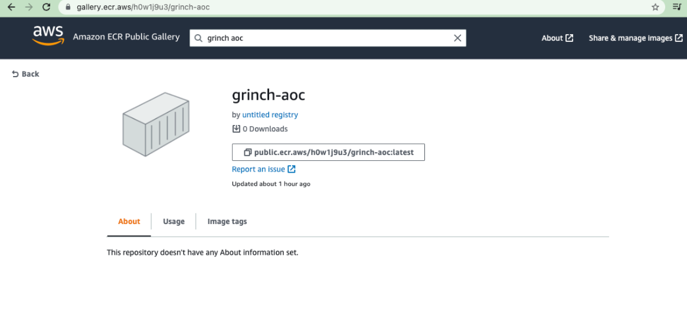

[Link to Suspected AWS Public Container Gallery for Grinch Enterprises](https://gallery.ecr.aws/h0w1j9u3/grinch-aoc)

You can retrieve the potential Grinch Enterprises image by running the following command on your AttackBox:  
`docker pull public.ecr.aws/h0w1j9u3/grinch-aoc:latest`

which returns will return an output similar to the following:

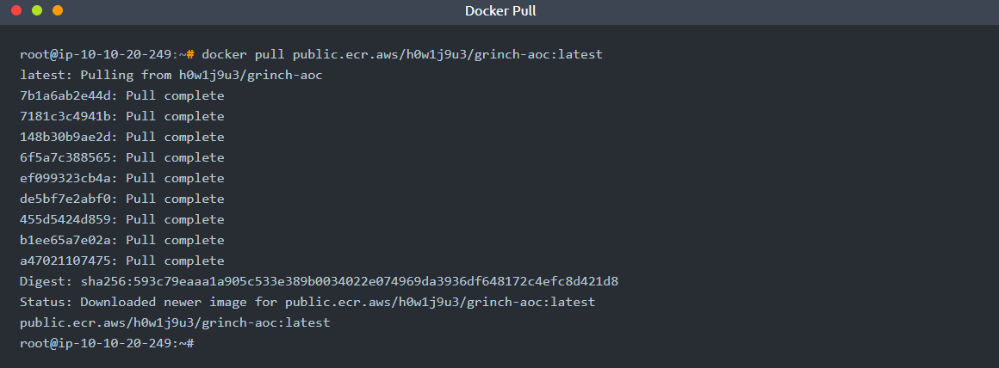

You can run the container and interact with it by running the following command:  
`docker run -it public.ecr.aws/h0w1j9u3/grinch-aoc:latest`

which will open a shell inside the container image, as indicated by the $. Once inside the container, we can do a little reconnaissance:  
`ls -la`

which shows there are no regular files or subdirectories in the present working directory.

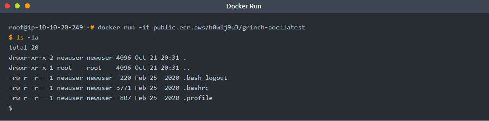

## Spoiler

A good place to check next is environment variables - in Linux and especially for containers, environment variables may be used to store secrets or other sensitive information used to configure the container at run-time.

So we try `printenv` to learn more about the environment configurations where we see:

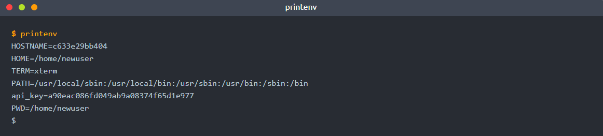

and we have stumbled on an `api_key` which I'm guessing Grinch Enterprises didn't intend to leave behind.

## Bonus Challenge

A container image is composed of a number of layers - perhaps there is sensitive information in an underlying container layer that Grinch Enterprises didn't clean up as part of their build process. One key reason that developers (and attackers) might package their application (or attack tools) in a container is that a container allows a developer to "freeze" an application and its dependencies into an image as part of the build process. The build process is part of the Software Development Lifecycle (SDLC), where applications and their dependencies are packaged together and tested prior to distribution and use.

Once an image is built, running the container image will always result in the same configuration state as specified at build-time. Container images are built from a source file known as a `Dockerfile`. Dockerfiles are a list of new-line separated instructions that instruct the Docker daemon how to generate a container image. You can read an exhaustive explanation of how to write Dockerfiles in the Dockerfile reference. You can see an example of a [Dockerfile here](https://docs.docker.com/engine/reference/builder/). In the case of Grinch Enterprises, we don't have the original Dockerfile - but with the container image, we have something just as good. Let's start by creating a new directory and saving the downloaded image as a .tar file.

1. Create a new directory: `mkdir aoc`
2. Change directory to the newly created directory: `cd aoc`
3. Save the container image as a .tar file: `docker save -o aoc.tar public.ecr.aws/h0w1j9u3/grinch-aoc:latest`

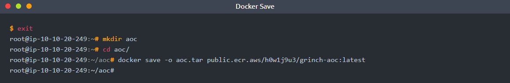

Once we have saved the image, we can further inspect the image by unpacking the compressed file  
`tar -xf aoc.tar`

Note that I used the -v (verbose) option when I performed the command, and you can see the various files that are being unpacked:

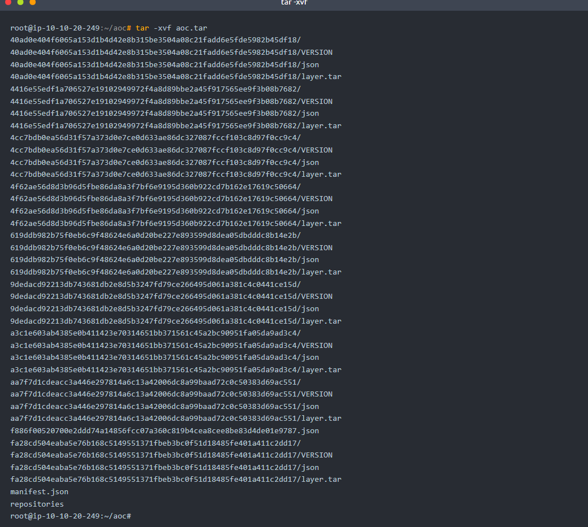

These files represent the various container image layers, with the exception of the manifest.json file. manifest.json represents the "manifest" of container image layers that compose the final container image we were just inside. Let's take a look at this image using a tool called "jq" to "pretty-print" the output for easier readability:

**Note: On an attack box, jq is now pre-installed and you can skip this step**

1. Install jq: apt install jq -y

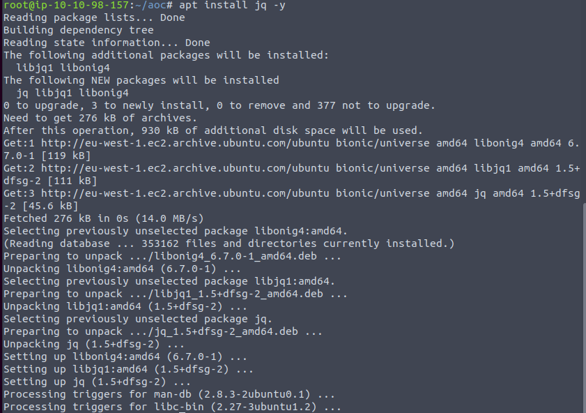

2. Print the contents of manifest.json to the terminal using jq to pretty-print: `cat manifest.json | jq`

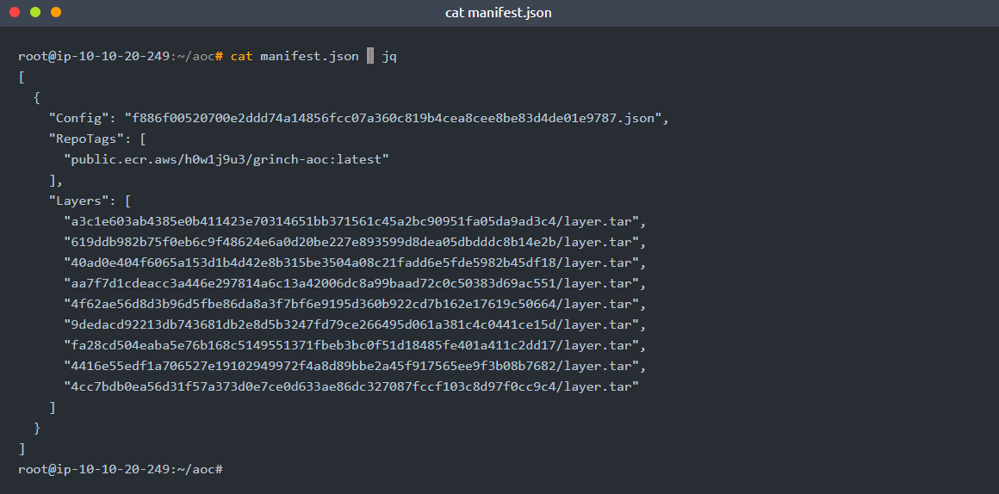

Note the first piece of information in the file is "Config", which represents the underlying configurations and commands used to build the container image -  
`f886f00520700e2ddd74a14856fcc07a36c819b4cea8cee8be83d4de01e9787.json`  
This configuration file is also located in the root of the unpacked container image directory:

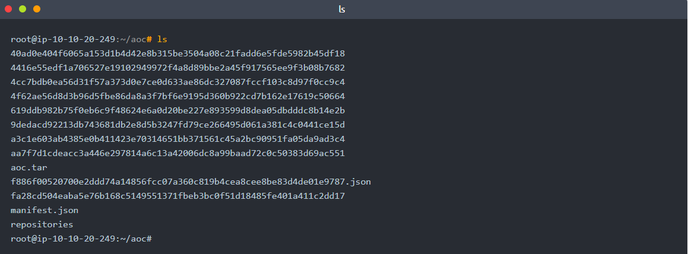

and can be inspected in the same manner as manifest.json:  
`cat f886f00520700e2ddd74a14856fcc07a36c819b4cea8cee8be83d4de01e9787.json | jq`

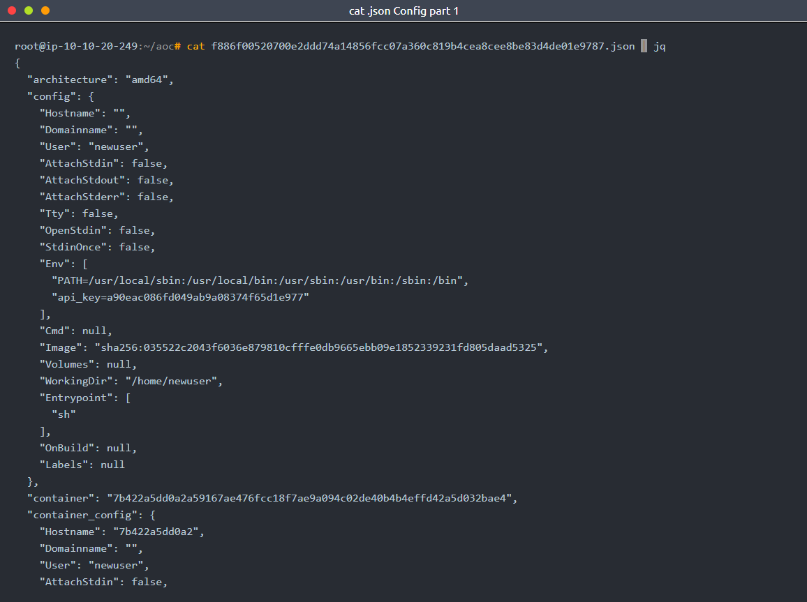

The first section of the manifest configuration file walks through the final image configuration as intended to run on a container host system. However, this next section is of particular interest to an attacker - here's how the container image was built. You can see each section broken up by curly braces, and some of the sections have an extra line indicating `"empty_layer": true`.

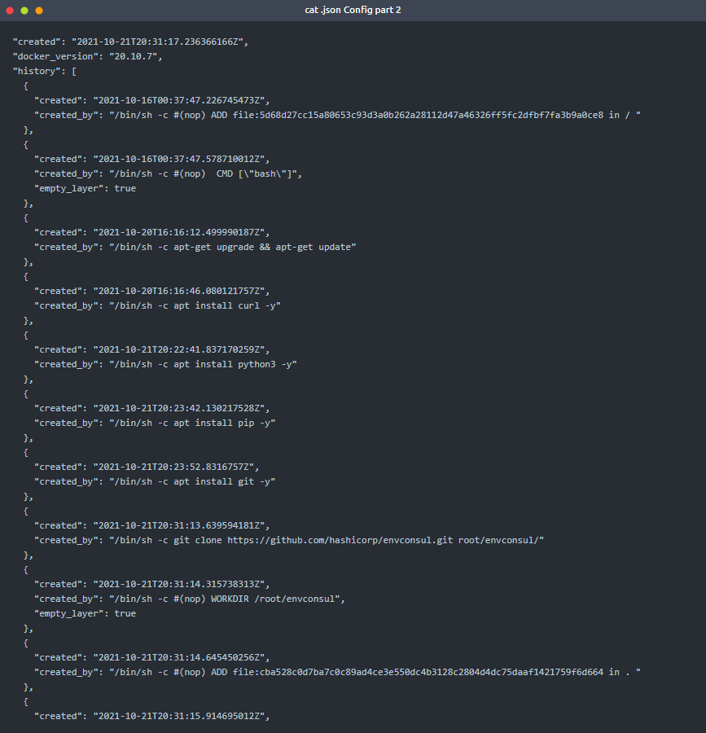

Each of these sections are describing a particular command run by the Docker daemon at the time that the image was built, and if the `"empty_layer": true` configuration is not listed as part of the section definition, then the container layer is retained in the overall container image as one of the layers listed in the `manifest.json` file. Of particular interest - we notice the container containers a tool called `envconsul` that is pulled from Github. Reviewing the Github repository for [envconsul](https://www.github.com/hashicorp/envconsul) - the about description states envconsul is a tool that allows a user to "Launch a subprocess with environment variables using data from @hashicorp Consul and Vault." Noting that this source code was cloned into a root directory - perhaps there is something sensitive related to envconsul that a regular container user isn't intended to see at Grinch Enterprises. Let's dig through the image layers and see if we can find out what is so sensitive about envconsul.

We can more closely inspect the layers by switching to the sub-directories representing the layers in the unpacked container root directory. As we switch between these layers, we notice one layer of special interest:

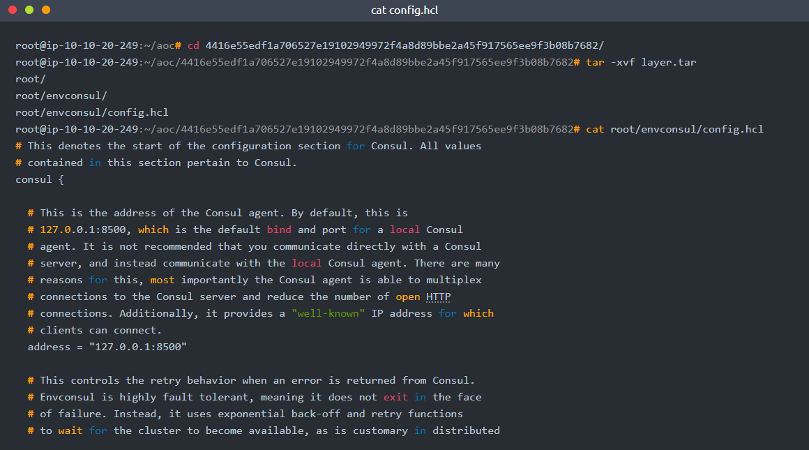

## Spoiler

This layer contains a config.hcl file - as we look at this file in the container image layer - it is clear that sensitive configurations are maintained in the file. Let's use Linux command-line tool `grep` and see if we can return a "secret" or a "token"...and there it is on line 4 when grepping with the string 'token'. I wonder if the Grinch Enterprise developers knew that the container image cached all of the container layers? Either way, now we can turn the tables on Grinch Enterprises and access their Vault cluster with all its secrets!

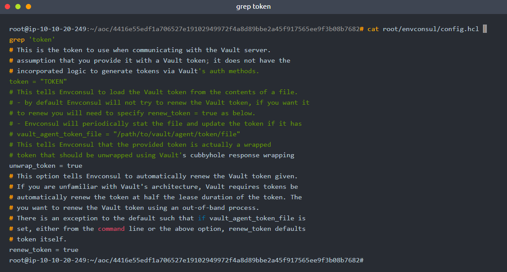

---
# Questions

> What command will list container images stored in your local container registry?

Answer: **docker images**

> What command will allow you to save a docker image as a tar archive?

Answer: **docker save**

> What is the name of the file (including file extension) for the configuration, repository tags, and layer hash values stored in a container image?

Answer: **manifest.json**

> What is the token value you found for the bonus challenge?

Answer: **7095b3e9300542edadbc2dd558ac11fa**

===============================================================================

**NOTE: Will be performing this on own machine, not the Attackbox provided by THM**
**NOTE: Pls make sure Docker and AWSCLI are available before continuing**

Run the following command to find the various `docker` commands and usages:  
`docker help`  

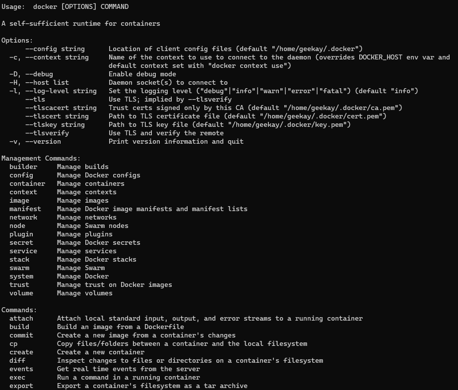

Run the following command to pull docker image:  
`docker pull public.ecr.aws/h0w1j9u3/grinch-aoc:latest`

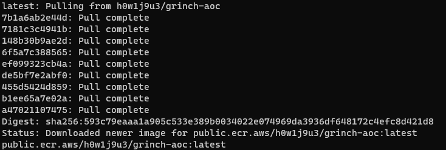

Follow the steps mentioned in the story under Bonus Challenge to get the token.