Deploy the virtual machine attached to this task; it will be visible in the split-screen view once it is ready. 

If you don't see a virtual machine load, then click the Show Split View button. 

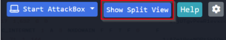

---

McSkidy received reports of multiple phishing attempts from various elves. 

One of the elves shared the email that was sent to her, along with the attachment. The email was forwarded as a .eml file, along with the base64 encoded string in a text file. Is Grinch Enterprises up to their shenanigans? 

---

Adversaries use a technique known as Phishing to attempt to infiltrate a target organization and gain a foothold (Initial Access).  

The definition of Phishing according to the MITRE ATT&CK Framework: "**Adversaries may send phishing messages to gain access to victim systems. All forms of phishing are electronically delivered social engineering. Phishing can be targeted, known as spearphishing. In spearphishing, a specific individual, company, or industry will be targeted by the adversary. More generally, adversaries can conduct non-targeted phishing, such as in mass malware spam campaigns.**

**Adversaries may send victims emails containing malicious attachments or links, typically to execute malicious code on victim systems. Phishing may also be conducted via third-party services, like social media platforms. Phishing may also involve social engineering techniques, such as posing as a trusted source.**" 

Reference - [https://attack.mitre.org/techniques/T1566/](https://attack.mitre.org/techniques/T1566/)

Since this type of attack targets employees of both small and large organizations alike, security awareness training is often enforced to help minimize the chances of a recipient falling victim to this type of attack.

There are several signs to look for in emails without performing extensive analysis to help determine whether an email is potentially a phishing attempt. Some examples are listed below:

- Do you know the sender? Does the email address match the sender? Does the reply-to email match the sender?

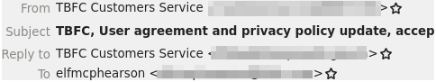

- In the email body, does the email greet you personally (Hello McSkidy), or is it very generic (Hello Elf)?
- Does the email contain any grammar mistakes, such as misspelled words?
- Does the email give you a sense of urgency where you need to act fast? Such as a deadline to prevent your account from being disabled.

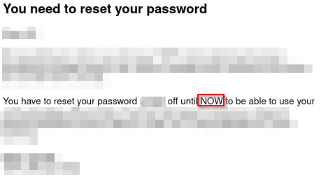

- Does the email contain a link or a clickable button that redirects you to a website? Does the link match the sender, or is it a random website?

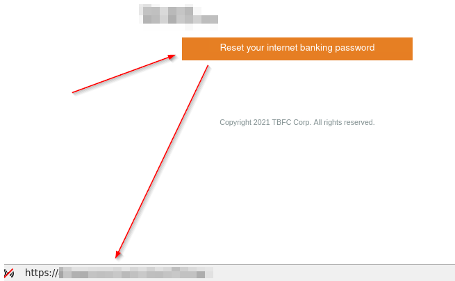

- Is there an attachment to the email? 

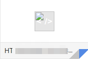

Now you're ready to dive in. Within the attached virtual machine, open the mail application.  

`Email.eml` will automatically open for you. Inspect the file contents of `email.eml` and answer the questions below.  

When reviewing email source code, you'll typically see encoded strings in `Base64` (a mathematical calculation performed on characters to encode them into a reversible format).  See an example below.

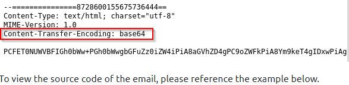

To view the source code of the email, please reference the example below.

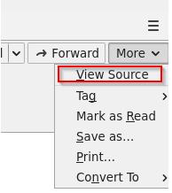

Below are the commands to assist you with analyzing the encoded attachment text file.

- You can use the Linux command line to read the contents of the text files.  
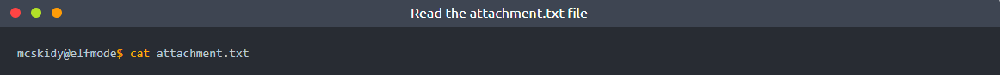

- To decode the Base64 encoded string in the Linux command-line, you can use the following command:  
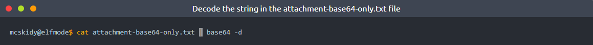

- To convert the Base64 encoded string to its original file format, you can use the following command:  
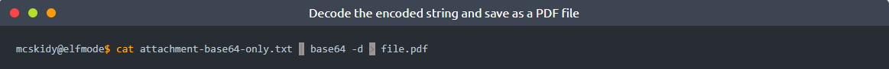

You know the file is a PDF file based on the magic header. See below.  
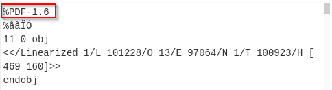

What are `magic headers`? Refer to this Wikipedia [link](https://en.wikipedia.org/wiki/List_of_file_signatures) for more information.  
**Note: You can try to convert the Base64 into the actual PDF file using CyberChef.**  
**P.S. Don't worry; you'll be introduced to CyberChef in the upcoming days if you're not familiar with it. ;)**

---
# Questions

> Who was the email sent to? (Answer is the email address)

Answer: **elfmcphearson@tbfc.com**

> Phishing emails use similar domains of their targets to increase the likelihood the recipient will be tricked into interacting with the email. Who does it say the email was from? (Answer is the email address)

Answer: **customerservice@t8fc.info**

> Sometimes phishing emails have a different reply-to email address. If this email was replied to, what email address will receive the email response?

Answer: **fisher@tempmailz.grinch**

> Less sophisticated phishing emails will have typos. What is the misspelled word?

Answer: **stright**

> The email contains a link that will redirect the recipient to a fraudulent website in an effort to collect credentials. What is the link to the credential harvesting website?

Answer: **https://89xgwsnmo5.grinch/out/fishing/**

> View the email source code. There is an unusual email header. What is the header and its value?

Answer: **X-GrinchPhish: >;^)**

> You received other reports of phishing attempts from other colleagues. Some of the other emails contained attachments. Open attachment.txt. What is the name of the attachment?

Answer: **password-reset-instructions.pdf**

> What is the flag in the PDF file?

Answer: **THM{A0C_Thr33_Ph1sh1ng_An4lys!s}**

===============================================================================

Deploy the Machine attached to this task.

Open the `Email Artifacts` folder, and open the `email.eml` by double-clicking it:  
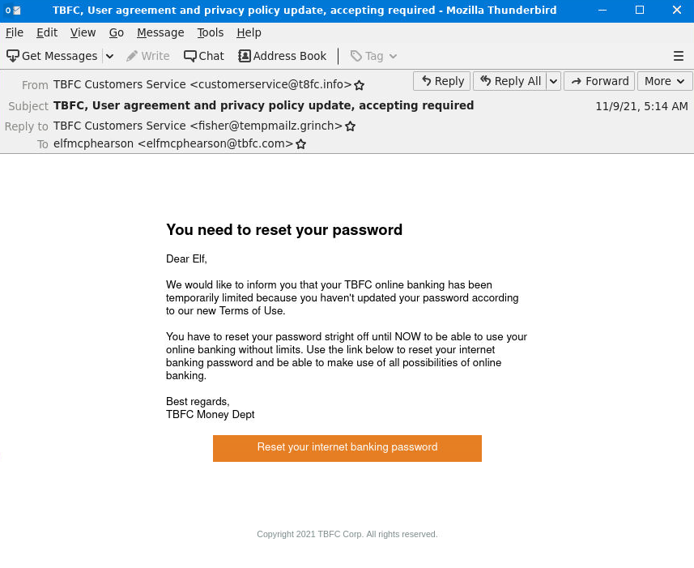

Qn1 to Qn3 can be found in the email addresses at the top of the `email.eml`.

Qn4 is referring to a misspell word found in the first line of the second paragraph.

Qn5 is referring to the URL embedded within the `Reset your internet banking password` box:  

Qn6: click on the `More` button at the top right of the email, and select `View Source`:  
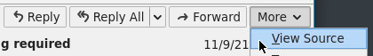  
Scroll down the source code to find the unique header:  
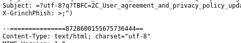

Qn7: On the same `Email Artifacts` folder, open the `attachment.txt` file by double-clicking it.  
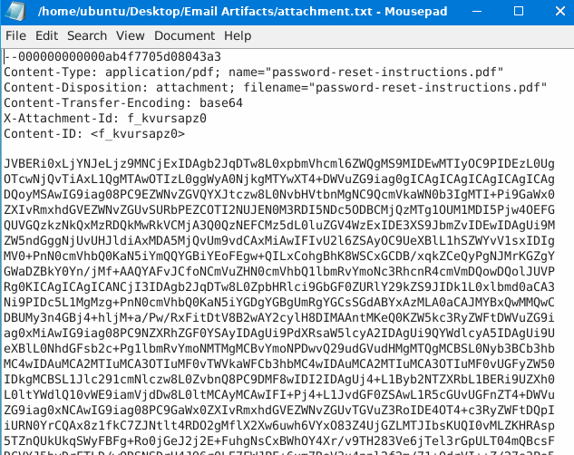

Qn8: Open the terminal, and run the following command:
`cd Desktop`  
`cat Email\ Artifacts/attachment-base64-only.txt | base64 -d > file.pdf`  
A PDF file `file.pdf` will be generated on the Desktop.  
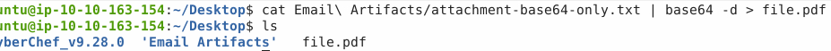  
Go to the file and double-click to open it as a PDF:  
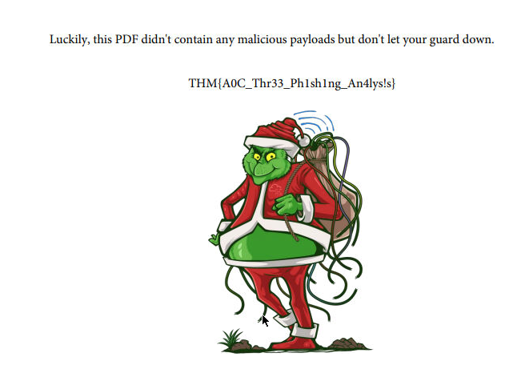

