## Story:

McPayroll is processing the bonuses for all the hardworking elves. One of the Elves has sent McPayroll a file that they're claiming contains their updated payment information. The only problem is that she doesn't recognize the Elf - could this be a sneaky attack from Grinch Enterprises to cause more havoc? Analyze the file to see if you can determine whether it's malicious or not!

McPayroll provides this file to McSkidy who is a member of the security team. McSkidy is a wise elf. She knows to analyze this file in a sandboxed environment. Therefore, she fired up her Remnux VM to take a look at the suspicious file. She unzipped the archive and saw that there was a folder named 'Samples' and a file named 'testfile' in the zip archive. She copied these files over to her Remnux desktop to begin the analysis.

## Learning Objectives:

In this task, we will learn:  
1. How to identify the file type of a file regardless of file extension
2. How to find strings in a file
3. How to calculate hash of a file
4. Using VirusTotal to perform preliminary analysis of a suspicious file

## Initial analysis:

To get started with the analysis, McSkidy started by running the `file` command. The `file` command is a Linux utility that helps determine a given file's file type, regardless of the file extension the file may have. McSkidy understands that malware authors sometimes use misleading file extensions, so she verifies the file type as the first step.

The following syntax is used to check the file type of a file:  
`file <filename>`

You can read more about the file utility by running the following command in the Linux terminal:  
`file --help` or `man file`

Here is a screenshot of McSkidy running the file command on one of the files:  
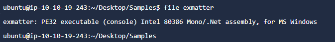

This file seems to be a Windows executable file. It seems like McSkidy’s suspicions held their weight. To gather more information about the file, McSkidy tries the `strings` command. The `strings` command is also a Linux utility. This utility extracts and prints the printable character sequences from a given file or what's also known as 'strings'. Knowing what strings are present in a file can often provide interesting information about the file. Specifically for executable files, the strings utility can give pointers to the different functions called by the executable file, any IP addresses or domain names, URLs, etc. which might help in further analysis. This information may also help security tools like antivirus software in flagging files as malicious by identifying possible malicious traces (or Indicators Of Compromise/IOCs as they are called in the security industry).

The following syntax is used for the strings command:  
`strings <filename>`

You can read more about the strings utility and its options by running the following command in the Linux terminal:  
`strings --help` or `man strings`

The output of the strings command was a little too long for the terminal window, McSkidy saved the output to a file. This can be done by redirecting the output to a file:  
`strings <filename> > strings_output.txt`

This was the strings output:  
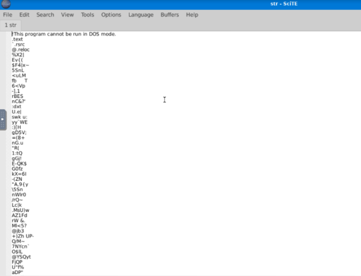

You can see that the first line reads: "This program cannot be run in DOS mode". This is part of the DOS stub of a Windows executable. McSkidy was a little confused when looking at this file, as it contained a lot of gibberish. However, she kept scrolling until she was rewarded with some interesting strings:  
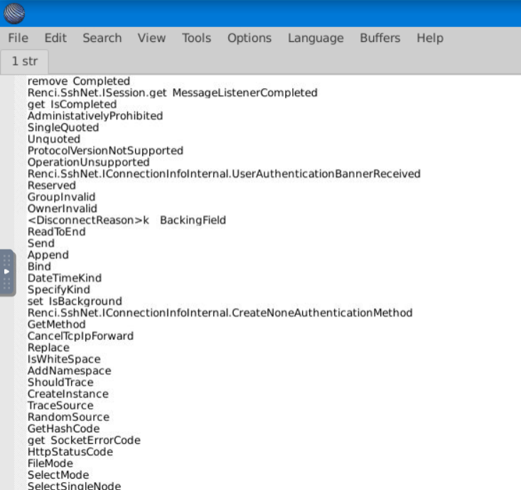

As McSkidy started to discover more interesting strings, she started to gain an idea of what the evil elf's intentions were with the malware. She could see references to 'ssh', 'session', 'message', and 'disconnect', which hints that this executable might be trying to establish some kind of an SSH connection to send a message or file.

## VirusTotal:

Even though this functionality could be used in a non-malicious program, McSkidy was unwilling to take any chances. Therefore, McSkidy decided to upload the file to VirusTotal. VirusTotal is a website that will scan files, URLs, IP addresses, domains, or a file hash you provide using 60+ different Antivirus software products and displays a summary of their scan results.

On the homepage, McSkidy had a few options to either: submit a file, a URL, IP address, domain, or search using the file's hash. McSkidy understood that the file could contain sensitive information and should not be uploaded to a third-party analysis service right away, so she calculated its MD5 hash and searched VirusTotal using the file's hash. 

On a Linux system, the program `md5sum` can be used to output the MD5 hash of a file:  
`md5sum <filename>`

Once she had the MD5 hash, McSkidy searched it on VirusTotal  
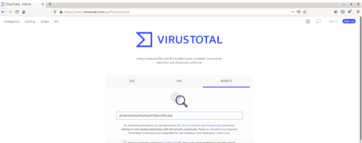

After pressing enter, she saw the results that confirmed her suspicions. She could see that the file was marked as malicious by a majority of Antivirus software vendors. Moreover, she could see the classification each Antivirus software had given the file:  
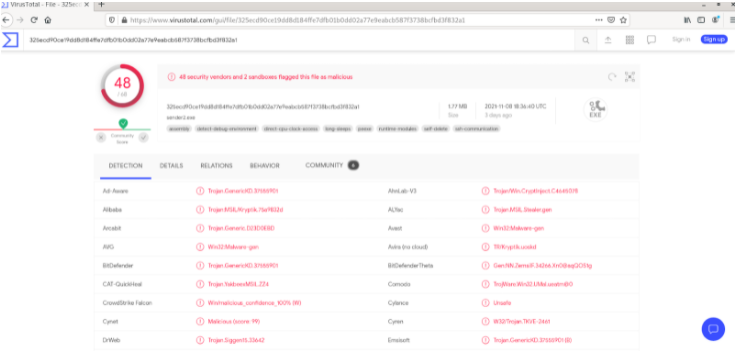

On the details tab, she could see the hashes of the file, its submission history with VirusTotal, and the different properties of the file:  
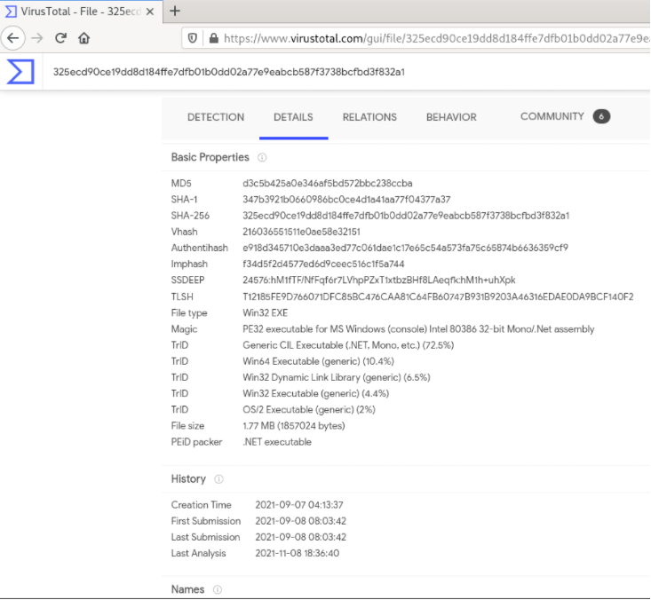

The relations tab explains the relations between the malware and the different domains, IP addresses and files that are associated with it, and their VirusTotal scores (if available):  
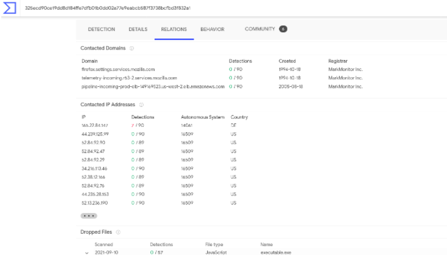

The behavior tab shows the different activities performed by the malware, based on a few different behavioral detection engines:  
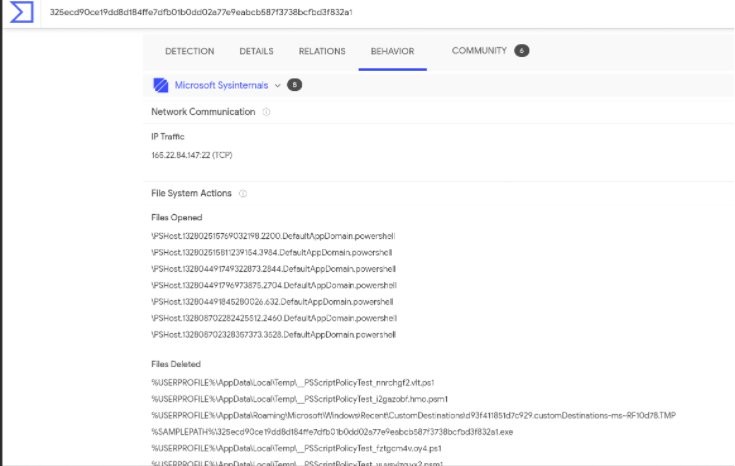

Finally, the community tab contains community member posts and what their view on the malware is:  
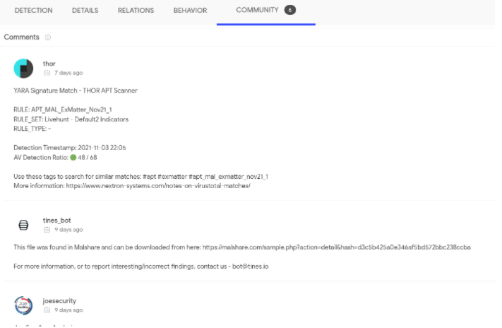

After looking at all this information, McSkidy was certain that this particular file in the package was malicious!

Now, let's log into the machine attached with the task and help McSkidy answer the following questions.

Deploy the machine attached to the task. It will be visible in the split-screen view when ready. If you don't see the machine in your browser, click the "Show Split View" button.

---
# Questions

> Open the terminal and navigate to the file on the desktop named 'testfile'. Using the 'strings' command, check the strings in the file. There is only a single line of output to the 'strings' command. What is the output?

Answer: **X5O!P%@AP[4\PZX54(P^)7CC)7}$EICAR-STANDARD-ANTIVIRUS-TEST-FILE!$H+H***

> Check the file type of 'testfile' using the 'file' command. What is the file type?

Answer: **EICAR virus test files**

> Calculate the file's hash and search for it on VirusTotal. When was the file first seen in the wild?

Answer: **2005-10-17 22:03:48**

> On VirusTotal's detection tab, what is the classification assigned to the file by Microsoft?

Answer: **Virus:DOS/EICAR_Test_File**

> Go to [this link](https://www.eicar.org/?page_id=3950) to learn more about this file and what it is used for. What were the first two names of this file?

Answer: **ducklin.htm ducklin-html.htm**

> The file has 68 characters in the start known as the known string. It can be appended with whitespace characters upto a limited number of characters. What is the maximum number of total characters that can be in the file?

Answer: **128**

===============================================================================

Start up the **Machine** attached to this task.

Qn1: Open terminal on the machine and run the following command:  
`strings Desktop/testfile`  
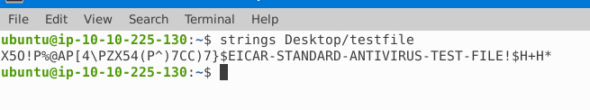

Qn2: Run the following command:  
`file Desktop/testfile`  
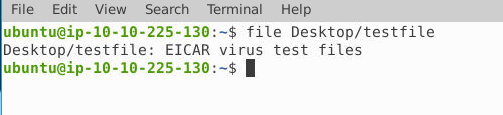

Qn3: Run the following command:  
`md5sum Desktop/testfile`  
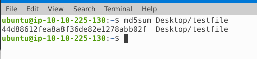  
Copy the MD5 hash, go to browser, navigate to [Virustotal](https://www.virustotal.com/) and search the hash. Then look under `Details` tab:  
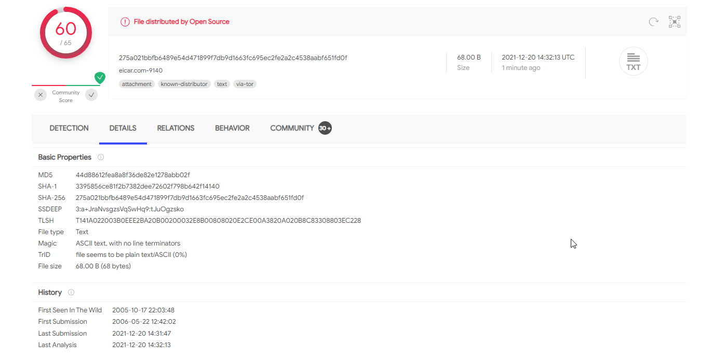 

Qn4: Navigate to the `detection` tab of the same hash:  
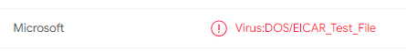

Qn5: Open the [link](https://www.eicar.org/?page_id=3950) provided by the question, and search the first two names of the file in the 'Additional notes**:  
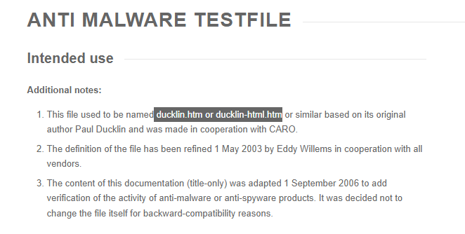

Qn6: Check description under `The Anti-Malware Testfile` header:  
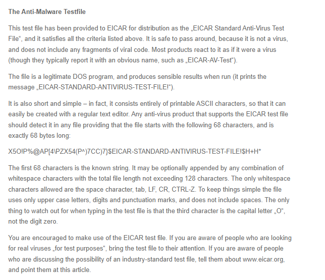