_McSkidy has finally gotten around to identifying the first trace of Grinch Enterprises within their network. They're looking at local machines to determine what exactly they did when they first entered the network. Can you help them make sense of what happened?_

You have probably heard of The Cyber Swiss Army Knife - `CyberChef`. This tool will help you uncover what Grinch Enterprises did when they first entered the network.

All you need is to be a good chef and follow the recipes! 

On the left-hand column, you can choose the ingredients or Operations you want to bake the best cake for this Christmas party, as shown in the image below:
 
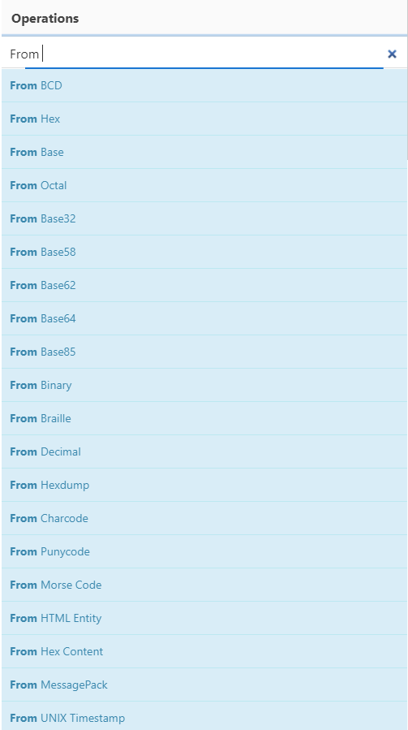

To bake the perfect tasty cake, you need to add the ingredients you need in the right order by dragging them to the middle column that says `Recipe`. Pretty cool, right? 

For example, let's decode a base64-encoded string `R3JpbmNoIEVudGVycHJpc2VzIHdvbid0IHRha2Ugb3ZlciB0aGUgTm9ydGggUG9sZSE=`:

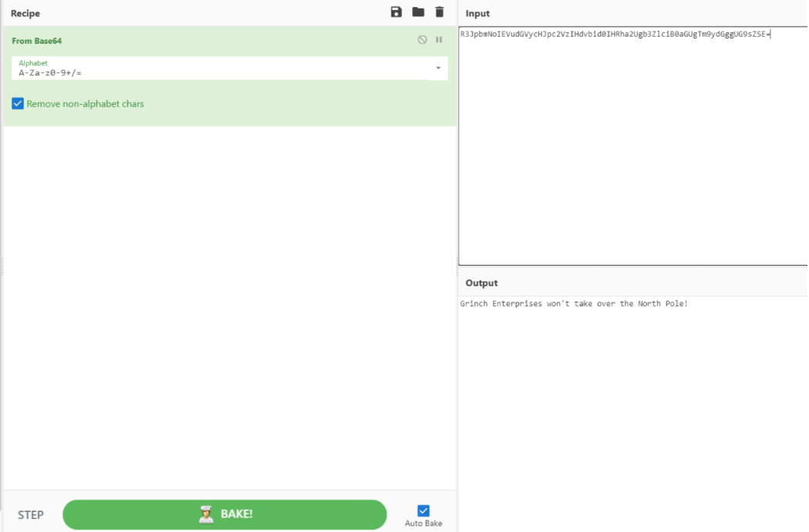

According to Mozilla, "Base64 encoding schemes are commonly used when there is a need to encode binary data that needs to be stored and transferred over media that are designed to deal with ASCII."  While attackers still use this simple form of obfuscation to evade Antivirus detection, it's far from the most effective and stealthy technique.

To decode the string above, we'll use the From Base64 ingredient under the Operations column by dragging it under the Recipe pane (or double click From Base64), then paste our base64-encoded string `R3JpbmNoIEVudGVycHJpc2VzIHdvbid0IHRha2Ugb3ZlciB0aGUgTm9ydGggUG9sZSE=` in the Input text area, and finally BAKE it! You will see the results of the deobfuscated string `Grinch Enterprises won't take over the North Pole!` in the Output field. 

You can drag as many ingredients as you wish to the Recipe field to produce the output that makes sense to you :)

CyberChef has a lot of interesting features such as being able to decrypt a file or text that was encrypted using various ciphers, as shown below:

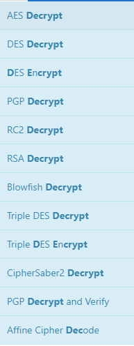

Another noteworthy cipher that attackers commonly use, and what we'll focus on, is the XOR (Exclusive Or (XOR)) cipher.

Exclusive or XOR is a logical operator which results true (1) when two values are different (one is true and the other one is false) and returns 0 when two values are the same, as shown in the image below:

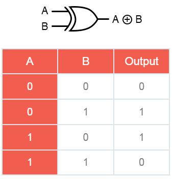

**Now that we've taken a look at the basics of CyberChef and some common obfuscation techniques let's explore another helpful tool to complete this task.**

**Oledump** ([oledump.py](https://blog.didierstevens.com/programs/oledump-py/)) is an excellent tool written in Python by Didier Stevens, which helps you analyze OLE (Compound File Binary Format) files. You can think of OLE files as 'a mini file system' or similar to a Zip archive. Applications such as MS Office with extensions .doc, .xls, .ppt are known as OLE files. Malicious actors can abuse macros to hide malicious commands/scripts within Excel and Word documents.

You can run the command `oledump.py [Filename]` to view the streams as shown below:  
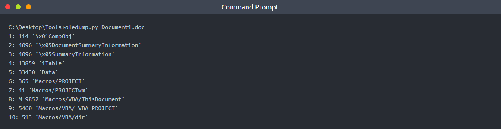

According to the documentation on [OLE files](https://olefile.readthedocs.io/en/latest/OLE_Overview.html), OLE files could contain **storages** which are basically folders that contain **streams** of data or other **storages**. The example below depicts what a typical Word document looks like 'under the hood' and the streams of data you'll normally see. Each stream has a name and `oledump` will conveniently index each stream by assigning it a number to easily select it for analysis.

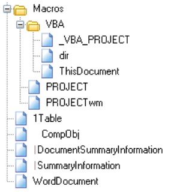

The **M** letter next to a stream indicates that the stream contains a **VBA Macro**. VBA Macros are created using the Visual Basic for Applications programming language and have legitimate use cases. For instance, macros allow users to create custom functions to automate repetitive or time-consuming tasks within Excel or Word.

Before we start using oledump.py, let's take a look at some of the useful options for analyzing OLE files. To explore more options, use the `-m` option.

`-A` does an ASCII dump similar to option -a, but duplicate lines are removed.  
`-S` dumps strings.  
`-d` produces a raw dump of the stream content.  
`-s` STREAM NUMBER or `--select`=STREAM NUMBER allows you to select the stream number to analyze (`-s a` to select all streams)  
`-d, --dump` - perform a raw dump  
`-x, --hexdump` - perform a hex dump  
`-a, --asciidump` - perform an ascii dump  
`-S, --strings` - perform a strings dump  
`-v, --vbadecompress` - VBA decompression  

Grinch Enterprises left a malicious document on the machine, and you need to find it. The document contains a malicious obfuscated base64-encoded script that also comes with a "secret" cipher ingredient... **decimal 35**. Find out what the evil script does and locate the two flags.

To solve this challenge, you need to find the stream that contains the obfuscated script. Select the macro stream number 8 and dump the contents by running the command:  
`oledump.py -s 8 -d`

The decimal number 35 will be our **XOR** key. Let's build the recipe in CyberChef using the following ingredients:  
1. **From Base64**
2. **XOR 35** (Don't forget to choose Decimal from the dropdown!)

You might have noticed the secret script still looks odd because it's double-encoded using Base64! Let's choose **From Base64** for our third ingredient. 

Now that you're armed with knowledge let's start the challenge!

---

The virtual machine will launch in-browser. If you wish to access the virtual machine via Remote Desktop, use the credentials below. 

**Machine IP**: `MACHINE_IP`

**User**: `administrator`

**Password**: `sn0wF!akes!!!`

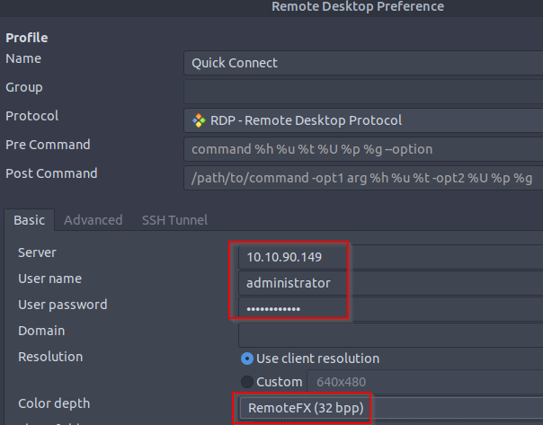

Accept the Certificate when prompted, and you should be logged into the remote system now.

**Note**: The virtual machine may take up to 3 minutes to fully load.

---
# Questions

> What is the username (email address of Grinch Enterprises) from the decoded script?

Answer: **Grinch.Enterprises.2021@gmail.com**

> What is the mailbox password you found?

Answer: **S@ntai$comingt0t0wn**

> What is the subject of the email?

Answer: **Christmas Wishlist**

> What port is the script using to exfiltrate data from the North Pole?

Answer: **587**

> What is the flag hidden found in the document that Grinch Enterprises left behind? (Hint: use the following command oledump.py -s {stream number} -d, the answer will be in the caption).

Answer: **YouFoundGrinchCookie**

> There is still a second flag somewhere... can you find it on the machine?

Answer: **S@nt@c1Au$IsrEAl**

===============================================================================

Start up the **Machine** attached to this task.

Qn1. Open up the command prompt, and run the following command:  
`oledump.py ..\..\Santa_Claus_Naughty_List_2021\Santa_Claus_Naughty_List_2021.doc`  
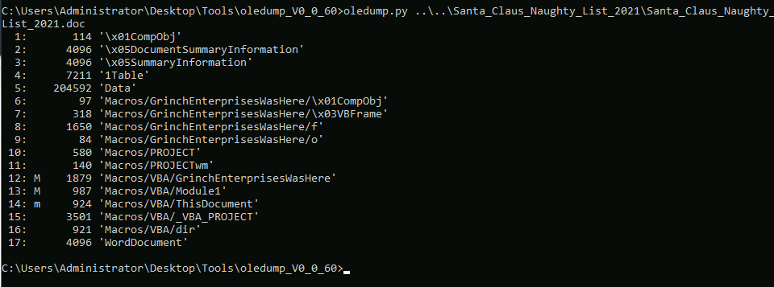  
Run the following command to get the encoded script:  
`oledump.py -s 8 -S ..\..\Santa_Claus_Naughty_List_2021\Santa_Claus_Naughty_List_2021.doc`  
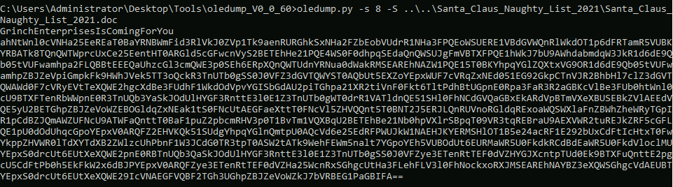  
Copy that base64-encoded string, then open up the `CyberChef` that can be found in the `Tools` folder on `Desktop`:  
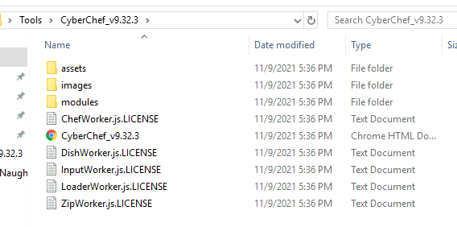  
Paste the encoded string in `Input`, then drag 3 items into the `Recipe` column in following order:  
1. From Base64
2. XOR with Key 35 and choose DECIMAL
3. From Base64  
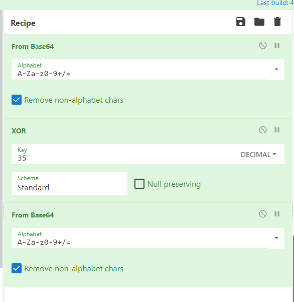

In the `Output` column, we will find the **$username**"  
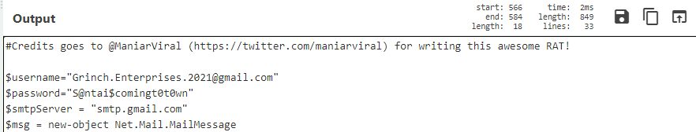

Qn2. Password is also found in the same `Output` column.

Qn3. Email subject is also found in the same `Output` column.  
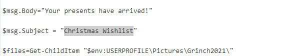

Qn4. Port number is also found in the same `Output` column.  
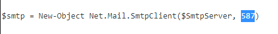

Qn5. Run the following command in Command Prompt to get the flag in `Caption`:  
`oledump.py -s 7 -S ..\..\Santa_Claus_Naughty_List_2021\Santa_Claus_Naughty_List_2021.doc`  
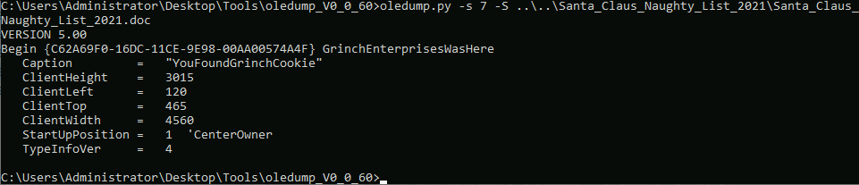

Qn6. Looking back at the `Output` column from CyberChef with the encoded string, we can find this particular string:  
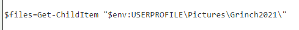  
Head to the following folder to find a `Grinch2021` folder:  
`C:\Users\Administrator\Pictures\Grinch2021`  
Open the `Grinch2021` folder to find a `flag2.png` inside. Open it to find the flag:  

