Deploy the virtual machine attached to this task; it will be visible in the split-screen view once it is ready. 

If you don't see a virtual machine load, then click the Show Split View button.  
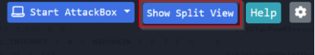

---

One of the administrators with access to the Elf Dome Defense system realized that his password file was missing from his desktop. Without the password, he will not be able to log into the Mission Control panel. McSkidy suspects that perhaps one of the previous phishing attempts was successful. McSkidy jumps into action.

You need to inspect the event logs to determine what has occurred and see if you can retrieve the password from the deleted text file. 

## Learning Objectives:  
- Analyze Windows event logs to understand actions performed in an attack.
- Recover key artifacts in unencrypted web communications. 
- Utilize PowerShell Scripting to recover a delete artifact. 

---

**PowerShell** comes baked into the Windows Operating System. It is a beneficial tool for Windows Administrators to automate day-to-day tasks. PowerShell has also allowed adversaries to perform nefarious activities, a concept known as Living off the Land.  

The official definition of PowerShell per Microsoft - "**PowerShell is a cross-platform task automation solution made up of a command-line shell, a scripting language, and a configuration management framework. PowerShell runs on Windows, Linux, and macOS.**" 

Link - https://docs.microsoft.com/en-us/powershell/scripting/overview?view=powershell-7.2

As defenders, we can audit commands run in the PowerShell console on each workstation. This is known as **PowerShell Logging**. When a PowerShell command or script is run, the activity is logged into the Windows Event Log system. 

Many event logs are generated in a Windows system, but the logs we care about are specific to PowerShell. 

Event logs are categorized by providers, such as **Microsoft-Windows-PowerShell**. Each provider has specific event ids to identify particular events or actions that occurred on the workstation. The event ids of interest for us in this investigation are **4103** and **4104**.

Typically you'll use **Event Viewer** to view event logs locally on a Windows system, but we installed a nifty tool called **Full Event Log View** to help make this a painless experience. 

When you start the tool, it will display a large number of event logs. Fret not; search is your friend.  
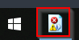

Open the ``Advanced Options`` to start your search.  
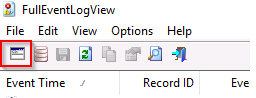

The events of interest on this endpoint took place a few weeks ago, specifically during the week of **November 11th, 2021**. Use the below search criteria to get you started.  
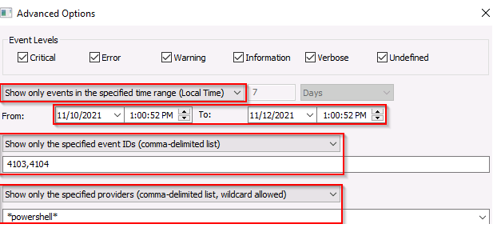

Alternatively, you can search based on a string value, a keyword. You know there is web traffic involved in the attack. Maybe a good keyword to use would be '**HTTP**'.  
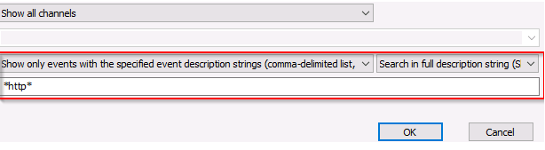

Additional resources:  
- Investigating Windows 2.0: https://tryhackme.com/jr/investigatingwindows2
- Investigating Windows 3.x: https://tryhackme.com/jr/investigatingwindows3
- PowerShell for Pentesters: https://tryhackme.com/jr/powershellforpentesters

---

If you wish to access the virtual machine via Remote Desktop, use the credentials below. 

**Machine IP**: `MACHINE_IP`  
**User**: `administrator`  
**Password**: `sn0wF!akes!!!`  
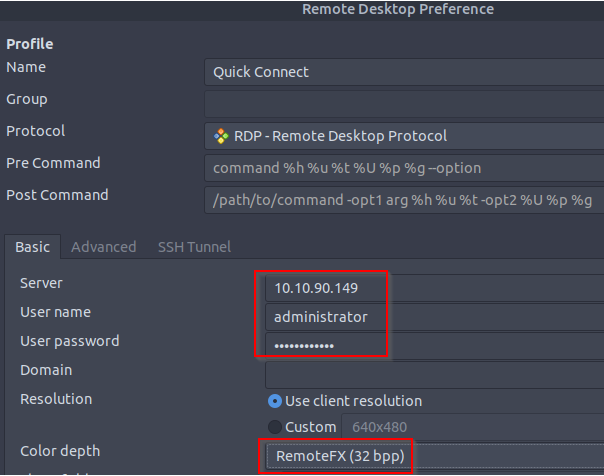

Accept the Certificate when prompted, and you should be logged into the remote system now.  
**Note**: The virtual machine may take up to 3 minutes to load.

---
# Questions

> What command was executed as Elf McNealy to add a new user to the machine?

Answer: **Invoke-Nightmare**

> What user executed the PowerShell file to send the password.txt file from the administrator's desktop to a remote server?

Answer: **adm1n**

> What was the IP address of the remote server? What was the port used for the remote connection? (format: IP,Port)

Answer: **10.10.148.96,4321**

> What was the encryption key used to encrypt the contents of the text file sent to the remote server?

Answer: **j3pn50vkw21hhurbqmxjlpmo9doiukyb**

> What application was used to delete the password.txt file?

Answer: **sdelete.exe**

> What is the date and timestamp the logs show that password.txt was deleted? (format: MM/DD/YYYY H:MM:SS PM)

Answer: **11/11/2021 7:29:27 PM**

> What were the contents of the deleted password.txt file?

Answer: **Mission Control: letitsnowletitsnowletitsnow**

===============================================================================

Start up the **Machine** attached to this task.

Qn1. Start the `FullEventLogView` application that is pinned to the Windows taskbar.  
Click the `Advanced Option`, the first icon on the application hotbar:  
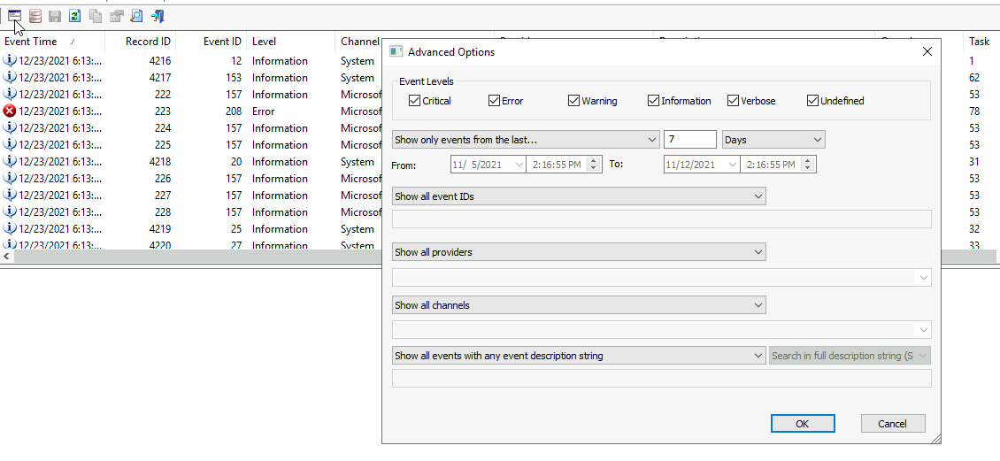
Use the following search options to refine and limit search results:  
- **Show only events in the specified time range (Local Time)**: from `11/10/2021 1:00:00PM` to `11/12/2021 1:00:00PM`
- **Show only the specified event IDs (comma-delimited list)**: `4103,4104`
- **Show only the specified providers (comma-delimited list, wildcard allowed)**: `*powershell*`  
  
Scroll down to find a unique event calling a function `Invoke-Nightmare` with description sayings a CVE exploit:  
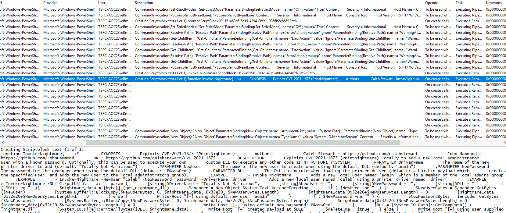

Qn2. In the same event, the user can be found in the description of the event:  
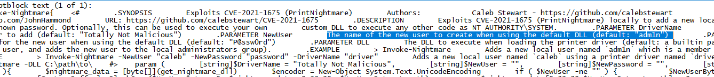

Qn3. Scroll down the events further to find an event executed by `adm1n` which does a function `Invoke-WebRequest` on POST HTTP to a remote server:  
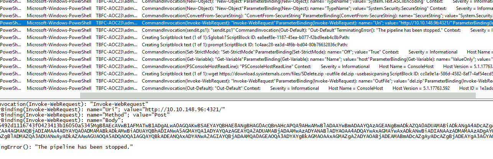

Qn4. a few event lines above the `Invoke-WebRequest` line, there is an event which shows the `$key` value:  
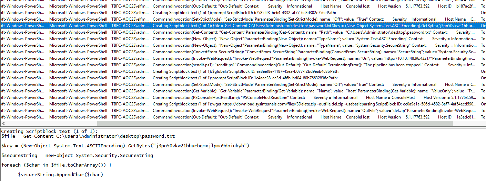

Qn5. Scroll further down the events to find an event invoking an application to delete `password.txt` from Administrator's Desktop:  
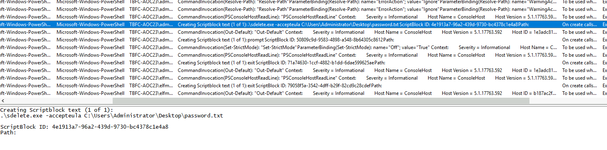

Qn6. From the same event an Qn5, note the timestamp of the event:  
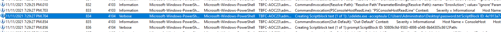

Qn7. Open `decryptor.ps` on Desktop using a notepad editor.  
Insert key value as `j3pn50vkw21hhurbqmxjlpmo9doiukyb`  
Insert Encrypted value as `"76492d1116743f0423413b16050a5345MgB8AEcAVwB1AFMATwB1ADgALwA0AGQAKwBSAEYAYQBHAE8ANgBHAG0AcQBnAHcAPQA9AHwAMwBlADAAYwBmADAAYQAzAGEANgBmADkAZQA0ADUAMABiADkANgA4ADcAZgA3ADAAMQA3ADAAOABiADkAZAA2ADgAOQA2ADAANQA3AGEAZAA4AGMANQBjADIAMAA4ADYAYQA0ADMAMABkADkAMwBiADUAYQBhADIANwA5AGMAYQA1ADYAYQAzAGEAYQA2ADUAMABjADAAMwAzADYANABlADYAOAA4ADQAYwAxAGMAYwAxADkANwBiADIANAAzADMAMAAzADgAYQA5ADYANAAzADEANAA2AGUAZgBkAGEAMAA3ADcANQAyADcAZgBlADMAZQA3ADUANwAyADkAZAAwAGUAOQA5ADQAOQA1AGQAYQBkADEANQAxADYANwA2AGIAYQBjADAAMQA0AGEAOQA3ADYAYgBkAGMAOAAxAGMAZgA2ADYAOABjADEAMABmADcAZgAyADcAZgBjADEAYgA3AGYAOAA3AGIANQAyAGUAMwA4ADgAYQAxADkANgA4ADMA"`  
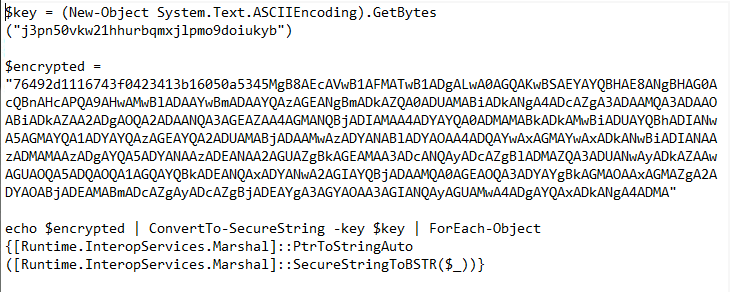
Open Powershell and run the `decryptor.ps`:  
`cd .\Desktop\`  
`.\decryptor.ps`  
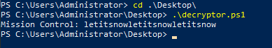