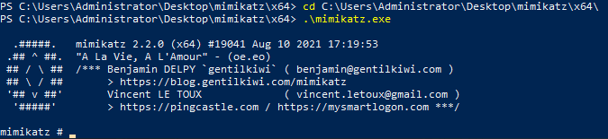

## Story

McSkidy has learned a lot about how Grinch Enterprises operates and wants to prepare for any future attacks from anyone who hates Christmas. From a forensics analysis they did, she noticed that the Grinch Enterprises performed some malicious activities. She wants to perform these on the same machine they compromised to understand her adversaries a little better. Can you follow along and help her prepare for any other attacks?

_There is no video for today's task._

## Learning Objectives

In this task you will:  
- Understand post exploitation
- Understand how passwords are stored on Windows
- Dump passwords from LSASS process on Windows
- Crack Password Hashes

## Post Exploitation

The post-exploitation stage usually occurs after an attacker has gained unauthorized access to a system. During this stage, an attacker will aim to do the following:  
- Escalate their privileges: An attacker would try to obtain access to sensitive information (documentation on how internal technology stacks work or credentials for other systems) or critical functionality that is only available to higher privileged users, e.g., administrative portals to manage users
- Maintain persistence within the target environment: An attacker would set up other mechanisms to maintain access to the environment if their current access has been blocked or removed.

The information retrieved in the post-exploitation stage allows attackers to enumerate, identify and exploit other components on the broader environment/network. Suppose an attacker has compromised a system that stores HR information. In that case, they can use the employee names and details to carry out social engineering attacks (such as phishing) against these employees.

In this case, we'll be looking at a common post-exploitation scenario when an attacker has gained access to a privileged user in Windows. It is prevalent for attackers to dump password hashes and crack them to retrieve clear text user passwords. Before covering this scenario, we'll take a brief look at Password Hashing, authentication in Windows, and why it's possible to perform these actions.

## Password Hashing

A password hash represents the original password that has been converted to another form. Hashing this password applies a one-way transformation to change the clear text password to a form that cannot easily be recognized. When a string is provided to a hash function, the output of this hash function is a fixed-length string that is unique for the input provided. Various types of algorithms perform this hashing, including MD5, SHA1, and SHA256.

> password123 → MD5 → 7576f3a00f6de47b0c72c5baf2d505b0  
> (INPUT → FUNCTION → OUTPUT)

As you can see from above, the password is converted to a string of seemingly random characters by the MD5 algorithm. Using password hashing allows systems to verify whether passwords are correct without storing the original password. If an attacker gets access to a system that stores clear text passwords, they can easily use these passwords for malicious purposes. However, if the passwords are hashed, it can be difficult for an attacker to retrieve the clear text passwords (this depends on the algorithm in use and the complexity of the user's password).

While these hash functions are 1-way functions that are supposed to make it very difficult to retrieve the original form of the password, under certain conditions, attackers can still recover the clear-text password that corresponds to the password hash. A common way to retrieve these clear-text passwords (commonly referred to as cracking hashes) is bypassing various inputs to the hashing algorithm and checking whether the output corresponds to the original hash.

For example, if the password hash in question is 7576f3a00f6de47b0c72c5baf2d505b0 and an attacker knows that the hashing algorithm is MD5, an attacker can try various forms of passwords to see if the hashes match the original hash:

> password12 → MD5 → eebf9d92578b4212b541fb41f326a8f2  
> password123 → MD5 → 7576f3a00f6de47b0c72c5baf2d505b0  
> password1234 → MD5 → 1e61d855bd708b5235d19a53e48ba5a5  

You can see here that the hash for password123 matches the original hash provided above.

## Authentication and Hashing

Windows stores various credentials in the Security Accounts Manager (SAM) database. Commonly, credentials such as user passwords are stored as hashes within the SAM database.

The two most common hashes stored in the SAM database are:  
- LAN Manager (LM) - this hash is the oldest form of password storage used by Windows that are kept around for legacy systems. The algorithm used to create this hash utilizes a limited character set as input, so it's possible to try all combinations of letters and numbers to retrieve the original hash.
- NT LAN Manager (NTLM) - Modern Windows systems use this hashing algorithm to store passwords.

When a user logs onto a local Windows machine, the Local Security Authority Subsystem Service (LSASS) process retrieves the user's credentials from the SAM database. It compares this against the hashed form of the user's password. If the hash of the password entered by the user matches the hash of the password stored in the SAM database, then the user can successfully log on.

Once this user successfully logs on, the LSASS process stores the user's credentials in memory. This is designed out of convenience; when users access other resources, they don't need to enter their credentials constantly, but the LSASS process uses the credentials stored in memory for various actions.

## Dumping Password Hashes

Deploy the machine attached to this task using the green Start Machine button, and Access the machine on $MACHINE_IP. This machine is accessible in the browser. Alternatively, you can also access the machine via RDP using the credentials:  
- Username: Administrator
- Password: letmein123!

Additionally, deploy the attack box, which will be used in a later section of this task.

When an attacker gets access to a local Windows system, one of the first things they would do would be to dump the password hashes stored in the LSASS process. Since the LSASS process has to interact with the SAM database and store credentials in memory, it usually runs with more privileges than a standard user. For an attacker to interact with LSASS, they need to have high privileges.

A standard tool used to retrieve password hashes from memory is called `mimikatz` (https://github.com/gentilkiwi/mimikatz). Mimikatz has various modules that can be used to extract different kinds of credentials from memory and use these credentials to access user accounts. For this exercise, we'll be using the `sekurlsa` module.

Open PowerShell using the start menu and Navigate to the `C:\Users\Administrator\Desktop\mimikatz\x64` and run the mimikatz program  

Use the following command to check if you have the appropriate privileges to run the program:

Once you have verified that you have the appropriate privileges, we'll be dumping the passwords from the LSASS memory using the `sekurlsa` module. This module is used to extract various credentials from the LSASS memory. You need Administrator access or a SYSTEM account to use this module.

Within this module, we can use the `logonpasswords` function to extract the credentials for currently logged in users:  

From the output above, you can see that we could obtain the NTLM and SHA1 hashes for another user logged onto the machine. Now that we have the NTLM password hash, let's try to crack the hash to retrieve the clear-text password.

## Cracking Password Hashes

In the previous section, we mentioned that we could pass in the combinations of potential input to the hashing algorithm in use and compare these hashes against our target hash. In this case, we'll use a tool called John The Ripper to crack the password hashes. To use John The Ripper, start the AttackBox and copy the NTLM hash you've recovered into a file called hash.txt  

Once you've copied the hash, run the following command:  

The parameters and arguments used in the command above are as follows:  
- —format=NT is used to represent the type of the hash. In this case, we're specifying that we want to crack an NTLM hash. You can find a full list of formats supported by john using the john --list=formats command.
- /usr/share/wordlists/rockyou.txt is the wordlist containing the input passwords that will be hashed by john and compared against our hash.
- hash.txt represents the text file containing the hash
- —pot=output.txt represents the output file that the clear text retrieved password will be stored in

The output above shows that john has successfully cracked the password. Use the `cat` command to read the cracked password, which will be in the format of `$HASH-TYPE$PASSWORD-HASH:RECOVERED-PASSWORD`

Check out the following rooms to further your understanding of the concepts in this task:  
- Cracking Password Hashes With John The Ripper
- Learning Post-Exploitation Basics

---
# Questions

> What is the username of the other user on the system?

Answer: **emily**

> What is the NTLM hash of this user?

Answer: **8af326aa4850225b75c592d4ce19ccf5**

> What is the password for this user?

Answer: **1234567890**

===============================================================================

Start up the **Machine** attached to this task.

Qn1. Open up Powershell on the Machine, and go to the mimikatz folder:  
`cd C:\Users\Administrator\Desktop\mimikatz\x64`  
`.\mimikatz.exe`  

Run the following commands to find the username of the other user on the system:  
`sekurlsa::logonpasswords`  

Qn2. The NTLM hash can also be found in the same page of the command in Qn1.

Qn3. Start up the **Attackbox**, open the terminal and copy the hash over to the Attackbox using the following command:  
`echo "8af326aa4850225b75c592d4ce19ccf5" > hash.txt`  
  
Run the following command to crack the password:  
`john --format=NT -w=/usr/share/wordlists/rockyou.txt hash.txt --pot=output.txt`  
  
The cracked password will be found in the output file `output.txt` in the form `$HASH-TYPE$PASSWORD-HASH:RECOVERED-PASSWORD`.  
Run `cat` command to read it:  
`cat output.txt`  
  